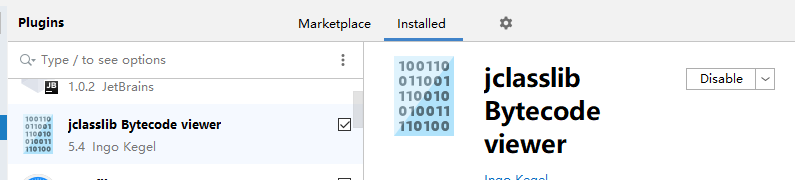
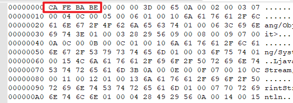
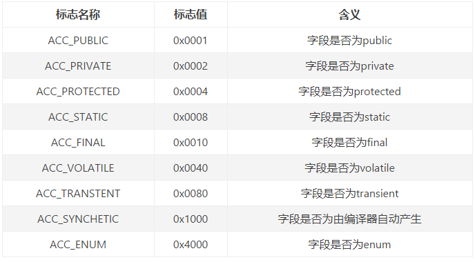
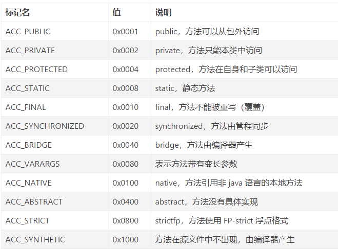
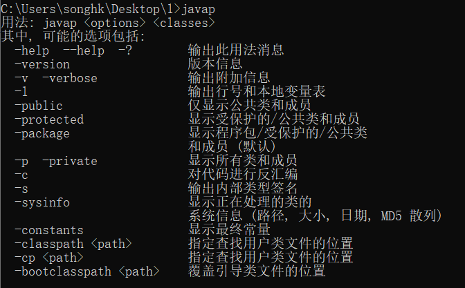
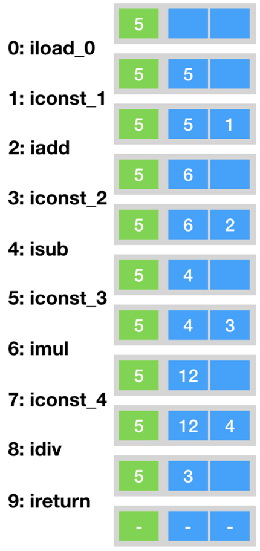
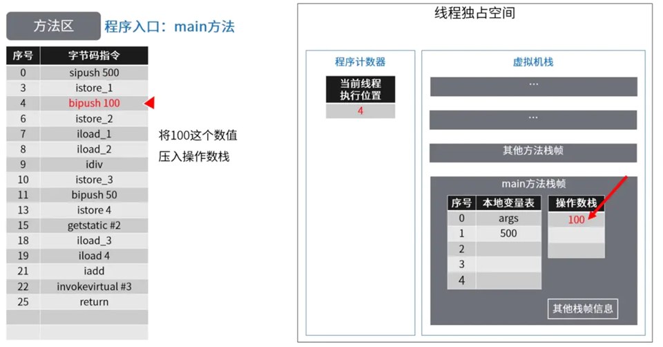
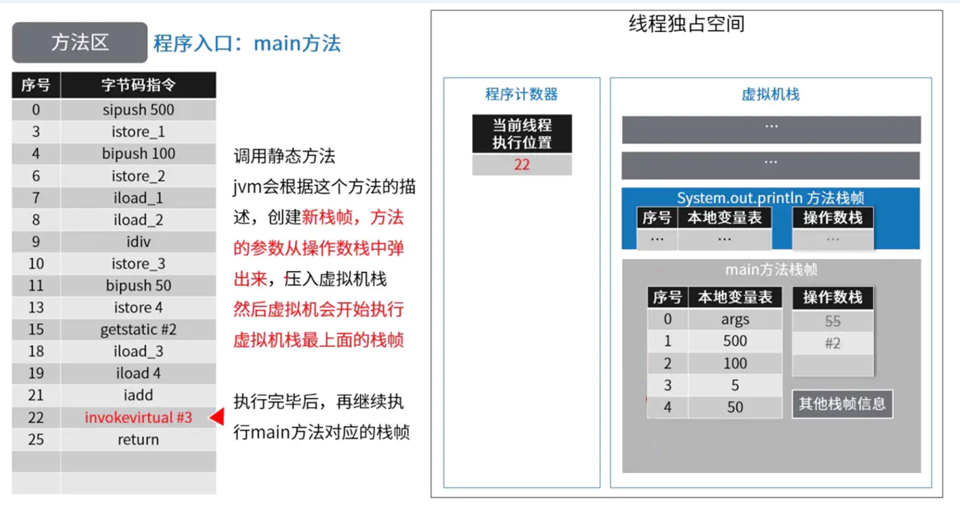
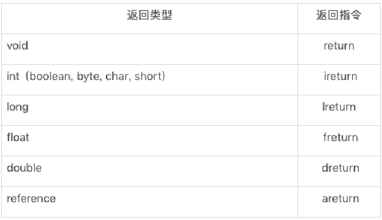

**官方资料：**





{% link 第1篇-字节码篇,思维导图,https://blog.shiguangdev.cn/html/atguigu/%E5%B0%9A%E7%A1%85%E8%B0%B7_JVM%E7%B2%BE%E8%AE%B2%E4%B8%8EGC%E8%B0%83%E4%BC%98%E7%AC%AC1%E7%AF%87-%E5%AD%97%E8%8A%82%E7%A0%81%E7%AF%87.html,https://th.bing.com/th?id=ODLS.257b82c4-9cf6-4599-8c46-03342a2f9e88&w=32&h=32&qlt=90&pcl=fffffa&o=6&pid=1.2 %}

**代码仓库：**





# 1、JVM概述

## 1.1、Java语言及Java生态圈

### Oracle JDK与Open JDK什么关系？


官方的说明：
https://www.oracle.com/cn/java/technologies/javase-downloads.html
Oracle Customers and ISVs targeting Oracle LTS releases: Oracle JDK is Oracle's supported Java SE version for customers and for developing, testing, prototyping or demonstrating your Java applications.
End users and developers looking for free JDK versions:**<font color="red"> Oracle OpenJDK offers the same features and performance as Oracle JDK under the GPL license .</font>**

Oracle JDK下载路径：
https://www.oracle.com/java/technologies/javase-jdk15-downloads.html
Open JDK下载路径：
https://cn.azul.com/downloads/zulu-community/?version=java-11-lts&os=windows&architecture=x86-64-bit

Oracle与OpenJDK之间的主要区别
1. Oracle JDK版本将每三年发布一次LTS版本，而OpenJDK版本每三个月发布一次。
2. Oracle JDK将更多地关注稳定性，它重视更多的企业级用户，而OpenJDK经常发布以支持其他性能，这可能会导致不稳定。
3. Oracle JDK支持长期发布的更改，而Open JDK仅支持计划和完成下一个发行版。
4. Oracle JDK根据二进制代码许可协议获得许可，而OpenJDK根据GPL v2许可获得许可。 使用Oracle平台时会产生一些许可影响。如Oracle 宣布的那样，在没有商业许可的情况下，在2019年1月之后发布的Oracle Java SE 8的公开更新将无法用于商业，商业或生产用途。但是，OpenJDK是完全开源的，可以自由使用。
5. Oracle JDK的构建过程基于OpenJDK，因此OpenJDK与Oracle JDK之间没有技术差异。
6. 顶级公司正在使用Oracle JDK，例如Android Studio，Minecraft和IntelliJ IDEA开发工具，其中Open JDK不太受欢迎。
7. Oracle JDK具有Flight Recorder，Java Mission Control和Application Class-Data Sharing功能，Open JDK具有Font Renderer功能，这是OpenJDK与Oracle JDK之间的显著差异。
8. Oracle JDK具有良好的GC选项和更好的渲染器，而OpenJDK具有更少的GC选项，并且由于其包含自己的渲染器的分布，因此具有较慢的图形渲染器选项。
9. 在响应性和JVM性能方面，Oracle JDK与OpenJDK相比提供了更好的性能。
10. 与OpenJDK相比，Oracle JDK的开源社区较少，OpenJDK社区用户的表现优于Oracle JDK发布的功能，以提高性能。
11. 如果使用Oracle JDK会产生许可影响，而OpenJDK没有这样的问题，并且可以以任何方式使用，以满足完全开源和免费使用。
12. Oracle JDK在运行JDK时不会产生任何问题，而OpenJDK在为某些用户运行JDK时会产生一些问题。
13. 根据使用方的使用和许可协议，现有应用程序可以从Oracle JDK迁移到Open JDK，反之亦然。
14. Oracle JDK将从其10.0.X版本将收费，用户必须付费或必须依赖OpenJDK才能使用其免费版本。
15. Oracle JDK不会为即将发布的版本提供长期支持，用户每次都必须通过更新到最新版本获得支持来获取最新版本。
16. Oracle JDK以前的1.0版以前的版本是由Sun开发的，后来被Oracle收购并为其他版本维护，而OpenJDK最初只基于Java SDK或JDK版本7。
17. Oracle JDK发布时大多数功能都是开源的，其中一些功能免于开源，并且根据Sun的许可授权，而OpenJDK发布了所有功能，如开源和免费。
18. Oracle JDK完全由Oracle公司开发，而Open JDK项目由IBM，Apple，SAP AG，Redhat等顶级公司加入和合作。

### JDK与JVM是什么关系？


#### 如何理解Java是跨平台的语言？


**<font color="red">“write once, run anywhere.”</font>（一次编译，处处运行）**

当Java源代码成功编译成字节码后，如果想在不同的平台上面运行，则无须再次编译。
这个优势不再那么吸引人了。Python、PHP、Perl、Ruby、Lisp等有强大的解释器。跨平台似乎已经快成为一门语言必选的特性。

#### 如何理解JVM跨语言的平台？


Java虚拟机根本不关心运行在其内部的程序到底是使用何种编程语言编写的，<font color="red">它只关心“字节码”文件</font>。

**<font color="red">Java不是最强大的语言，但是JVM是最强大的虚拟机。</font>**

### Java不存在内存溢出？内存泄漏？


java = (c++)--;

垃圾收集机制为我们打理了很多繁琐的工作，大大提高了开发的效率，但是，垃圾收集也不是万能的，懂得JVM内部的内存结构、工作机制，是设计高扩展性应用和诊断运行时问题的基础，也是Java工程师进阶的必备能力。

### Java发展的几个重大事件？

- 2000年，JDK 1.3发布，**Java HotSpot Virtual Machine正式发布，成为Java的默认虚拟机。**

- 2002年，JDK 1.4发布，古老的Classic虚拟机退出历史舞台。

- 2003年年底，**Java平台的Scala正式发布，同年Groovy也加入了 Java阵营。**

- 2006年，JDK 6发布。同年，**Java开源并建立了 OpenJDK**。顺理成章，**Hotspot虚拟机也成为了 OpenJDK中的默认虚拟机。**

- 2007年，**Java平台迎来了新伙伴Clojure。**

- 2008 年，Oracle 收购了 BEA,**得到了 JRockit 虚拟机。**

- 2009年，Twitter宣布把后台大部分程序从Ruby迁移到Scala，这是Java平台的又一次大规模应用。

- 2010年，Oracle收购了Sun，**获得Java商标和最具价值的HotSpot虚拟机。**此时，Oracle拥有市场占用率最高的两款虚拟机HotSpot和JRockit，并计划在未来对它们进行整合：HotRockit.  JCP组织管理：Java语言

- 2011年，JDK7发布。在JDK 1.7u4中，**正式启用了新的垃圾回收器G1**。

- 2017年，JDK9发布。**将G1设置为默认GC，替代CMS (被标记为Deprecated)**
  同年，**IBM的J9开源**，形成了现在的Open J9社区

- 2018年，Android的Java侵权案判决，Google赔偿Oracle计88亿美元

  同年，JDK11发布，LTS版本的JDK,**发布革命性的ZGC,调整JDK授权许可**

- 2019年，JDK12发布，加入RedHat领导开发的**Shenandoah GC**


#### 说说你认识的JVM？

- Sun Classic VM  -->解释型

- Exact VM   --> Solaris

- **<font color="red">SUN公司的 HotSpot VM</font>**

- **<font color="red">BEA 的 JRockit  --> 不包含解释器，服务器端，JMC</font>**

- **<font color="red">IBM 的 J9</font>**

- KVM和CDC/CLDC Hotspot

- Azul VM

- Liquid VM

- Apache Harmony

- Microsoft JVM

- TaobaoJVM

- **Graal VM --> 2018年,“Run Programs Faster Anywhere”**

  

- Dalvik VM

- 其他JVM：Java Card VM、Squawk VM、JavaInJava、Maxine VM、Jikes RVM、IKVM.NET、Jam VM、Cacao VM、Sable VM、Kaffe、Jelatine JVM、Nano VM、MRP、Moxie JVM


#### JVM的生命周期？

**虚拟机的启动**
Java虚拟机的启动是通过引导类加载器(bootstrap class loader)创建一个初始类(initial class)来完成的，这个类是由虚拟机的具体实现指定的。

**虚拟机的退出有如下的几种情况：**

- 某线程调用Runtime类或System类的exit方法，或 Runtime类的halt方法，并且Java安全管理器也允许这次exit或halt操作。
- 程序正常执行结束
- 程序在执行过程中遇到了异常或错误而异常终止
- 由于操作系统出现错误而导致Java虚拟机进程终止


#### 重点说下HotSpot？

- **SUN**的**JDK**版本从**1.3.1**开始运用**HotSpot**虚拟机， **2006**年底开源，主要使用C++实现，**JNI**接口部分用**C**实现
- **HotSpot**是较新的**Java**虚拟机，使用**JIT(Just in Time)**编译器，可以大大提高**Java**运行的性能。 
- **Java**原先是把源代码编译为字节码在虚拟机执行，这样执行速度较慢。而**HotSpot**将常用的部分代码编译为本地(原生，native)代码，这样显着提高了性能。 
- **HotSpot JVM** 参数可以分为规则参数**(standard options)**和非规则参数**(non-standard options)**。 规则参数相对稳定，在**JDK**未来的版本里不会有太大的改动。 非规则参数则有因升级**JDK**而改动的可能。


## 1.2、JVM的架构与知识脉络图

### 能否画出JVM架构图？


这个架构可以分成三层看：

- 最上层：javac编译器将编译好的字节码class文件，通过java 类装载器执行机制，把对象或class文件存放在 jvm划分内存区域。
- 中间层：称为Runtime Data Area，主要是在Java代码运行时用于存放数据的，从左至右为方法区(永久代、元数据区)、堆(共享,GC回收对象区域)、栈、程序计数器、寄存器、本地方法栈(私有)。
- 最下层：解释器、JIT(just in time)编译器和 GC（Garbage Collection，垃圾回收器）

### JVM有哪几块知识脉络？


# 2、字节码文件概述

## 2.1、字节码文件是跨平台的吗？

<font color="red">Java 虚拟机不和包括 Java 在内的任何语言绑定，它只与“Class 文件”这种特定的二进制文件格式所关联。</font>
无论使用何种语言进行软件开发，只要能将源文件编译为正确的Class文件，那么这种语言就可以在Java虚拟机上执行。可以说，统一而强大的Class文件结构，就是Java虚拟机的基石、桥梁。


想要让一个Java程序正确地运行在JVM中，Java源码就必须要被编译为符合JVM规范的字节码。

> Java 语言和虚拟机规范：https://docs.oracle.com/javase/specs/index.html


所有的JVM全部遵守Java虚拟机规范，也就是说所有的JVM环境都是一样的，这样一来字节码文件可以在各种JVM上运行。

从Java虚拟机的角度看，通过Class文件，可以让更多的计算机语言支持Java虚拟机平台。因此，<font color="red">Class文件结构不仅仅是Java虚拟机的执行入口，更是Java生态圈的基础和核心</font>。

### class文件里是什么？

源代码经过编译器编译之后便会生成一个字节码文件，字节码是一种二进制的类文件，它的内容是JVM的指令，而不像C、C++经由编译器直接生成**机器码**。

随着Java平台的不断发展，在将来，Class文件的内容也一定会做进一步的扩充，但是其基本的格式和结构不会做重大调整。


### 能介绍下生成class文件的编译器吗？


#### 前端编译器与后端编译器

##### <font  size="3">前端编译器（Front-End Compiler）</font>

前端编译器主要负责处理源代码的语法分析、语义分析和中间代码生成。它的主要任务是将高级语言（如C、C++、Java等）编写的源代码转换为一种中间表示形式（Intermediate Representation, IR），这种中间表示形式通常是独立于目标机器的。

**前端编译器的主要任务就是负责将符合Java语法规范的Java代码转换为符合JVM规范的字节码文件。**

主要功能：

- **词法分析（Lexical Analysis）**：将源代码分解为一个个的词法单元（tokens），如关键字、标识符、操作符等。
- **语法分析（Syntax Analysis）**：根据语言的语法规则，将词法单元组织成语法树（Syntax Tree）或抽象语法树（Abstract Syntax Tree, AST）。
- **语义分析（Semantic Analysis）**：检查语法树的语义正确性，确保代码符合语言的语义规则，如类型检查、作用域检查等。
- **中间代码生成（Intermediate Code Generation）**：将语法树或抽象语法树转换为中间表示形式（如三地址码、控制流图等），这种中间表示形式通常是独立于目标机器的。

特点：

- **与源语言相关**：前端编译器的设计和实现与源语言的语法和语义密切相关。
- **与目标机器无关**：前端编译器生成的中间代码通常是独立于目标机器的，可以在不同的平台上运行。

##### <font  size="3">后端编译器（Back-End Compiler）</font>

后端编译器主要负责优化中间代码并生成目标机器代码。它的任务是将前端生成的中间表示形式转换为特定目标机器的机器码或汇编代码。

主要功能：

- **中间代码优化（Intermediate Code Optimization）**：对中间代码进行各种优化，如常量折叠、死代码消除、循环优化等，以提高代码的执行效率。
- **目标代码生成（Target Code Generation）**：将优化后的中间代码转换为目标机器的机器码或汇编代码。这一步需要考虑目标机器的指令集、寄存器分配、内存管理等因素。
- **机器相关优化（Machine-Specific Optimization）**：根据目标机器的特性进行优化，如指令选择、寄存器分配、指令调度等。

特点：

- **与目标机器相关**：后端编译器的设计和实现与目标机器的指令集、体系结构密切相关。
- **与源语言无关**：后端编译器通常不关心源语言的语法和语义，它只处理中间代码并生成目标机器代码。

##### <font  size="3">前端与后端的协同工作</font>

- **编译流程**：前端编译器和后端编译器通常是分开的，但它们协同工作以完成整个编译过程。前端负责将源代码转换为中间表示形式，后端负责将中间表示形式转换为目标机器代码。
- **可移植性**：由于中间代码是独立于目标机器的，因此可以通过更换后端编译器来生成不同目标机器的代码，从而实现代码的可移植性。

#####  <font  size="3">举例</font>

- **GCC（GNU Compiler Collection）**：GCC是一个典型的多语言编译器集合，它包含多个前端（如C前端、C++前端、Fortran前端等）和多个后端（如x86后端、ARM后端等）。不同的前端处理不同的源语言，生成统一的中间表示形式，然后由不同的后端生成目标机器代码。
- **Java虚拟机（JVM）**：Java编译器的前端将Java源代码编译为字节码（一种中间表示形式），然后由JVM的后端（即时编译器JIT）将字节码编译为特定平台的机器码。

##### <font  size="3">总结</font>

- **前端编译器**：负责源代码的词法、语法、语义分析，生成中间代码，与源语言相关，与目标机器无关。
- **后端编译器**：负责中间代码的优化和目标代码生成，与目标机器相关，与源语言无关。

通过前端和后端的协同工作，编译器能够将高级语言的源代码转换为高效的目标机器代码。


#### 前端编译器的种类

Java源代码的编译结果是字节码，那么肯定需要有一种编译器能够将Java源码编译为字节码，承担这个重要责任的就是配置在path环境变量中的**javac编译器**。javac是一种能够将Java源码编译为字节码的**前端编译器**。

HotSpot VM并没有强制要求前端编译器只能使用javac来编译字节码，其实只要编译结果符合JVM规范都可以被JVM所识别即可。
在Java的前端编译器领域，除了javac之外，还有一种被大家经常用到的前端编译器，那就是内置在Eclipse中的**ECJ (Eclipse Compiler for Java)编译器**。和Javac的全量式编译不同，ECJ是一种增量式编译器。

- 在Eclipse中，当开发人员编写完代码后，使用“Ctrl+S”快捷键时，ECJ编译器所釆取的**编译方案**是把未编译部分的源码逐行进行编译，而非每次都全量编译。因此ECJ的编译效率会比javac更加迅速和高效，当然编译质量和javac相比大致还是一样的。
- ECJ不仅是Eclipse的默认内置前端编译器，在Tomcat中同样也是使用ECJ编译器来编译jsp文件。由于ECJ编译器是釆用GPLv2的开源协议进行源代码公开，所以，大家可以登录eclipse官网下载ECJ编译器的源码进行二次开发。
- 默认情况下，IntelliJ IDEA 使用 javac 编译器。(还可以自己设置为AspectJ编译器 ajc)


### javac编译器的编译步骤？

javac编译器在将Java源码编译为一个有效的字节码文件过程中经历了4个步骤，分别是**词法解析、语法解析、语义解析以及生成字节码**。


大部分的程序代码转换成物理机的目标代码或虚拟机能执行的指令集之前，都需要经过上图中的各个步骤。


### 目前前端编译器的局限性？

前端编译器并不会直接涉及编译优化等方面的技术，而是将这些具体优化细节移交给HotSpot的JIT编译器负责。

复习：**AOT**(静态提前编译器，**Ahead Of Time Compiler**)

- jdk9引入了AOT编译器(静态提前编译器，Ahead Of Time Compiler)
- Java 9 引入了实验性 AOT 编译工具**jaotc**。它借助了 Graal 编译器，将所输入的 Java 类文件转换为机器码，并存放至生成的动态共享库之中。
- 所谓 AOT 编译，是与即时编译相对立的一个概念。我们知道，即时编译指的是**在程序的运行过程中**，将字节码转换为可在硬件上直接运行的机器码，并部署至托管环境中的过程。而 AOT 编译指的则是，**在程序运行之前**，便将字节码转换为机器码的过程。
  - **.java -> .class -> .so**
- 最大好处：Java虚拟机加载已经预编译成二进制库，可以直接执行。不必等待即时编译器的预热，减少Java应用给人带来“第一次运行慢”的不良体验。
- 缺点：
  - 破坏了java“一次编译，到处运行”，必须为每个不同硬件、OS编译对应的发行包。
  - **降低了Java链接过程的动态性**，加载的代码在编译期就必须全部已知。

还需要继续优化中，最初只支持Linux x64 java base


## 2.2、哪些类型对应有Class的对象？

（1）class：
外部类，成员(成员内部类，静态内部类)，局部内部类，匿名内部类
（2）interface：接口
（3）[]：数组
（4）enum：枚举
（5）annotation：注解@interface
（6）primitive type：基本数据类型
（7）void

```java
@Test
public void test(){
    Class c1 = Object.class;
    Class c2 = Comparable.class;
    Class c3 = String[].class;
    Class c4 = int[][].class;
    Class c5 = ElementType.class;
    Class c6 = Override.class;
    Class c7 = int.class;
    Class c8 = void.class;
    Class c9 = Class.class;
 
    int[] a = new int[10];
    int[] b = new int[100];
    Class c10 = a.getClass();
    Class c11 = b.getClass();
    // 只要元素类型与维度一样，就是同一个Class
    System.out.println(c10 == c11);
}
```

## 2.3、字节码指令

### 什么是字节码指令(byte code)？

Java虚拟机的指令由一个字节长度的、代表着某种特定操作含义的**操作码（opcode）**以及跟随其后的零至多个代表此操作所需参数的**操作数（operand）**所构成。虚拟机中许多指令并不包含操作数，只有一个操作码。
比如： 


### 为什么要懂字节码指令？

```java
public class ByteCodeInterview {
    //面试题： i++和++i有什么区别？
    @Test
    public void test1(){
        int i = 10;
//        i++;
        ++i;

        System.out.println(i);
    }

    @Test
    public void test2(){
        int i = 10;
        i = i++;
        System.out.println(i);// 10
    }

    @Test
    public void test3(){
        int i = 2;
        i *= i++; //i = i * i++
        System.out.println(i); // 4
    }

    @Test
    public void test4(){
        int k = 10;
        k = k + (k++) + (++k); //
        System.out.println(k);//32
    }

    //包装类对象的缓存问题
    @Test
    public void test5(){

        Integer i1 = 10;
        Integer i2 = 10;
        System.out.println(i1 == i2);//true

        Integer i3 = 128;
        Integer i4 = 128;
        System.out.println(i3 == i4);//false

        Boolean b1 = true;
        Boolean b2 = true;
        System.out.println(b1 == b2);//true
    }

    //String声明的字面量数据都放在字符串常量池中
    //jdk 6中字符串常量池存放在方法区（即永久代中）
    //jdk7 及以后字符串常量池存放在堆空间
    @Test
    public void test6(){
        String str = new String("hello") + new String("world");
        String str1 = "helloworld";
        str.intern();
        System.out.println(str == str1);//false --> true (加上intern() 在str声明之前)

    }
}
```


```java
class Father {
    int x = 10;
    public Father() {
        this.print();
        x = 20;
    }
    public void print() {
        System.out.println("Father.x = " + x);
    }
}
class Son extends Father {
    int x = 30;

    public Son() {
        this.print();
        x = 40;
    }
    public void print() {
        System.out.println("Son.x = " + x);
    }
}

public class ByteCodeInterview1 {
    public static void main(String[] args) {
        Father f = new Son();
        System.out.println(f.x);
    }
}
```

运行结果

```
Son.x = 0
Son.x = 30
20
```

## 2.4、如何解读class文件？

方式一：一个一个二进制的看。这里用到的是Notepad++,需要安装一个HEX-Editor插件，也可用其他支持二进制格式的文本阅读器，入Notepad--，UltraEdit，Sublime Text 等


或者使用 Binary Viewer


方式二：使用javap指令：jdk自带的反解析工具

方式三：使用IDEA插件：jclasslib 


使用方法：

每次修改代码后重新编译字节码文件


菜单栏 `View -> Show Bytecode With Jclasslib`  打开工具栏


然后可查看并分析类加载过程


或jclasslib bytecode viewer客户端工具。（可视化更好)


# 3、Class文件结构细节

> 官方文档位置：https://docs.oracle.com/javase/specs/jvms/se8/html/jvms-4.html

**Class 类的本质 :**

任何一个Class文件都对应着唯一一个类或接口的定义信息，但反过来说，Class文件实际上它并不一定以磁盘文件的形式存在。Class 文件是一组以8位字节为基础单位的**二进制流**。

**Class文件格式**

 Class 的结构不像 XML 等描述语言，由于它没有任何分隔符号。所以在其中的数据项，无论是字节顺序还是数量，都是被严格限定的，哪个字节代表什么含义，长度是多少，先后顺序如何，都不允许改变。 

“下雨天留客天留我不留”
“下雨天，留客天，留我不留？”
“下雨天，留客天，留我不？留！”
“下雨，天留客？天留，我不留！”


Class 文件格式采用一种类似于 C语言结构体的方式进行数据存储，这种结构中只有两种数据类型：**无符号数和表**。

- 无符号数属于基本的数据类型，以 u1、u2、u4、u8 来分别代表 1 个字节、2 个字节、4 个字节和 8 个字节的无符号数，无符号数可以用来描述数字、索引引用、数量值或者按照 UTF-8 编码构成字符串值。
- 表是由多个无符号数或者其他表作为数据项构成的复合数据类型，所有表都习惯性地以“_info”结尾。表用于描述有层次关系的复合结构的数据，整个 Class 文件本质上就是一张表。 由于表没有固定长度，所以通常会在其前面加上个数说明

举例：

```java
public class Demo {
    private int num = 1;

    public int add(){
        num = num + 2;
        return num;

    }
}
```

 对应的字节码文件（jdk8）：

```
00000000 CA FE BA BE 00 00 00 34 00 16 0A 00 04 00 12 09 .......4........
00000010 00 03 00 13 07 00 14 07 00 15 01 00 03 6E 75 6D .............num
00000020 01 00 01 49 01 00 06 3C 69 6E 69 74 3E 01 00 03 ...I...<init>...
00000030 28 29 56 01 00 04 43 6F 64 65 01 00 0F 4C 69 6E ()V...Code...Lin
00000040 65 4E 75 6D 62 65 72 54 61 62 6C 65 01 00 12 4C eNumberTable...L
00000050 6F 63 61 6C 56 61 72 69 61 62 6C 65 54 61 62 6C ocalVariableTabl
00000060 65 01 00 04 74 68 69 73 01 00 18 4C 63 6F 6D 2F e...this...Lcom/
00000070 61 74 67 75 69 67 75 2F 6A 61 76 61 31 2F 44 65 atguigu/java1/De
00000080 6D 6F 3B 01 00 03 61 64 64 01 00 03 28 29 49 01 mo;...add...()I.
00000090 00 0A 53 6F 75 72 63 65 46 69 6C 65 01 00 09 44 ..SourceFile...D
000000A0 65 6D 6F 2E 6A 61 76 61 0C 00 07 00 08 0C 00 05 emo.java........
000000B0 00 06 01 00 16 63 6F 6D 2F 61 74 67 75 69 67 75 .....com/atguigu
000000C0 2F 6A 61 76 61 31 2F 44 65 6D 6F 01 00 10 6A 61 /java1/Demo...ja
000000D0 76 61 2F 6C 61 6E 67 2F 4F 62 6A 65 63 74 00 21 va/lang/Object.!
000000E0 00 03 00 04 00 00 00 01 00 02 00 05 00 06 00 00 ................
000000F0 00 02 00 01 00 07 00 08 00 01 00 09 00 00 00 38 ...............8
00000100 00 02 00 01 00 00 00 0A 2A B7 00 01 2A 04 B5 00 ........*...*...
00000110 02 B1 00 00 00 02 00 0A 00 00 00 0A 00 02 00 00 ................
00000120 00 09 00 04 00 0A 00 0B 00 00 00 0C 00 01 00 00 ................
00000130 00 0A 00 0C 00 0D 00 00 00 01 00 0E 00 0F 00 01 ................
00000140 00 09 00 00 00 3D 00 03 00 01 00 00 00 0F 2A 2A .....=........**
00000150 B4 00 02 05 60 B5 00 02 2A B4 00 02 AC 00 00 00 ....`...*.......
00000160 02 00 0A 00 00 00 0A 00 02 00 00 00 0D 00 0A 00 ................
00000170 0E 00 0B 00 00 00 0C 00 01 00 00 00 0F 00 0C 00 ................
00000180 0D 00 00 00 01 00 10 00 00 00 02 00 11 -- -- -- .............
```

解读：


**换句话说，充分理解了每一个字节码文件的细节，自己也可以反编译出Java源文件来。**

## 3.1、class文件结构细节概述

Class文件的结构并不是一成不变的，随着Java虚拟机的不断发展，总是不可避免地会对Class文件结构做出一些调整，但是其基本结构和框架是非常稳定的。
Class文件的总体结构如下：

- 魔数
- Class文件版本
- 常量池
- 访问标识(或标志)
- 类索引，父类索引，接口索引集合
- 字段表集合
- 方法表集合
- 属性表集合


下面是一张Java字节码总的结构表，我们按照上面的顺序逐一进行解读就可以了。


## 3.2、class文件的魔数是什么？

**Magic Number（魔数）：class文件的标志**

- 每个 Class 文件开头的4个字节的无符号整数称为魔数（Magic Number）

- 它的唯一作用是确定这个文件是否为一个能被虚拟机接受的有效合法的Class文件。即：魔数是Class文件的标识符。

- 魔数值固定为0xCAFEBABE。不会改变。

  

- 如果一个Class文件不以0xCAFEBABE开头，虚拟机在进行文件校验的时候就会直接抛出以下错误：

  ```
  Error: A JNI error has occurred, please check your installation and try again
  Exception in thread "main" java.lang.ClassFormatError: Incompatible magic value 1885430635 in class file StringTest
  ```

- 使用魔数而不是扩展名来进行识别主要是基于安全方面的考虑，因为文件扩展名可以随意地改动。

## 3.3、如何确保高版本的JVM可执行低版本的class文件？

- **不同版本的Java编译器编译的Class文件对应的版本是不一样的。目前，高版本的Java虚拟机可以执行由低版本编译器生成的Class文件,但是低版本的Java虚拟机不能执行由高版本编译器生成的Class文件。否则JVM会抛出java.lang.UnsupportedClassVersionError异常。 （向下兼容）**
- 在实际应用中，由于开发环境和生产环境的不同，可能会导致该问题的发生。因此，需要我们在开发时，特别注意开发编译的JDK版本和生产环境中的JDK版本是否一致。

**class文件版本号**

- 紧接着魔数的 4 个字节存储的是 Class 文件的版本号。同样也是4个字节。第5个和第6个字节所代表的含义就是编译的副版本号minor_version，而第7个和第8个字节就是编译的主版本号major_version。

- 它们共同构成了class文件的格式版本号。譬如某个 Class 文件的主版本号为 M，副版本号为 m，那么这个Class 文件的格式版本号就确定为 M.m。

- 版本号和Java编译器的对应关系如下表：

  

- Java 的版本号是从45开始的，JDK 1.1之后的每个JDK大版本发布主版本号向上加1。

- 虚拟机JDK版本为1.k （k >= 2）时，对应的class文件格式版本号的范围为45.0 - 44+k.0 （含两端）。

## 3.4、常量池：class文件的基石？作用是？

常量池：存放所有常量

- 常量池是Class文件中内容最为丰富的区域之一。常量池对于Class文件中的字段和方法解析也有着至关重要的作用。
- **常量池：可以理解为Class文件之中的资源仓库，它是Class文件结构中与其他项目关联最多的数据类型（后面的很多数据类型都会指向此处），也是占用Class文件空间最大的数据项目之一。**
- **常量池表项**中，用于存放编译时期生成的各种**字面量**和**符号引用**，这部分内容将在类加载后进入方法区的**运行时常量池中**存放。


- 在版本号之后，紧跟着的是常量池的数量，以及若干个常量池表项。

- 常量池中常量的数量是不固定的，所以在常量池的入口需要放置一项u2类型的无符号数，代表常量池容量计数值（constant_pool_count）。与Java中语言习惯不一样的是，这个容量计数是从1而不是0开始的。

  

  由上表可见，Class文件使用了一个前置的容量计数器（constant_pool_count）加若干个连续的数据项（constant_pool）的形式来描述常量池内容。我们把这一系列连续常量池数据称为常量池集合。

### 为什么需要常量池计数器？

**constant_pool_count （常量池计数器）：**

- 由于常量池的数量不固定，时长时短，所以需要放置两个字节来表示常量池容量计数值。

- 常量池容量计数值（u2类型）：**从1开始**，表示常量池中有多少项常量。即**constant_pool_count=1**表示常量池中有0个常量项。

- Demo的值为：

  

  其值为0x0016,十进制值为22

  需要注意的是，这实际上只有21项常量。索引为范围是1-21。为什么呢？

  通常我们写代码时都是从0开始的，但是这里的常量池却是从1开始，因为它把第0项常量空出来了。这是为了满足后面某些指向常量池的索引值的数据在特定情况下需要表达“不引用任何一个常量池项目”的含义，这种情况可用索引值0来表示。


### 常量池表

**constant_pool []（常量池）：**

- constant_pool是一种表结构，以 1 ~ constant_pool_count - 1为索引。表明了后面有多少个常量项。
- 常量池主要存放两大类常量：**字面量（Literal）**和 **符号引用（Symbolic References）**
- 它包含了class文件结构及其子结构中引用的所有字符串常量、类或接口名、字段名和其他常量。常量池中的每一项都具备相同的特征。第1个字节作为类型标记，用于确定该项的格式，这个字节称为tag byte （标记字节、标签字节）。


####  字面量和符号引用

在对这些常量解读前，我们需要搞清楚几个概念。
常量池主要存放两大类常量：字面量（Literal）和符号引用（Symbolic References）。如下表：


```java
String str = "atguigu";
final int NUM = 10;
```

 **全限定名**
com/atguigu/test/Demo这个就是类的全限定名，仅仅是把包名的"."替换成"/"，为了使连续的多个全限定名之间不产生混淆，在使用时最后一般会加入一个“;”表示全限定名结束。

**简单名称**
简单名称是指没有类型和参数修饰的方法或者字段名称，上面例子中的类的add()方法和num字段的简单名称分别是add和num。

**描述符**
描述符的作用是用来描述字段的数据类型、方法的参数列表（包括数量、类型以及顺序）和返回值。根据描述符规则，基本数据类型（byte、char、double、float、int、long、short、boolean）以及代表无返回值的void类型都用一个大写字符来表示，而对象类型则用字符L加对象的全限定名来表示，详见下表:   （数据类型：基本数据类型 、 引用数据类型）


用描述符来描述方法时，按照**先参数列表，后返回值**的顺序描述，参数列表按照参数的严格顺序放在一组小括号“()”之内。如：
方法java.lang.String toString()的描述符为() Ljava/lang/String;，
方法int abc(int[] x, int y)的描述符为([II) I。


**谈谈你对符号引用、直接引用的理解？**

Java代码在进行Javac编译的时候，并不像C和C++那样有“连接”这一步骤，而是在虚拟机加载Class文件的时候进行动态链接。也就是说，**在Class文件中不会保存各个方法、字段的最终内存布局信息，因此这些字段、方法的符号引用不经过运行期转换的话无法得到真正的内存入口地址，也就无法直接被虚拟机使用。**当虚拟机运行时，需要从常量池获得对应的符号引用，再在类创建时或运行时解析、翻译到具体的内存地址之中。 

虚拟机在加载Class文件时才会进行动态链接，也就是说，Class文件中不会保存各个方法和字段的最终内存布局信息，因此，这些字段和方法的符号引用不经过转换是无法直接被虚拟机使用的。**当虚拟机运行时，需要从常量池中获得对应的符号引用，再在类加载过程中的解析阶段将其替换为直接引用，并翻译到具体的内存地址中**。

这里说明下符号引用和直接引用的区别与关联：

- 符号引用：符号引用以**一组符号**来描述所引用的目标，符号可以是任何形式的字面量，只要使用时能无歧义地定位到目标即可。**符号引用与虚拟机实现的内存布局无关**，引用的目标并不一定已经加载到了内存中。 
- 直接引用：直接引用可以是直接**指向目标的指针、相对偏移量或是一个能间接定位到目标的句柄**。**直接引用是与虚拟机实现的内存布局相关的**，同一个符号引用在不同虚拟机实例上翻译出来的直接引用一般不会相同。如果有了直接引用，那说明引用的目标必定已经存在于内存之中了。


#### 常量类型和结构

常量池中每一项常量都是一个表，JDK1.7之后共有14种不同的表结构数据。如下表格所示：


- 根据上图每个类型的描述我们也可以知道每个类型是用来描述常量池中哪些内容（主要是字面量、符号引用）的。比如：CONSTANT_Integer_info是用来描述常量池中字面量信息的，而且只是整型字面量信息。
- 标志为15、16、18的常量项类型是用来支持动态语言调用的（jdk1.7时才加入的）。
   细节说明：
  - CONSTANT_Class_info 结构用于表示类或接口
  - CONSTANT_Fieldref_info、CONSTANT_Methodref_info和CONSTANT_InterfaceMethodref_info结构表示字段、方法和接口方法
  - CONSTANT_String_info结构用于表示String类型的常量对象
  - CONSTANT_Integer_info和CONSTANT_Float_info 表示4字节（int和float）的数值常量
  - CONSTANT_Long_info和CONSTANT_Double_info结构表示8字节(long和double)的数值常量
    在class文件的常量池表中，所有的8字节常量均占两个表成员（项）的空间。如果一个CONSTANT_Long_info或CONSTANT_Double_info结构的项在常量池表中的索引位n，则常量池表中下一个可用项的索引位n+2，此时常量池表中索引为n+1的项仍然有效但必须视为不可用的
  - CONSTANT_NameAndType_info结构用于表示字段或方法，但是和之前的3个结构不同，CONSTANT_NameAndType_info结构没有指明该字段或方法所属的类或接口。
  - CONSTANT_Utf8_info用于表示字符常量的值
  - CONSTANT_MethodHandle_info结构用于表示方法句柄
  - CONSTANT_MethodType_info结构表示方法类型
  - CONSTANT_InvokeDynamic_info结构用于表示invokedynamic指令所用到的引导方法(bootstrap method)、引导方法所用到的动态调用名称(dynamic invocation name)、参数和返回类型，并可以给引导方法传入一系列称为静态参数(static argument)的常量。
- 解析方式：
  一个字节一个字节的解析
- 使用javap命令解析：javap -verbose Demo.class 或 jclasslib工具会更方便。


**总结：**

- 这14种表（或者常量项结构）的共同点是：表开始的第一位是一个u1类型的标志位（tag），代表当前这个常量项使用的是哪种表结构，即哪种常量类型。
- 在常量池列表中，CONSTANT_Utf8_info常量项是一种使用改进过的UTF-8编码格式来存储诸如文字字符串、类或者接口的全限定名、字段或者方法的简单名称以及描述符等常量字符串信息。
- 这14种常量项结构还有一个特点是，其中13个常量项占用的字节固定，只有CONSTANT_Utf8_info占用字节不固定，其大小由length决定。为什么呢？**因为从常量池存放的内容可知，其存放的是字面量和符号引用，最终这些内容都会是一个字符串，这些字符串的大小是在编写程序时才确定**，比如你定义一个类，类名可以取长取短，所以在没编译前，大小不固定，编译后，通过utf-8编码，就可以知道其长度。


## 3.5、访问标识

**访问标识(access_flag、访问标志、访问标记)**

- 在常量池后，紧跟着访问标记。该标记使用两个字节表示，用于识别一些类或者接口层次的访问信息，包括：这个 Class 是类还是接口；是否定义为 public 类型；是否定义为 abstract 类型；如果是类的话，是否被声明为 final 等。各种访问标记如下所示：

  

- 类的访问权限通常为 **ACC_** 开头的常量。
- 每一种类型的表示都是通过设置访问标记的32位中的特定位来实现的。比如，若是public final的类，则该标记为ACC_PUBLIC | ACC_FINAL。
- 使用**ACC_SUPER**可以让类更准确地定位到父类的方法**super.method()**,现代编译器都会设置并且使用这个标记。


**补充说明：**

1. 带有**ACC_INTERFACE**标志的class文件表示的是接口而不是类，反之则表示的是类而不是接口。
    **1）如果一个class文件被设置了 ACC_INTERFACE 标志，那么同时也得设置ACC_ABSTRACT 标志。同时它不能再设置 ACC_FINAL、ACC_SUPER 或 ACC_ENUM 标志。**
   **2）如果没有设置ACC_INTERFACE标志，那么这个class文件可以具有上表中除 ACC_ANNOTATION外的其他所有标志。当然，ACC_FINAL和ACC_ABSTRACT这类互斥的标志除外。这两个标志不得同时设置。**
2. ACC_SUPER标志用于确定类或接口里面的invokespecial指令使用的是哪一种执行语义。**针对Java虚拟机指令集的编译器都应当设置这个标志**。对于Java SE 8及后续版本来说，无论class文件中这个标志的实际值是什么，也不管class文件的版本号是多少，Java虚拟机都认为每个class文件均设置了ACC_SUPER标志。
    **1）ACC_SUPER标志是为了向后兼容由旧Java编译器所编译的代码而设计的。目前的 ACC_SUPER标志在由JDK 1.0.2之前的编译器所生成的access_flags中是没有确定含义的，如果设置了该标志，那么Oracle的Java虚拟机实现会将其忽略。**
3. ACC_SYNTHETIC标志意味着该类或接口是由编译器生成的，而不是由源代码生成的。
4. 注解类型必须设置ACC_ANNOTATION标志。如果设置了 ACC_ANNOTATION标志， 那么也必须设置ACC_INTERFACE标志。
5. ACC_ENUM标志表明该类或其父类为枚举类型。
6. 表中没有使用的access_flags标志是为未来扩充而预留的，这些预留的标志在编译器中应该设置为0, Java虚拟机实现也应该忽略它们。


## 3.6、类索引、父类索引、接口索引集合

- 在访问标记后，会指定该类的类别、父类类别以及实现的接口，格式如下：

  

- 这三项数据来确定这个类的继承关系。

  - 类索引用于确定这个类的全限定名
  - 父类索引用于确定这个类的父类的全限定名。由于 Java语言不允许多重继承，所以父类索引只有一个，除了java.lang.Object 之外，所有的Java类都有父类，因此除了java.lang.Object 外，所有Java类的父类索引都不为 0。
  - 接口索引集合就用来描述这个类实现了哪些接口，这些被实现的接口将按 implements 语句（如果这个类本身是一个接口，则应当是 extends 语句）后的接口顺序从左到右排列在接口索引集合中。


1. **this_class（类索引）**
   2字节无符号整数，指向常量池的索引。它提供了类的全限定名,如com/atguigu/java1/Demo。this_class的值必须是对常量池表中某项的一个有效索引值。常量池在这个索引处的成员必须为CONSTANT_Class_info类型结构体，该结构体表示这个class文件所定义的类或接口。
2. **super_class （父类索引）**
   - 2字节无符号整数，指向常量池的索引。它提供了当前类的父类的全限定名。如果我们没有继承任何类，其默认继承的是java/lang/Object类。同时，由于Java不支持多继承，所以其父类只有一个
   - superclass指向的父类不能是final。

3. **interfaces**
  - 指向常量池索引集合，它提供了一个符号引用到所有已实现的接口
  - 由于一个类可以实现多个接口，因此需要以数组形式保存多个接口的索引，表示接口的每个索引也是一个指向常量池的CONSTANT_Class (当然这里就必须是接口，而不是类)。
  - **interfaces_count (接口计数器)**
    interfaces_count项的值表示当前类或接口的直接超接口数量。
  - **interfaces \[](接口索引集合)**
    interfaces []中每个成员的值必须是对常量池表中某项的有效索引值，它的长度为 interfaces_count。 每个成员 interfaces[i]必须为 CONSTANT_Class_info结构，其中 0 <= i < interfaces_count。在 interfaces[]中，各成员所表示的接口顺序和对应的源代码中给定的接口顺序（从左至右）一样，**即 interfaces[0]对应的是源代码中最左边的接口。**


## 3.7、字段表集合

**fields：**

- 用于描述接口或类中声明的变量。字段（field）包括**类级变量以及实例级变量**，但是不包括方法内部、代码块内部声明的局部变量。(local variables)
- 字段叫什么名字、字段被定义为什么数据类型，这些都是无法固定的，只能引用常量池中的常量来描述。
- 它指向常量池索引集合，它描述了每个字段的完整信息。比如**字段的标识符、访问修饰符（public、private或protected）、是类变量还是实例变量（static修饰符）、是否是常量（final修饰符）**等。

**注意事项：**

- 字段表集合中不会列出从父类或者实现的接口中继承而来的字段，但有可能列出原本Java代码之中不存在的字段。譬如在内部类中为了保持对外部类的访问性，会自动添加指向外部类实例的字段。
- 在Java语言中字段是无法重载的，两个字段的数据类型、修饰符不管是否相同，都必须使用不一样的名称，但是对于字节码来讲，如果两个字段的描述符不一致，那字段重名就是合法的。

### 字段计数器

**fields_count （字段计数器）**
fields_count的值表示当前class文件fields表的成员个数。使用两个字节来表示。

fields表中每个成员都是一个field_info结构，用于表示该类或接口所声明的所有类字段或者实例字段，不包括方法内部声明的变量，也不包括从父类或父接口继承的那些字段。


### 字段表

**fields []（字段表）：**

- fields表中的每个成员都必须是一个fields_info结构的数据项，用于表示当前类或接口中某个字段的完整描述
- 一个字段的信息包括如下这些信息。这些信息中，**各个修饰符都是布尔值，要么有，要么没有**。
  - 作用域（public、private、protected修饰符）
  - 是实例变量还是类变量（static修饰符）
  - 可变性（final）
  - 并发可见性（volatile修饰符，是否强制从主内存读写）
  - 可否序列化（transient修饰符）
  - 字段数据类型（基本数据类型、对象、数组）
  - 字段名称
  - 字段表结构


字段表作为一个表，同样有他自己的结构：


**字段表访问标识：**

我们知道，一个字段可以被各种关键字去修饰，比如：作用域修饰符（public、private、protected）、static修饰符、final修饰符、volatile修饰符等等。因此，其可像类的访问标志那样，使用一些标志来标记字段。字段的访问标志有如下这些：




**字段名索引：**

根据字段名索引的值，查询常量池中的指定索引项即可。


**描述符索引：**

描述符的作用是用来描述字段的数据类型、方法的参数列表（包括数量、类型以及顺序）和返回值。根据描述符规则，基本数据类型（byte,char,double,float,int,long,short,boolean）及代表无返回值的void类型都用一个大写字符来表示，而对象则用字符L加对象的全限定名来表示，如下所示：


**属性表集合：**

一个字段还可能拥有一些属性，用于存储更多的额外信息。比如初始化值、一些注释信息等。属性个数存放在attribute_count中，属性具体内容存放在attributes数组中。

以常量属性为例，结构为：

```
ConstantValue_attribute{
    u2 attribute_name_index;
    u4 attribute_length;
    u2 constantvalue_index;
}
```

说明：对于常量属性而言，attribute_length值恒为2。

## 3.8、方法表集合

methods：指向常量池索引集合，它完整描述了每个方法的签名。

- 在字节码文件中，**每一个method_info项都对应着一个类或者接口中的方法信息**。比如方法的访问修饰符(public、private或protected),方法的返回值类型以及方法的参数信息等。
- 如果这个方法不是抽象的或者不是native的，那么字节码中会体现出来。
- 一方面，methods表只描述当前类或接口中声明的方法，**不包括从父类或父接口继承的方法**。另一方面，methods表有可能会出现由编译器自动添加的方法，最典型的便是编译器产生的方法信息(比如：**类(接口)初始化方法\<clinit>()和实例初始化方法\<init>()**)。

**使用注意事项：**

在Java语言中，要重载(Overload)一个方法，除了要与原方法具有相同的简单名称之外，还要求必须拥有一个与原方法不同的特征签名，特征签名就是一个方法中各个参数在常量池中的字段符号引用的集合，也就是因为返回值不会包含在特征签名之中，因此Java语言里无法仅仅依靠返回值的不同来对一个已有方法进行重载。但在Class文件格式中，特征签名的范围更大一些，只要描述符不是完全一致的两个方法就可以共存。也就是说，如果两个方法有相同的名称和特征签名，但返回值不同，那么也是可以合法共存于同一个class文件中。

也就是说，尽管Java语法规范并不允许在一个类或者接口中声明多个方法签名相同的方法，但是和**Java语法规范相反，字节码文件中却恰恰允许存放多个方法签名相同的方法，唯一的条件就是这些方法之间的返回值不能相同**。


### 方法计数器

**methods_count （方法计数器）:**

methods_count的值表示当前class文件methods表的成员个数。使用两个字节来表示。
methods 表中每个成员都是一个method_info结构。


### 方法表

**methods []（方法表）:**

- methods表中的每个成员都必须是一个method_info结构，用于表示当前类或接口中某个方法的完整描述。如果某个method_info结构的access_flags项既没有设置 **ACC_NATIVE** 标志也没有设置**ACC_ABSTRACT**标志，那么该结构中也应包含实现这个方法所用的Java虚拟机指令。

- method_info结构可以表示类和接口中定义的所有方法，包括实例方法、类方法、实例初始化方法和类或接口初始化方法

- 方法表的结构实际跟字段表是一样的，方法表结构如下：

  

**方法表访问标志：**

跟字段表一样，方法表也有访问标志，而且他们的标志有部分相同，部分则不同，方法表的具体访问标志如下：




 **方法名索引：**

根据方法名索引的值，查询常量池中的指定索引项即可。


**描述符索引：**

根据描述符索引的值，查询常量池中的指定索引项即可。


**属性计数器：**

根据属性计数器的值，判断出方法中属性的个数。


**属性表：**

属性计数器后面就是属性表了，由于只有一个属性，所以这里也只有一个属性表。
由于涉及到属性表，这里简单说下，下一节会详细介绍。


## 3.9、属性表集合

**属性表集合(attributes)：**

方法表集合之后的属性表集合，**指的是class文件所携带的辅助信息**，比如该 class 文件的源文件的名称。以及任何带有RetentionPolicy.CLASS 或者RetentionPolicy.RUNTIME的注解。这类信息通常被用于Java虚拟机的验证和运行，以及Java程序的调试，**一般无须深入了解**。

此外，字段表、方法表都可以有自己的属性表。用于描述某些场景专有的信息。

属性表集合的限制没有那么严格，不再要求各个属性表具有严格的顺序，并且只要不与已有的属性名重复，任何人实现的编译器都可以向属性表中写入自己定义的属性信息，但Java虚拟机运行时会忽略掉它不认识的属性。


### 属性计数器

**attributes_count （属性计数器）：**

attributes_count的值表示当前class文件属性表的成员个数。属性表中每一项都是一个attribute_info结构。


### 属性表

**attributes []（属性表）：**

属性表的每个项的值必须是attribute_info结构。属性表的结构比较灵活，各种不同的属性只要满足以下结构即可。


属性的通用格式：


即只需说明属性的名称以及占用位数的长度即可，属性表具体的结构可以去自定义。


**属性类型：**

属性表实际上可以有很多类型，上面看到的Code属性只是其中一种，Java8里面定义了23种属性。
下面这些是虚拟机中预定义的属性：


或（查看官网）


#### ① ConstantValue 属性

ConstantValue 属性表示一个常量字段的值。位于 field_info结构的属性表中。

```java
ConstantValue_attribute {
    u2 attribute_name_index;
    u4 attribute_length;
    u2 constantvalue_index;//字段值在常量池中的索引，常量池在该索引处的项给出该属性表示的常量值。（例如，值是long型的，在常量池中便是CONSTANT_Long）
}
```

#### ② Deprecated 属性

Deprecated 属性是在 JDK 1.1 为了支持注释中的关键词@deprecated 而引入的。

```java
Deprecated_attribute {
    u2 attribute_name_index;
     u4 attribute_length;
}
```

#### ③ Code 属性

Code属性就是存放方法体里面的代码。但是，并非所有方法表都有Code属性。像接口或者抽象方法，他们没有具体的方法体，因此也就不会有Code属性了。

Code属性表的结构,如下图：


可以看到：Code属性表的前两项跟属性表是一致的，即Code属性表遵循属性表的结构，后面那些则是他自定义的结构。

#### ④ InnerClasses 属性

为了方便说明特别定义一个表示类或接口的 Class 格式为 C。如果 C 的常量池中包含某个CONSTANT_Class_info 成员，且这个成员所表示的类或接口不属于任何一个包，那么 C 的ClassFile 结构的属性表中就必须含有对应的 InnerClasses 属性。InnerClasses 属性是在 JDK 1.1 中为了支持内部类和内部接口而引入的,位于 ClassFile结构的属性表。

#### ⑤ LineNumberTable 属性

LineNumberTable 属性是可选变长属性，位于 Code结构的属性表。

LineNumberTable属性是**用来描述Java源码行号与字节码行号之间的对应关系**。这个属性可以用来在调试的时候定位代码执行的行数。

**start_pc,即字节码行号;line_number，即Java源代码行号**。

在 Code 属性的属性表中,LineNumberTable 属性可以按照任意顺序出现，此外，多个 LineNumberTable属性可以共同表示一个行号在源文件中表示的内容，即 LineNumberTable 属性不需要与源文件的行一一对应。

LineNumberTable属性表结构:


#### ⑥ LocalVariableTable 属性

LocalVariableTable 是可选变长属性，位于 Code属性的属性表中。它被调试器**用于确定方法在执行过程中局部变量的信息**。在 Code 属性的属性表中，LocalVariableTable 属性可以按照任意顺序出现。 Code 属性中的每个局部变量最多只能有一个 LocalVariableTable 属性。

- **start pc + length表示这个变量在字节码中的生命周期起始和结束的偏移位置（this生命周期从头0到结尾）**
- **index就是这个变量在局部变量表中的槽位（槽位可复用）**
- **name就是变量名称**
- **Descriptor**表示局部变量类型描述

LocalVariableTable 属性表结构:


#### ⑦ Signature 属性

Signature 属性是可选的定长属性，位于 ClassFile， field_info或 method_info结构的属性表中。在 Java 语言中，任何类、 接口、 初始化方法或成员的泛型签名如果包含了类型变量（ Type Variables） 或参数化类型（ Parameterized Types），则 Signature 属性会为它记录泛型签名信息。


#### ⑧ SourceFile属性

SourceFile属性结构：


可以看到，其长度总是固定的8个字节。

#### ⑨ 其他属性

Java虚拟机中预定义的属性有20多个，这里就不一一介绍了，通过上面几个属性的介绍，只要领会其精髓，其他属性的解读也是易如反掌。


## 3.10、小结


# 4、oracle官方的反解析工具：javap

## 4.1、解析字节码的作用

通过反编译生成的字节码文件，我们可以深入的了解java代码的工作机制。但是，自己分析类文件结构太麻烦了！除了使用第三方的jclasslib工具之外，oracle官方也提供了工具：javap。

javap是jdk自带的反解析工具。它的作用就是根据class字节码文件，反解析出当前类对应的code区（字节码指令）、局部变量表、异常表和代码行偏移量映射表、常量池等信息。

通过局部变量表，我们可以查看局部变量的作用域范围、所在槽位等信息，甚至可以看到槽位复用等信息。


## 4.2、javac -g操作

解析字节码文件得到的信息中，有些信息（如局部变量表、指令和代码行偏移量映射表、常量池中方法的参数名称等等）需要在使用javac编译成class文件时，指定参数才能输出。

比如，你直接javac xx.java，就不会在生成对应的局部变量表等信息，如果你使用javac -g xx.java就可以生成所有相关信息了。如果你使用的eclipse或IDEA，则默认情况下，eclipse、IDEA在编译时会帮你生成局部变量表、指令和代码行偏移量映射表等信息的。


## 4.3、javap的用法

**javap的用法格式：**
**javap \<options> \<classes>**
其中，classes就是你要反编译的class文件。
在命令行中直接输入javap或javap -help可以看到javap的options有如下选项：



这里重组一下：


**一般常用的是-v -l -c三个选项。**

- javap -l 会输出行号和本地变量表信息。
- javap -c 会对当前class字节码进行反编译生成汇编代码。
- javap -v classxx 除了包含-c内容外，还会输出行号、局部变量表信息、常量池等信息。


## 4.4、使用举例

有下面一个类

```java
package com.atguigu.java1;

/**
 * @author shkstart
 */
public class JavapTest {
    private int num;
    boolean flag;
    protected char gender;
    public String info;

    public static final int COUNTS = 1;
    static{
        String url = "www.atguigu.com";
    }
    {
        info = "java";
    }
    public JavapTest(){

    }
    private JavapTest(boolean flag){
        this.flag = flag;
    }
    private void methodPrivate(){

    }
    int getNum(int i){
        return num + i;
    }
    protected char showGender(){
        return gender;
    }
    public void showInfo(){
        int i = 10;
        System.out.println(info + i);
    }
}
```

希望输出的信息比较完整的话，使用如下操作：

```bash
javap -v -p JavapTest.class
```

对应的内容信息为：

```bash
Classfile /C:/Users/songhk/Desktop/2/JavapTest.class
  Last modified 2020-9-6; size 1358 bytes
  MD5 checksum 526b4a845e4d98180438e4c5781b7e88
  Compiled from "JavapTest.java"
public class com.atguigu.java1.JavapTest
  minor version: 0
  major version: 52
  flags: ACC_PUBLIC, ACC_SUPER
Constant pool:
   #1 = Methodref          #16.#46        // java/lang/Object."<init>":()V
   #2 = String             #47            // java
   #3 = Fieldref           #15.#48        // com/atguigu/java1/JavapTest.info:Ljava/lang/String;
   #4 = Fieldref           #15.#49        // com/atguigu/java1/JavapTest.flag:Z
   #5 = Fieldref           #15.#50        // com/atguigu/java1/JavapTest.num:I
   #6 = Fieldref           #15.#51        // com/atguigu/java1/JavapTest.gender:C
   #7 = Fieldref           #52.#53        // java/lang/System.out:Ljava/io/PrintStream;
   #8 = Class              #54            // java/lang/StringBuilder
   #9 = Methodref          #8.#46         // java/lang/StringBuilder."<init>":()V
  #10 = Methodref          #8.#55         // java/lang/StringBuilder.append:(Ljava/lang/String;)Ljava/lang/StringBuilder;
  #11 = Methodref          #8.#56         // java/lang/StringBuilder.append:(I)Ljava/lang/StringBuilder;
  #12 = Methodref          #8.#57         // java/lang/StringBuilder.toString:()Ljava/lang/String;
  #13 = Methodref          #58.#59        // java/io/PrintStream.println:(Ljava/lang/String;)V
  #14 = String             #60            // www.atguigu.com
  #15 = Class              #61            // com/atguigu/java1/JavapTest
  #16 = Class              #62            // java/lang/Object
  #17 = Utf8               num
  #18 = Utf8               I
  #19 = Utf8               flag
  #20 = Utf8               Z
  #21 = Utf8               gender
  #22 = Utf8               C
  #23 = Utf8               info
  #24 = Utf8               Ljava/lang/String;
  #25 = Utf8               COUNTS
  #26 = Utf8               ConstantValue
  #27 = Integer            1
  #28 = Utf8               <init>
  #29 = Utf8               ()V
  #30 = Utf8               Code
  #31 = Utf8               LineNumberTable
  #32 = Utf8               LocalVariableTable
  #33 = Utf8               this
  #34 = Utf8               Lcom/atguigu/java1/JavapTest;
  #35 = Utf8               (Z)V
  #36 = Utf8               methodPrivate
  #37 = Utf8               getNum
  #38 = Utf8               (I)I
  #39 = Utf8               i
  #40 = Utf8               showGender
  #41 = Utf8               ()C
  #42 = Utf8               showInfo
  #43 = Utf8               <clinit>
  #44 = Utf8               SourceFile
  #45 = Utf8               JavapTest.java
  #46 = NameAndType        #28:#29        // "<init>":()V
  #47 = Utf8               java
  #48 = NameAndType        #23:#24        // info:Ljava/lang/String;
  #49 = NameAndType        #19:#20        // flag:Z
  #50 = NameAndType        #17:#18        // num:I
  #51 = NameAndType        #21:#22        // gender:C
  #52 = Class              #63            // java/lang/System
  #53 = NameAndType        #64:#65        // out:Ljava/io/PrintStream;
  #54 = Utf8               java/lang/StringBuilder
  #55 = NameAndType        #66:#67        // append:(Ljava/lang/String;)Ljava/lang/StringBuilder;
  #56 = NameAndType        #66:#68        // append:(I)Ljava/lang/StringBuilder;
  #57 = NameAndType        #69:#70        // toString:()Ljava/lang/String;
  #58 = Class              #71            // java/io/PrintStream
  #59 = NameAndType        #72:#73        // println:(Ljava/lang/String;)V
  #60 = Utf8               www.atguigu.com
  #61 = Utf8               com/atguigu/java1/JavapTest
  #62 = Utf8               java/lang/Object
  #63 = Utf8               java/lang/System
  #64 = Utf8               out
  #65 = Utf8               Ljava/io/PrintStream;
  #66 = Utf8               append
  #67 = Utf8               (Ljava/lang/String;)Ljava/lang/StringBuilder;
  #68 = Utf8               (I)Ljava/lang/StringBuilder;
  #69 = Utf8               toString
  #70 = Utf8               ()Ljava/lang/String;
  #71 = Utf8               java/io/PrintStream
  #72 = Utf8               println
  #73 = Utf8               (Ljava/lang/String;)V
{
  private int num;
    descriptor: I
    flags: ACC_PRIVATE

  boolean flag;
    descriptor: Z
    flags:

  protected char gender;
    descriptor: C
    flags: ACC_PROTECTED

  public java.lang.String info;
    descriptor: Ljava/lang/String;
    flags: ACC_PUBLIC

  public static final int COUNTS;
    descriptor: I
    flags: ACC_PUBLIC, ACC_STATIC, ACC_FINAL
    ConstantValue: int 1

  public com.atguigu.java1.JavapTest();
    descriptor: ()V
    flags: ACC_PUBLIC
    Code:
      stack=2, locals=1, args_size=1
         0: aload_0
         1: invokespecial #1                  // Method java/lang/Object."<init>":()V
         4: aload_0
         5: ldc           #2                  // String java
         7: putfield      #3                  // Field info:Ljava/lang/String;
        10: return
      LineNumberTable:
        line 20: 0
        line 18: 4
        line 22: 10
      LocalVariableTable:
        Start  Length  Slot  Name   Signature
            0      11     0  this   Lcom/atguigu/java1/JavapTest;

  private com.atguigu.java1.JavapTest(boolean);
    descriptor: (Z)V
    flags: ACC_PRIVATE
    Code:
      stack=2, locals=2, args_size=2
         0: aload_0
         1: invokespecial #1                  // Method java/lang/Object."<init>":()V
         4: aload_0
         5: ldc           #2                  // String java
         7: putfield      #3                  // Field info:Ljava/lang/String;
        10: aload_0
        11: iload_1
        12: putfield      #4                  // Field flag:Z
        15: return
      LineNumberTable:
        line 23: 0
        line 18: 4
        line 24: 10
        line 25: 15
      LocalVariableTable:
        Start  Length  Slot  Name   Signature
            0      16     0  this   Lcom/atguigu/java1/JavapTest;
            0      16     1  flag   Z

  private void methodPrivate();
    descriptor: ()V
    flags: ACC_PRIVATE
    Code:
      stack=0, locals=1, args_size=1
         0: return
      LineNumberTable:
        line 28: 0
      LocalVariableTable:
        Start  Length  Slot  Name   Signature
            0       1     0  this   Lcom/atguigu/java1/JavapTest;

  int getNum(int);
    descriptor: (I)I
    flags:
    Code:
      stack=2, locals=2, args_size=2
         0: aload_0
         1: getfield      #5                  // Field num:I
         4: iload_1
         5: iadd
         6: ireturn
      LineNumberTable:
        line 30: 0
      LocalVariableTable:
        Start  Length  Slot  Name   Signature
            0       7     0  this   Lcom/atguigu/java1/JavapTest;
            0       7     1     i   I

  protected char showGender();
    descriptor: ()C
    flags: ACC_PROTECTED
    Code:
      stack=1, locals=1, args_size=1
         0: aload_0
         1: getfield      #6                  // Field gender:C
         4: ireturn
      LineNumberTable:
        line 33: 0
      LocalVariableTable:
        Start  Length  Slot  Name   Signature
            0       5     0  this   Lcom/atguigu/java1/JavapTest;

  public void showInfo();
    descriptor: ()V
    flags: ACC_PUBLIC
    Code:
      stack=3, locals=2, args_size=1
         0: bipush        10
         2: istore_1
         3: getstatic     #7                  // Field java/lang/System.out:Ljava/io/PrintStream;
         6: new           #8                  // class java/lang/StringBuilder
         9: dup
        10: invokespecial #9                  // Method java/lang/StringBuilder."<init>":()V
        13: aload_0
        14: getfield      #3                  // Field info:Ljava/lang/String;
        17: invokevirtual #10                 // Method java/lang/StringBuilder.append:(Ljava/lang/String;)Ljava/lang/StringBuilder;
        20: iload_1
        21: invokevirtual #11                 // Method java/lang/StringBuilder.append:(I)Ljava/lang/StringBuilder;
        24: invokevirtual #12                 // Method java/lang/StringBuilder.toString:()Ljava/lang/String;
        27: invokevirtual #13                 // Method java/io/PrintStream.println:(Ljava/lang/String;)V
        30: return
      LineNumberTable:
        line 36: 0
        line 37: 3
        line 38: 30
      LocalVariableTable:
        Start  Length  Slot  Name   Signature
            0      31     0  this   Lcom/atguigu/java1/JavapTest;
            3      28     1     i   I

  static {};
    descriptor: ()V
    flags: ACC_STATIC
    Code:
      stack=1, locals=1, args_size=0
         0: ldc           #14                 // String www.atguigu.com
         2: astore_0
         3: return
      LineNumberTable:
        line 15: 0
        line 16: 3
      LocalVariableTable:
        Start  Length  Slot  Name   Signature
}
SourceFile: "JavapTest.java"
```

## 4.5、总结

1、通过javap命令可以查看一个java类反汇编得到的Class文件版本号、常量池、访问标识、变量表、指令代码行号表等等信息。不显示类索引、父类索引、接口索引集合、\<clinit>()、\<init>()等结构

2、通过对前面例子代码反汇编文件的简单分析，可以发现，一个方法的执行通常会涉及下面几块内存的操作：
（1）java栈中：局部变量表、操作数栈。
（2）java堆。通过对象的地址引用去操作。
（3）常量池。
（4）其他如帧数据区、方法区的剩余部分等情况，测试中没有显示出来，这里说明一下。

3、平常，我们比较关注的是java类中每个方法的反汇编中的指令操作过程，这些指令都是顺序执行的，可以参考官方文档查看每个指令的含义，很简单：
https://docs.oracle.com/javase/specs/jvms/se7/html/jvms-6.html


# 5、字节码指令集与解析概述

Java字节码对于虚拟机，就好像汇编语言对于计算机，属于基本执行指令。

Java 虚拟机的指令由**一个字节长度**的、代表着某种特定操作含义的数字（称为**操作码，Opcode**）以及跟随其后的零至多个代表此操作所需参数（称为操作**数，Operands**）而构成。由于 Java 虚拟机采用面向操作数栈而不是寄存器的结构，所以大多数的指令都不包含操作数，只有一个操作码。

由于限制了 Java 虚拟机操作码的长度为一个字节（即 0～255），这意味着指令集的操作码总数不可能超过 256 条。

官方文档：https://docs.oracle.com/javase/specs/jvms/se8/html/jvms-6.html

熟悉虚拟机的指令对于动态字节码生成、反编译Class文件、Class文件修补都有着非常重要的价值。因此，阅读字节码作为了解 Java 虚拟机的基础技能，需要熟练掌握常见指令。


## 5.1、字节码与数据类型

在Java虚拟机的指令集中，大多数的指令都包含了其操作所对应的数据类型信息。例如，iload指令用于从局部变量表中加载int型的数据到操作数栈中，而fload指令加载的则是float类型的数据。

对于大部分与数据类型相关的字节码指令，**它们的操作码助记符中都有特殊的字符来表明专门为哪种数据类型服务**：

- i代表对int类型的数据操作
- l代表long类型的数据操作
- s代表short类型的数据操作
- b代表byte类型的数据操作
- c代表char类型的数据操作
- f代表float类型的数据操作
- d代表double类型的数据操作

也有一些指令的助记符中**没有明确地指明操作类型的字母**，如arraylength指令，它没有代表数据类型的特殊字符，但操作数永远只能是一个数组类型的对象。

还有另外一些指令，如无条件跳转指令goto则是与**数据类型无关的**。

**大部分的指令都没有支持整数类型byte、char和short，甚至没有任何指令支持boolean类型**。编译器会在编译期或运行期将byte和short类型的数据带符号扩展（Sign-Extend）为相应的int类型数据，将boolean和char类型数据零位扩展（Zero-Extend）为相应的int类型数据。与之类似，在处理boolean、byte、short和char类型的数组时，也会转换为使用对应的int类型的字节码指令来处理。因此**，大多数对于boolean、byte、short和char类型数据的操作，实际上都是使用相应的int类型作为运算类型**。

```java
byte b1 = 12;
short s1 = 10;
int i = b1 + s1;
```

## 5.2、指令分类

由于完全介绍和学习这些指令需要花费大量时间。为了让大家能够更快地熟悉和了解这些基本指令，这里将JVM中的字节码指令集按用途大致分成 9 类:

- 加载与存储指令
- 算术指令
- 类型转换指令
- 对象的创建与访问指令
- 方法调用与返回指令
- 操作数栈管理指令
- 控制转移指令
- 异常处理指令
- 同步控制指令

(说在前面)在做值相关操作时：

- 一个指令，可以从局部变量表、常量池、堆中对象、方法调用、系统调用中等取得数据，这些数据（可能是值，可能是对象的引用）被压入操作数栈。
- 一个指令，也可以从操作数栈中取出一到多个值（pop多次），完成赋值、加减乘除、方法传参、系统调用等等操作。

# 6、字节码指令

> 面试题：知道字节码吗？字节码指令都有哪些？（百度）

## 6.1、加载与存储指令

**1、作用**

加载和存储指令用于将数据从栈帧的局部变量表和操作数栈之间来回传递。

**2、常用指令**

1、【局部变量压栈指令】将一个局部变量加载到操作数栈：xload、xload_\<n>（其中x为i、l、f、d、a，n 为 0 到 3）

2、【常量入栈指令】将一个常量加载到操作数栈：bipush、sipush、ldc、ldc_w、ldc2_w、aconst_null、iconst_m1、iconst\_\<i>、lconst\_\<l>、fconst\_\<f>、dconst_\<d>

3、【出栈装入局部变量表指令】将一个数值从操作数栈存储到局部变量表：xstore、xstore_\<n>（其中x为i、l、f、d、a，n 为 

4、扩充局部变量表的访问索引的指令 ：wide。

上面所列举的指令助记符中，有一部分是以尖括号结尾的（例如iload\_\<n>）。这些指令助记符实际上代表了一组指令（例如 iload_\<n>代表了iload_0、iload_1、iload_2和iload_3这几个指令）。这几组指令都是某个带有一个操作数的通用指令（例如 iload）的特殊形式，**对于这若干组特殊指令来说，它们表面上没有操作数，不需要进行取操作数的动作，但操作数都隐含在指令中**。 

比如：
iload_0:将局部变量表中索引为0位置上的数据压入操作数栈中。
iload 0:将局部变量表中索引为0位置上的数据压入操作数栈中。
iload 4:将局部变量表中索引为4位置上的数据压入操作数栈中。

除此之外，它们的语义与原生的通用指令完全一致（例如 iload_0的语义与操作数为0时的 iload 指令语义完全一致）。在尖括号之间的字母指定了指令隐含操作数的数据类型，\<n>代表非负的整数， \<i> 代表是int类型数据，\<l> 代表long类型，\<f>代表float类型，\<d> 代表double类型。

操作byte、char、short和boolean类型数据时，经常用int类型的指令来表示。

### 操作数栈与局部变量表

**1、操作数栈(Operand Stacks)**

我们知道，Java字节码是Java虚拟机所使用的指令集。因此，它与Java虚拟机基于栈的计算模型是密不可分的。
在解释执行过程中，每当为Java方法分配栈桢时，Java虚拟机往往需要开辟一块额外的空间作为**操作数栈，来存放计算的操作数以及返回结果**。具体来说便是：**执行每一条指令之前，Java 虚拟机要求该指令的操作数已被压入操作数栈中。在执行指令时，Java 虚拟机会将该指令所需的操作数弹出，并且将指令的结果重新压入栈中**。


以加法指令 iadd 为例。假设在执行该指令前，栈顶的两个元素分别为 int 值 1 和 int 值 2，那么 iadd 指令将弹出这两个 int，并将求得的和 int 值 3 压入栈中。


由于 iadd 指令只消耗栈顶的两个元素，因此，对于离栈顶距离为 2 的元素，即图中的问号，iadd 指令并不关心它是否存在，更加不会对其进行修改。

**2、局部变量表(Local Variables)**

Java 方法栈桢的另外一个重要组成部分则是局部变量区，**字节码程序可以将计算的结果缓存在局部变量区之中**。

实际上，Java 虚拟机将局部变量区**当成一个数组**，依次存放 **this** 指针（仅非静态方法），所传入的参数，以及字节码中的局部变量。

和操作数栈一样，long 类型以及 double 类型的值将占据两个单元，其余类型仅占据一个单元。


举例：

```java
public void foo(long l, float f) {
    {
        int i = 0;
    }
    {
        String s = "Hello, World";
    }
}
```

对应的图示：


在栈帧中，与性能调优关系最为密切的部分就是局部变量表。局部变量表中的变量也是重要的垃圾回收根节点，只要被局部变量表中直接或间接引用的对象都不会被回收。

在方法执行时，虚拟机使用局部变量表完成方法的传递。

#### 局部变量压栈指令

**局部变量压栈指令将给定的局部变量表中的数据压入操作数栈。**

这类指令大体可以分为：

```bash
> xload_<n> (x为i、l、f、d、a，n为 0 到 3)
> xload (x为i、l、f、d、a)  
```

说明：在这里，x的取值表示数据类型。

指令xload_n表示将第n个局部变量压入操作数栈，比如iload_1、fload_0、aload_0等指令。其中aload_n表示将一个对象引用压栈。

指令xload通过指定参数的形式，把局部变量压入操作数栈，当使用这个命令时，表示局部变量的数量可能超过了4个，比如指令iload、fload等。


#### 常量入栈指令

常量入栈指令的功能是将常数压入操作数栈，根据数据类型和入栈内容的不同，又可以分为const系列、push系列和ldc指令。

**指令const系列**：用于对特定的常量入栈，入栈的常量隐含在指令本身里。指令有：iconst\_\<i> (i从-1到5)、lconst\_\<l> (l从0到1)、fconst\_\<f> (f从0到2)、dconst_\<d> (d从0到1)、aconst_null。
比如:

 ```
 iconst_m1将-1压入操作数栈；
 iconst_x（x为0到5）将x压入栈：
 lconst_0、lconst_1分别将长整数0和1压入栈； 
 fconst_0、fconst_1、fconst_2分别将浮点数0、1、2压入栈；
 dconst_0和dconst_1分别将double型0和1压入栈。
 aconst_null将null压入操作数栈；
 ```

从指令的命名上不难找出规律，指令助记符的第一个字符总是喜欢表示数据类型，i表示整数，l表示长整数，f表示浮点数，d表示双精度浮点，习惯上用a表示对象引用。如果指令隐含操作的参数，会以下划线形式给出。

```
int i = 3;   iconst_3
int j = 6;   iconst 6? bipush 6?
int k = 32768 ldc ?
```

**指令push系列**：主要包括bipush和sipush。它们的区别在于接收数据类型的不同，bipush接收8位整数作为参数，sipush接收16位整数，它们都将参数压入栈。

**指令ldc系列**：如果以上指令都不能满足需求，那么可以使用万能的**ldc**指令，它可以接收一个8位的参数，该参数指向常量池中的int、float或者String的索引，将指定的内容压入堆栈。

类似的还有**ldc_w**，它接收两个8位参数，能支持的索引范围大于**ldc**。

如果要压入的元素是long或者double类型的,则使用**ldc2_w**指令，使用方式都是类似的。

总结如下：


#### 出栈装入局部变量表指令

出栈装入局部变量表指令用于将操作数栈中栈顶元素弹岀后，装入局部变量表的指定位置，用于给局部变量赋值。

这类指令主要以store的形式存在，比如xstore （x为i、l、f、d、a）、 xstore_n （x 为 i、l、f、d、a, n 为 0 至 3）。

- 其中，指令istore_n将从操作数栈中弹出一个整数，并把它赋值给局部变量索引n位置。
- 指令xstore由于没有隐含参数信息，故需要提供一个byte类型的参数类指定目标局部变量表的位置。

**说明：** 

**一般说来，类似像store这样的命令需要带一个参数，用来指明将弹出的元素放在局部变量表的第几个位置。**但是，为了尽可能压缩指令大小，使用专门的istore_1指令表示将弹出的元素放置在局部变量表第1个位置。类似的还有istore_0、istore_2、istore_3,它们分别表示从操作数栈顶弹出一个元素，存放在局部变量表第0、2、3个位置。

由于局部变量表前几个位置总是非常常用，因此**这种做法虽然增加了指令数量，但是可以大大压缩生成的字节码的体积**。如果局部变量表很大，需要存储的槽位大于3,那么可以使用istore指令，外加一个参数，用来表示需要存放的槽位位置。


## 6.2、算术指令

**1、作用**

算术指令用于对两个操作数栈上的值进行某种特定运算，并把结果重新压入操作数栈。 

**2、分类：**

大体上算术指令可以分为两种：对**整型数据**进行运算的指令与对**浮点类型数据**进行运算的指令。

**3、byte、short、char和boolean类型说明**

在每一大类中，都有针对Java虚拟机具体数据类型的专用算术指令。但没有直接支持byte、short、char和boolean类型的算术指令，对于这些数据的运算，都使用int类型的指令来处理。此外，在处理boolean、byte、short和char类型的数组时，也会转换为使用对应的int类型的字节码指令来处理。


**4、运算时的溢出**

数据运算可能会导致溢出，例如两个很大的正整数相加，结果可能是一个负数。其实Java虚拟机规范并无明确规定过整型数据溢出的具体结果，仅规定了在处理整型数据时，只有除法指令以及求余指令中当出现除数为0时会导致虚拟机抛出异常ArithmeticException。

**5、运算模式**

- 向最接近数舍入模式：JVM要求在进行浮点数计算时，所有的运算结果都必须舍入到适当的精度，非精确结果必须舍入为可被表示的最接近的精确值，如果有两种可表示的形式与该值一样接近，将优先选择最低有效位为零的；
- 向零舍入模式：将浮点数转换为整数时，采用该模式，该模式将在目标数值类型中选择一个最接近但是不大于原值的数字作为最精确的舍入结果；

**6、NaN值使用**

当一个操作产生溢出时，将会使用有符号的无穷大表示，如果某个操作结果没有明确的数学定义的话，将会使用 **NaN**值来表示。而且所有使用**NaN**值作为操作数的算术操作，结果都会返回 **NaN**；


### 所有算术指令

所有的算术指令包括：

```
加法指令：iadd、ladd、fadd、dadd
减法指令：isub、lsub、fsub、dsub
乘法指令:imul、lmul、 fmul、dmul
除法指令：idiv、ldiv、fdiv、ddiv
求余指令：irem、lrem、frem、drem    //remainder:余数
取反指令：ineg、lneg、fneg、dneg    //negation:取反
自增指令：iinc

位运算指令，又可分为：
位移指令：ishl、ishr、iushr、lshl、lshr、lushr
按位或指令：ior、lor
按位与指令：iand、land
按位异或指令：ixor、lxor
 
比较指令：dcmpg、dcmpl、fcmpg、fcmpl、lcmp
```

**举例1：**

```java
public static int bar(int i) {
    return ((i + 1) - 2) * 3 / 4;
}
```

字节码指令对应的图示：



**举例2：**

```java
public void add(){
    byte i = 15;
    int j = 8;
    int k = i + j;
}
```

字节码对应的内存解析:


**举例3：**

```java
public static void main(String[] args) {
    int x = 500;
    int y = 100;
    int a = x / y;
    int b = 50;
    System.out.println(a + b);
}
```

字节码对应的内存解析:








### 比较指令的说明

- 比较指令的作用是比较栈顶两个元素的大小，并将比较结果入栈。

- **比较指令有：dcmpg, dcmpl、fcmpg、fcmpl、lcmp**。

  与前面讲解的指令类似，首字符d表示double类型，f表示float,l表示long。

- 对于double和float类型的数字，由于**NaN**的存在，各有两个版本的比较指令。以float为例，有fcmpg和fcmpl两个指令，它们的区别在于在数字比较时，若遇到**NaN**值，处理结果不同。

- 指令dcmpl和dcmpg也是类似的，根据其命名可以推测其含义，在此不再赘述。

- 指令lcmp针对long型整数，由于long型整数没有NaN值，故无需准备两套指令。

**举例：**
指令fcmpg和fcmpl都从栈中弹出两个操作数，并将它们做比较，设栈顶的元素为v2,栈顶顺位第2位的元素为v1,若v1=v2,则压入0；若v1>v2则压入1；若v1<v2则压入-1。

两个指令的不同之处在于，如果遇到**NaN**值，fcmpg会压入1,而fcmpl会压入-1。

数值类型的数据，才可以谈大小！ （byte\short\char\int；long\float\double)

boolean、引用数据类型不能比较大小。


## 6.3、类型转换指令

**类型转换指令说明**

① 类型转换指令可以将两种不同的数值类型进行相互转换。
② 这些转换操作一般用于实现用户代码中的**显式类型转换操作**，或者用来处理**字节码指令集中数据类型相关指令**无法与**数据类型**一一对应的问题。

### 宽化类型转换

**宽化类型转换（Widening Numeric Conversions）**

**1、转换规则**

Java虚拟机直接支持以下数值的宽化类型转换（widening numeric conversion，小范围类型向大范围类型的安全转换）。也就是说，并不需要指令执行，包括：

- 从int类型到long、float或者double类型。对应的指令为：i2l、i2f、i2d
- 从long类型到float、double类型。对应的指令为：l2f、l2d
- 从float类型到double类型。对应的指令为：f2d

**简化为：int --> long --> float --> double**

**2、精度损失问题**

- 宽化类型转换是不会因为超过目标类型最大值而丢失信息的，例如，从int转换到 long，或者从int转换到double，都不会丢失任何信息，转换前后的值是精确相等的。 
- 从int、long类型数值转换到float，或者long类型数值转换到double时，将可能发生精度丢失——可能丢失掉几个最低有效位上的值，转换后的浮点数值是根据IEEE754最接近舍入模式所得到的正确整数值。 

尽管宽化类型转换实际上是可能发生精度丢失的，但是这种转换永远不会导致Java虚拟机抛出运行时异常。 

**3、补充说明**

**从byte、char和short类型到int类型的宽化类型转换实际上是不存在的**。对于byte类型转为int,虚拟机并没有做实质性的转化处理，只是简单地通过操作数栈交换了两个数据。而将byte转为long时，使用的是i2l,可以看到在内部byte在这里已经等同于int类型处理，类似的还有short类型，这种处理方式有两个特点：

一方面可以减少实际的数据类型，如果为short和byte都准备一套指令，那么指令的数量就会大增，而**虚拟机目前的设计上，只愿意使用一个字节表示指令，因此指令总数不能超过256个，为了节省指令资源，将short和byte当做int处理也在情理之中**。

另一方面，由于局部变量表中的槽位固定为32位，无论是byte或者short存入局部变量表，都会占用32位空间。从这个角度说，也没有必要特意区分这几种数据类型。


### 窄化类型转换

**窄化类型转换（Narrowing Numeric Conversion）**

**1、转换规则**

Java虚拟机也直接支持以下**窄化类型转换**：

- 从int类型至byte、short或者char类型。**对应的指令有：i2b、i2s、i2c**
- 从long类型到int类型。**对应的指令有：l2i**
- 从float类型到int或者long类型。**对应的指令有：f2i、f2l**
- 从double类型到int、long或者float类型。**对应的指令有：d2i、d2l、d2f**

**2、精度损失问题**

窄化类型转换可能会导致转换结果具备不同的正负号、不同的数量级，因此，转换过程很可能会导致数值丢失精度。

尽管数据类型窄化转换可能会发生上限溢出、下限溢出和精度丢失等情况，但是Java虚拟机规范中明确规定数值类型的窄化转换指令永远不可能导致虚拟机抛出运行时异常

**3、补充说明**

3.1、 当将一个浮点值窄化转换为整数类型T（T限于int或long类型之一）的时候，将遵循以下转换规则：

- 如果浮点值是**NaN**，那转换结果就是int或long类型的0。
- 如果浮点值不是无穷大的话，浮点值使用IEEE 754的向零舍入模式取整，获得整数值v，如果v在目标类型T（int或long）的表示范围之内，那转换结果就是v。否则，将根据v的符号，转换为T所能表示的最大或者最小正数。

3.2、 当将一个 double 类型窄化转换为 float 类型时，将遵循以下转换规则：

通过向最接近数舍入模式舍入一个可以使用float类型表示的数字。最后结果根据下面这3条规则判断：

- 如果转换结果的绝对值太小而无法使用 float来表示，将返回 float类型的正负零。
- 如果转换结果的绝对值太大而无法使用 float来表示，将返回 float类型的正负无穷大。
- 对于double 类型的 **NaN** 值将按规定转换为 float类型的 **NaN **值。

## 6.4、对象的创建与访问指令

Java是面向对象的程序设计语言，虚拟机平台从字节码层面就对面向对象做了深层次的支持。有一系列指令专门用于对象操作，可进一步细分为创建指令、字段访问指令、数组操作指令、类型检查指令。

### 创建指令

虽然类实例和数组都是对象，但Java虚拟机对类实例和数组的创建与操作使用了不同的字节码指令：

**1、创建类实例的指令：**

- 创建类实例的指令：new
  它接收一个操作数，为指向常量池的索引，表示要创建的类型，执行完成后，将对象的引用压入栈。

**2、创建数组的指令：**

- **创建数组的指令：newarray、anewarray、multianewarray**。
  - newarray：创建基本类型数组
  - anewarray：创建引用类型数组
  - multianewarray：创建多维数组

上述创建指令可以用于创建对象或者数组，由于对象和数组在Java中的广泛使用，这些指令的使用频率也非常高。

### 字段访问指令

对象创建后，就可以通过对象访问指令获取对象实例或数组实例中的字段或者数组元素。

- **访问类字段（static字段，或者称为类变量）的指令：getstatic、putstatic**
- **访问类实例字段（非static字段，或者称为实例变量）的指令：getfield、putfield**

**举例：**

以getstatic指令为例，它含有一个操作数，为指向常量池的Fieldref索引，它的作用就是获取Fieldref指定的对象或者值，并将其压入操作数栈。

```java
public void sayHello() {
    System.out.println("hello");
}
```

对应的字节码指令：

```bash
0 getstatic #8 <java/lang/System.out>
3 ldc #9 <hello>
5 invokevirtual #10 <java/io/PrintStream.println>
8 return
```

图示：


### 数组操作指令

数组操作指令主要有：xastore和xaload指令。具体为：

- 把一个数组元素加载到操作数栈的指令：baload、caload、saload、iaload、laload、faload、daload、aaload
- 将一个操作数栈的值存储到数组元素中的指令：bastore、 castore、 sastore、iastore、 lastore、fastore、dastore、aastore

即：


- 取数组长度的指令：arraylength
  该指令弹出栈顶的数组元素，获取数组的长度，将长度压入栈。

**说明:**

- 指令xaload表示将数组的元素压栈，比如saload、caload分别表示压入short数组和char数组。指令xaload在执行时，要求操作数中栈顶元素为数组索引i,栈顶顺位第2个元素为数组引用a,该指令会弹岀栈顶这两个元素，并将a[i]重新压入栈。
- xastore则专门针对数组操作，以iastore为例，它用于给一个int数组的给定索引赋值。在iastore执行前，操作数栈顶需要以此准备3个元素：值、索引、数组引用，iastore会弹出这3个值，并将值赋给数组中指定索引的位置。

### 类型检查指令

检查类实例或数组类型的指令：instanceof、checkcast。

- 指令checkcast用于检查类型强制转换是否可以进行。如果可以进行，那么checkcast指令不会改变操作数栈，否则它会抛出ClassCastException异常。
- 指令instanceof用来判断给定对象是否是某一个类的实例，它会将判断结果压入操作数栈。

## 6.5、方法调用与返回指令

### <font color = "red">方法调用指令</font>

**方法调用指令**：invokevirtual、invokeinterface、invokespecial、invokestatic 、invokedynamic

以下5条指令用于方法调用：

- invokevirtual指令用于调用对象的实例方法，根据对象的实际类型进行分派（虚方法分派），支持多态。这也是Java语言中**最常见的方法分派方式**。
- invokeinterface指令用于**调用接口方法**，它会在运行时搜索由特定对象所实现的这个接口方法，并找出适合的方法进行调用。
- invokespecial指令用于调用一些需要特殊处理的实例方法，包括**实例初始化方法（构造器）、私有方法和父类方法**。这些方法都是**静态类型绑定**的，不会在调用时进行动态派发。
- invokestatic指令用于调用命名类中的**类方法（static方法）**。这是**静态绑定**的。
- invokedynamic：调用动态绑定的方法，这个是JDK 1.7后新加入的指令。用于在运行时动态解析出调用点限定符所引用的方法，并执行该方法。前面4条调用指令的分派逻辑都固化在 java 虚拟机内部，而 invokedynamic指令的分派逻辑是由用户所设定的引导方法决定的。

**代码举例：**

```java
package com.atguigu.java1;

import java.util.Comparator;

/**
 * @author shkstart
 * @create 14:47
 */
public class MethodInvokeTest {
    public static void main(String[] args) {
        Father f = new Father();
        Son s = new Son();
        System.out.println(f.getInfo());
        System.out.println(s.getInfo());

        Comparator<Integer> comparator = new Comparator<Integer>() {
            @Override
            public int compare(Integer o1, Integer o2) {
                return 0;
            }
        };
        //comparator = Integer::compare;

        comparator.compare(12,32);
    }
}

class Father {
    private String info = "atguigu";

    public void setInfo(String info) {
        this.info = info;
    }

    public String getInfo() {
        return info;
    }
}

class Son extends Father {
    private String info = "尚硅谷";

    public void setInfo(String info) {
        this.info = info;
    }

    public String getInfo() {
        return info;
    }

}
```

### 方法返回指令

方法调用结束前，需要进行返回。方法返回指令是**根据返回值的类型区分**的。

- 包括ireturn（当返回值是 boolean、byte、char、short和int 类型时使用）、lreturn、freturn、dreturn和areturn
- 另外还有一条return 指令供声明为 void的方法、实例初始化方法以及类和接口的类初始化方法使用。



**举例：**

通过ireturn指令,将当前函数操作数栈的顶层元素弹出，并将这个元素压入调用者函数的操作数栈中（因为调用者非常关心函数的返回值），所有在当前函数操作数栈中的其他元素都会被丢弃。

如果当前返回的是synchronized方法，那么还会执行一个隐含的monitorexit指令，退出临界区。

最后，会丢弃当前方法的整个帧，恢复调用者的帧，并将控制权转交给调用者。


对应的代码：

```java
public int methodReturn(){
    int i = 500;
    int j = 200;
    int k = 50;

    return (i + j) / k;
}
```

## 6.6、操作数栈管理指令

如同操作一个普通数据结构中的堆栈那样，JVM提供的操作数栈管理指令，可以用于直接操作操作数栈的指令。

这类指令包括如下内容：

- 将一个或两个元素从栈顶弹出，并且直接废弃： **pop，pop2**；
- 复制栈顶一个或两个数值并将复制值或双份的复制值重新压入栈顶： **dup, dup2, dup_x1, dup2_x1, dup_x2, dup2_x2**； 
- 将栈最顶端的两个Slot数值位置交换： **swap**。Java虚拟机没有提供交换两个64位数据类型（long、double）数值的指令。
- 指令**nop**,是一个非常特殊的指令，它的字节码为**0x00**。和汇编语言中的nop一样，它表示什么都不做。这条指令一般可用于调试、占位等。

这些指令属于通用型，对栈的压入或者弹出无需指明数据类型。

**说明：** 

- 不带\_x的指令是复制栈顶数据并压入栈顶。包括两个指令，dup和dup2。dup的系数代表要复制的Slot个数。
  - dup开头的指令用于复制1个Slot的数据。例如1个int或1个reference类型数据
  - dup2开头的指令用于复制2个Slot的数据。例如1个long，或2个int，或1个int+1个float类型数据
- 带\_x的指令是复制栈顶数据并插入栈顶以下的某个位置。共有4个指令,dup_x1, dup2_x1, dup_x2, dup2_x2。对于带_x的复制插入指令，只要将指令的dup和x的系数相加，结果即为需要插入的位置。因此
  - dup_x1插入位置：1+1=2，即栈顶2个Slot下面
  - dup_x2插入位置：1+2=3，即栈顶3个Slot下面
  - dup2_x1插入位置：2+1=3，即栈顶3个Slot下面
  - dup2_x2插入位置：2+2=4，即栈顶4个Slot下面
- pop：将栈顶的1个Slot数值出栈。例如1个short类型数值
- pop2：将栈顶的2个Slot数值出栈。例如1个double类型数值，或者2个int类型数值

## 6.7、控制转移指令

程序流程离不开条件控制，为了支持条件跳转，虚拟机提供了大量字节码指令，大体上可以分为：

1. 比较指令
2. 条件跳转指令
3. 比较条件跳转指令
4. 多条件分支跳转指令
5. 无条件跳转指令等。

### 条件跳转指令

条件跳转指令通常和比较指令结合使用。在条件跳转指令执行前，一般可以先用比较指令进行栈顶元素的准备，然后进行条件跳转。

条件跳转指令有： **ifeq, iflt, ifle, ifne, ifgt, ifge**, ifnull, ifnonnull。这些指令都接收两个字节的操作数，用于计算跳转的位置(16位符号整数作为当前位置的offset)。

它们的统一含义为：**弹出栈顶元素，测试它是否满足某一条件，如果满足条件，则跳转到给定位置**。

**具体说明：**


**注意：**

1. 与前面运算规则一致：
- 对于boolean、byte、char、short类型的条件分支比较操作，都是使用int类型的比较指令完成
- 对于long、float、double类型的条件分支比较操作，则会先执行相应类型的比较运算指令，运算指令会返回一个整型值到操作数栈中，随后再执行int类型的条件分支比较操作来完成整个分支跳转
2. 由于各类型的比较最终都会转为 int 类型的比较操作，所以Java虚拟机提供的int类型的条件分支指令是最为丰富和强大的。


### 比较条件跳转指令

比较条件跳转指令类似于比较指令和条件跳转指令的结合体，它将比较和跳转两个步骤合二为一。

这类指令有：**if_icmpeq、if_icmpne、if_icmplt、if_icmpgt、if_icmple、if_icmpge**、if_acmpeq和if_acmpne。其中指令助记符加上“if_”后，以字符“i”开头的指令针对int型整数操作(也包括short和byte类型)，以字符“a”开头的指令表示对象引用的比较。

**具体说明：**


这些指令都接收两个字节的操作数作为参数，用于计算跳转的位置。同时在执行指令时，栈顶需要准备两个元素进行比较。指令执行完成后，栈顶的这两个元素被清空，且没有任何数据入栈。**如果预设条件成立，则执行跳转，否则，继续执行下一条语句**。


### 多条件分支跳转指令

多条件分支跳转指令是专为switch-case语句设计的，主要有tableswitch和lookupswitch。 


从助记符上看，两者都是switch语句的实现，它们的区别:

- tableswitch要求**多个条件分支值是连续的**，它内部只存放起始值和终止值，以及若干个跳转偏移量，通过给定的操作数index, 可以立即定位到跳转偏移量位置，**因此效率比较高**。
- 指令lookupswitch内部**存放着各个离散的case-offset对**，每次执行都要搜索全部的case-offset对，找到匹配的case值，并根据对应的offset计算跳转地址，**因此效率较低**。

指令tableswitch的示意图如下图所示。由于tableswitch的case值是连续的，因此只需要记录最低值和最高值，以及每一项对应的offset偏移量，根据给定的index值通过简单的计算即可直接定位到offset。


指令lookupswitch处理的是离散的case值，但是出于效率考虑，**将case-offset对按照case 值大小排序**，给定index时，需要査找与index相等的case,获得其offset,如果找不到则跳转到default。指令lookupswitch 如下图所示。


### 无条件跳转指令

目前主要的无条件跳转指令为**goto**。指令goto接收两个字节的操作数，共同组成一个带符号的整数，**用于指定指令的偏移量，指令执行的目的就是跳转到偏移量给定的位置处**。

如果指令偏移量太大，超过双字节的带符号整数的范围，则可以使用指令goto_w,它和goto有相同的作用，但是它接收4个字节的操作数，可以表示更大的地址范围。

指令jsr、jsr_w、ret虽然也是无条件跳转的，但主要用于 try-finally语句，且已经被虚拟机逐渐废弃，故不在这里介绍这两个指令。


## 6.8、异常处理指令

### 抛出异常指令

**(1) athrow指令**

在Java程序中显示抛出异常的操作（throw语句）都是由athrow指令来实现。

除了使用throw语句显示抛出异常情况之外，**JVM规范还规定了许多运行时异常会在其他Java虚拟机指令检测到异常状况时自动抛出**。例如，在之前介绍的整数运算时，当除数为零时，虚拟机会在 idiv或 ldiv指令中抛出 ArithmeticException异常。

**(2) 注意**
正常情况下，操作数栈的压入弹出都是一条条指令完成的。唯一的例外情况是**在抛异常时，Java 虚拟机会清除操作数栈上的所有内容，而后将异常实例压入调用者操作数栈上**。

**异常及异常的处理：**
过程一：异常对象的生成过程 ---> throw (手动 / 自动)   ---> 指令：athrow
过程二：异常的处理：抓抛模型。 try-catch-finally     ---> 使用异常表


### 异常处理与异常

**1、处理异常：**

在Java虚拟机中，**处理异常**（catch语句）不是由字节码指令来实现的（早期使用jsr、ret指令），而是**采用异常表来完成的**。

**2、异常表**

如果一个方法定义了一个try-catch 或者try-finally的异常处理，就会创建一个异常表。它包含了每个异常处理或者finally块的信息。异常表保存了每个异常处理信息。比如：

- 起始位置
- 结束位置
- 程序计数器记录的代码处理的偏移地址
- 被捕获的异常类在常量池中的索引

**当一个异常被抛出时，JVM会在当前的方法里寻找一个匹配的处理，如果没有找到，这个方法会强制结束并弹出当前栈帧**，并且异常会重新抛给上层调用的方法(在调用方法栈帧)。如果在所有栈帧弹出前仍然没有找到合适的异常处理，这个线程将终止。如果这个异常在最后一个非守护线程里抛出，将会导致JVM自己终止，比如这个线程是个main线程。

**不管什么时候抛出异常，如果异常处理最终匹配了所有异常类型，代码就会继续执行**。在这种情况下，如果方法结束后没有抛出异常，仍然执行finally块，在return前，它直接跳到finally块来完成目标


## 6.9、同步控制指令

java虚拟机支持两种同步结构：**方法级的同步** 和 **方法内部一段指令序列的同步**，这两种同步都是使用monitor来支持的。

### 方法级的同步

 方法级的同步：**是隐式的**， 即无须通过字节码指令来控制，它实现在方法调用和返回操作之中。虚拟机可以从方法常量池的方法表结构中的 **ACC_SYNCHRONIZED** 访问标志得知一个方法是否声明为同步方法；

当调用方法时，调用指令将会检查方法的**ACC_SYNCHRONIZED**访问标志是否设置。

- 如果设置了，执行线程将先持有同步锁，然后执行方法。**最后**在方法完成（无论是正常完成还是非正常完成）时**释放同步锁**。
- 在方法执行期间，执行线程持有了同步锁，其他任何线程都无法再获得同一个锁。
- 如果一个同步方法执行期间抛出了异常，并且在方法内部无法处理此异常，那这个同步方法所持有的锁将在异常抛到同步方法之外时自动释放。

**举例：**

```java
private int i = 0;
public synchronized void add(){
    i++;
}
```

对应的字节码：

 ```bash
 0 aload_0
 1 dup
 2 getfield #2 <com/atguigu/java1/SynchronizedTest.i>
 5 iconst_1
 6 iadd
 7 putfield #2 <com/atguigu/java1/SynchronizedTest.i>
 10 return
 ```

**说明：**

这段代码和普通的无同步操作的代码没有什么不同，没有使用monitorenter和monitorexit进行同步区控制。这是因为，对于同步方法而言，**当虚拟机通过方法的访问标示符判断是一个同步方法时，会自动在方法调用前进行加锁**，当同步方法执行完毕后，不管方法是正常结束还是有异常抛岀，均会由虚拟机释放这个锁。因此，对于同步方法而言，monitorenter 和monitorexit指令是隐式存在的，并未直接出现在字节码中。

###  方法内指定指令序列的同步

同步一段指令集序列：通常是由java中的synchronized语句块来表示的。jvm的指令集有 monitorenter 和 monitorexit 两条指令来支持 synchronized关键字的语义。

当一个线程进入同步代码块时，它使用monitorenter指令请求进入。如果当前对象的监视器计数器为0,则它会被准许进入，若为1,则判断持有当前监视器的线程是否为自己，如果是，则进入，否则进行等待，直到对象的监视器计数器为0,才会被允许进入同步块。

当线程退岀同步块时，需要使用monitorexit声明退出。在Java虚拟机中，任何对象都有一个监视器与之相关联，用来判断对象是否被锁定，当监视器被持有后，对象处于锁定状态。

指令monitorenter和monitorexit在执行时，都需要在操作数栈顶压入对象,之后monitorenter和monitorexit的锁定和释放都是针对这个对象的监视器进行的。

下图展示了监视器如何保护临界区代码不同时被多个线程访问，只有当线程4离开临界区后，线程1、2、3才有可能进入。


**举例：**

```java
private int i = 0;

public void subtract(){
    synchronized (this){
        i--;
    }
}
```

对应的字节码：

```bash
0: aload_0
1: dup
2: astore_1
3: monitorenter
4: aload_0
5: dup
6: getfield      #2                  // Field i:I
9: iconst_1
10: isub
11: putfield      #2                  // Field i:I
14: aload_1
15: monitorexit
16: goto          24
19: astore_2
20: aload_1
21: monitorexit
22: aload_2
23: athrow
24: return
Exception table:
from    to  target type
4    16    19   any
19    22    19   any
```

编译器必须确保无论方法通过何种方式完成，方法中调用过的每条monitorenter指令都必须执行其对应的monitorexit指令，而无论这个方法是正常结束还是异常结束。

为了保证在方法异常完成时monitorenter和monitorexit指令依然可以正确配对执行，**编译器会自动产生一个异常处理器，这个异常处理器声明可处理所有的异常**，它的目的就是用来执行monitorexit指令


# 面试题

**int a = 1;JVM如何取得a的值（圆通）**


**Integer x = 5;int y = 5;比较 x == y 都经过哪些步骤？（百度）**


**Java虚拟机中，数据类型可以分为哪几类？  (阿里)**

1. Java虚拟机是通过某些数据类型来执行计算的，数据类型可以分为两种：**基本类型和引用类型**，基本类型的变量持有原始值，而引用类型的变量持有引用值。

   

2. Java语言中的所有基本类型同样也都是Java虚拟机中的基本类型。但是boolean有点特别，虽然Java虚拟机也把boolean看做基本类型，但是指令集对boolean只有很有限的支持，当编译器把Java源代码编译为字节码时，它会用int或者byte来表示boolean。在Java虚拟机中，false是由整数零来表示的，所有非零整数都表示true，涉及**boolean值的操作则会使用int**。另外，**boolean数组是当做byte数组来访问的**。
3. Java虚拟机还有一个只在内部使用的基本类型：**returnAddress**，Java程序员不能使用这个类型，**这个基本类型被用来实现Java程序中的finally子句**。该类型是**jsr, ret以及jsr_w指令**需要使用到的，它的值是JVM指令的操作码的指针。returnAddress类型不是简单意义上的数值，不属于任何一种基本类型，并且它的值是不能被运行中的程序所修改的。
4. Java虚拟机的引用类型被统称为“引用（reference）”，有三种引用类型：**类类型、接口类型、以及数组类型**，它们的值都是对动态创建对象的引用。类类型的值是对类实例的引用；数组类型的值是对数组对象的引用，在Java虚拟机中，数组是个真正的对象；**而接口类型的值，则是对实现了该接口的某个类实例的引用**。还有**一种特殊的引用值是null，它表示该引用变量没有引用任何对象**。

**为什么不把基本类型放堆中呢？  (阿里)**

首先是栈、堆的特点不同。（堆比栈要大，但是栈比堆的运算速度要快。）

将复杂数据类型放在堆中的目的是为了不影响栈的效率，而是通过引用的方式去堆中查找。（八大基本类型的大小创建时候已经确立大小。三大引用类型创建时候无法确定大小）

简单数据类型比较稳定，并且它只占据很小的内存，将它放在空间小、运算速度快的栈中，能够提高效率。


**Java中的参数传递是传值呢？还是传引用？ (阿里)**


**Java中有没有指针的概念？  (阿里)**

指针具有您可能（或可能不会）通常使用的额外操作；引用缺少这些操作，因为这些操作可能不安全。例如，如果您使用指针来索引数组的第一个元素，如下所示：int squares[] = {1, 4, 9, 16, 25, 36, 49};int* intPointer = squares;您可能想要取消引用指针并获取值“ 1”。还可以继续intPointer++获得值“4”，intPointer++获得值“9”。这是因为++操作将指针在内存中向前移动了一个“单位”。指针将一个地址存储在内存中，并且++操作将适当数量的字节添加到该地址。在许多系统上，int会加四个字节，但是如果指针是char指针，则只能加一个字节。由于指针的基础数据类型是内存中的地址，因此以下内容是合法的（但不建议这样做）：char* charPointer = squares;charPointer++;void* voidPointer = squares;voidPointer++。
