**官方资料：**





{% link 第3篇-运行时内存篇,思维导图,https://blog.shiguangdev.cn/html/atguigu/%E5%B0%9A%E7%A1%85%E8%B0%B7_JVM%E7%B2%BE%E8%AE%B2%E4%B8%8EGC%E8%B0%83%E4%BC%98%E7%AC%AC3%E7%AF%87-%E8%BF%90%E8%A1%8C%E6%97%B6%E5%86%85%E5%AD%98%E7%AF%87.html,https://th.bing.com/th?id=ODLS.257b82c4-9cf6-4599-8c46-03342a2f9e88&w=32&h=32&qlt=90&pcl=fffffa&o=6&pid=1.2 %}

**代码仓库：**





# 1、说明

> **面试题：**
>
> - 讲一下为什么JVM要分为堆、方法区等？原理是什么？（UC、智联）
> - JVM的分区了解吗，内存溢出发生在哪个位置 （亚信、BOSS）
> - 简述各个版本内存区域的变化？（猎聘）
> - OOM的错误，StackOverFlow错误，permgen space的错误  (蚂蚁金服)

**不同的JVM对于内存的划分方式和管理机制存在着部分差异。**结合JVM虚拟机规范，来探讨一下经典的JVM内存布局。

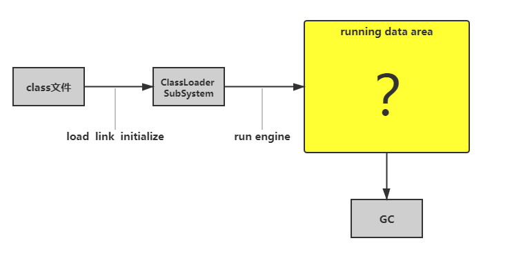

**面试题**：

- 说一说JVM的内存结构是什么样子的,每个区域放什么，各有什么特点？（快手、搜狐）

- JVM内存模型有哪些？（龙湖地产）

- JVM的内存模型，线程独有的放在哪里？哪些是线程共享的？哪些是线程独占的？（万达集团）

- 讲一下为什么JVM要分为堆、方法区等？原理是什么？（小米、搜狐）

- 讲讲JVM运行时数据库区  (字节跳动)

- JVM的内存布局以及垃圾回收原理及过程讲一下 (京东)

- 你能画出HotSpotVM内存结构图吗？

  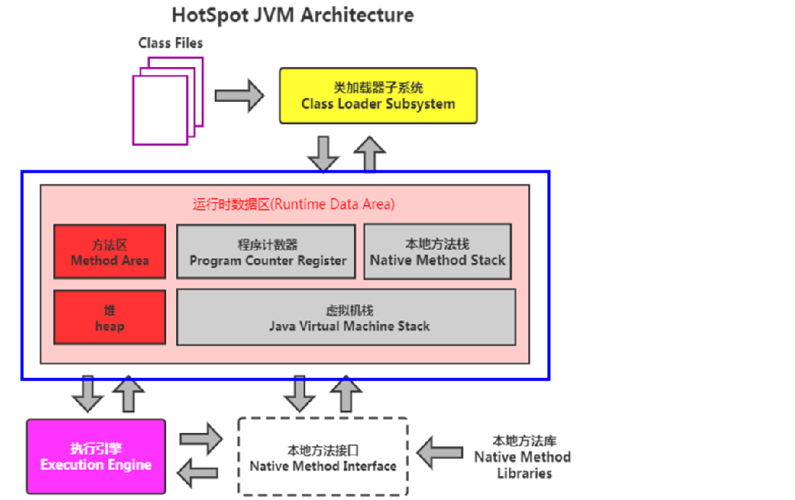

  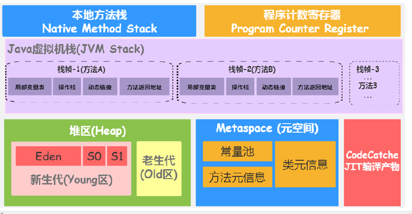

- 哪些内存结构与线程一一对应？

  Java虚拟机定义了若干种程序运行期间会使用到的运行时数据区，其中有一些会随着虚拟机启动而创建，随着虚拟机退出而销毁。另外一些则是与线程一一对应的，这些与线程对应的数据区域会随着线程开始和结束而创建和销毁。

# 2、程序计数器

> 面试题：JVM计数器如何记数（京东-物流）?

## 2.1、为什么需要它？

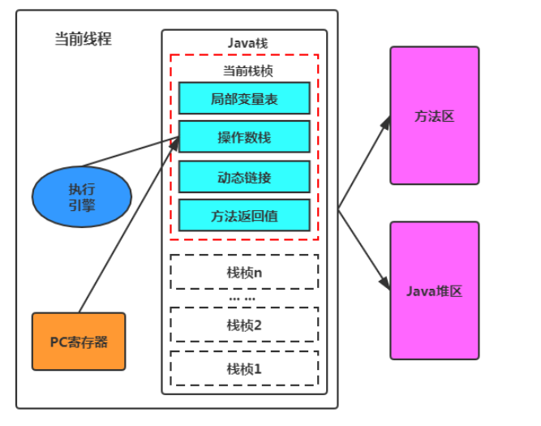

1. 为了保证程序(在操作系统中理解为进程)能够连续地执行下去，CPU必须具有某些手段来确定下一条指令的地址。而程序计数器正是起到这种作用，所以通常又称为**指令计数器**。
2. 在程序开始执行前，必须将它的起始地址，即程序的一条指令所在的内存单元地址送入PC，因此程序计数器（PC）的内容即是从内存提取的第一条指令的地址。当执行指令时，CPU将自动修改PC的内容，即每执行一条指令PC增加一个量，这个量等于指令所含的字节数，以便使其保持的总是将要执行的下一条指令的地址。
3. 由于大多数指令都是按顺序来执行的，所以修改的过程通常只是简单的对PC加1。 
4. 当程序转移时，转移指令执行的最终结果就是要改变PC的值，此PC值就是转去的地址，以此实现转移。有些机器中也称PC为**指令指针IP（Instruction Pointer）**。

**小结**：

- 它是程序控制流的指示器，分支、循环、跳转、异常处理、线程恢复等基础功能都需要依赖这个计数器来完成。
- **PC寄存器用来存储指向下一条指令的地址，也是即将要执行的指令代码。执行引擎的字节码解释器工作时就是通过改变这个计数器的值来选取下一条需要执行的字节码指令。**


> **为什么执行native方法时，是undefined？**

- 任何时间一个线程都只有一个方法在执行，也就是所谓的**当前方法**。程序计数器会存储当前线程正在执行的Java方法的JVM指令地址。
- **native 本地方法是大多是通过C语言实现，并未编译成需要执行的字节码指令，所以在计数器中当然是空（undefined）。**

## 2.2、案例

```java
public int test() {
    int x = 0;
    int y = 1;
    return x + y;
}
```

 对应的字节码：

```bash
public int test();
    descriptor: ()I
 
    flags: ACC_PUBLIC
 
    Code:
      stack=2, locals=3, args_size=1
         0: iconst_0
         1: istore_1
         2: iconst_1
         3: istore_2
         4: iload_1
         5: iload_2
         6: iadd
         7: ireturn
 
      LineNumberTable:
        line 7: 0
        line 8: 2
        line 9: 4
      LocalVariableTable:
        Start  Length  Slot  Name   Signature
 
            0       8     0  this   Lcom/alibaba/uc/TestClass;
            2       6     1     x   I
            4       4     2     y   I
```

字节码指令分析：

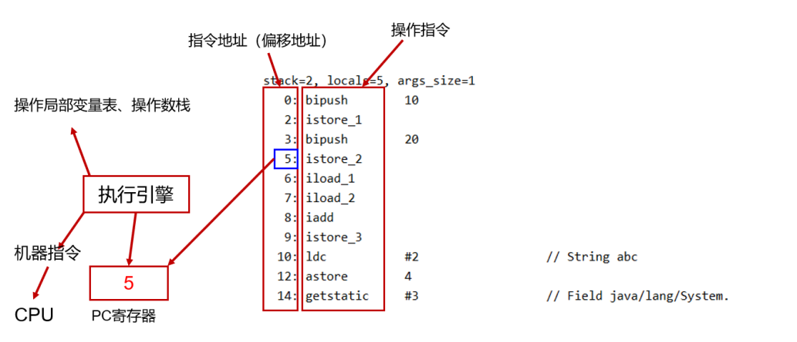

## 2.3、基本特征

JVM中的程序计数寄存器（Program Counter Register）中， Register 的命名源于CPU的寄存器，寄存器存储指令相关的现场信息。 CPU只有把数据装载到寄存器才能够运行。

这里，并非是广义上所指的物理寄存器，或许将其翻译为PC计数器（或指令计数器）会更加贴切(也称为程序钩子) ，并且也不容易引起一些不必要的误会。**JVM中的PC寄存器是对物理PC寄存器的一种抽象模拟。**

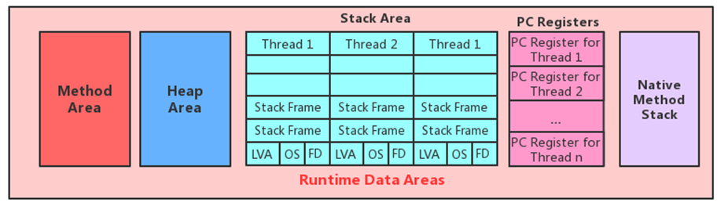

**总结**：

- 它是一块很小的内存空间，几乎可以忽略不记。也是运行速度最快的存储区域。不会随着程序的运行需要更大的空间。
- 在JVM规范中，每个线程都有它自己的程序计数器，是线程私有的，生命周期与线程的生命周期保持一致。
- **它是唯一一个在Java 虚拟机规范中没有规定任何OutOtMemoryError 情况的区域。**

## 2.4、两个问题

### 2.4.1、PC寄存器存储字节码指令地址有什么用？

因为CPU需要不停的切换各个线程，这时候切换回来以后，就得知道接着从哪开始继续执行。

JVM的字节码解释器就需要通过改变PC寄存器的值来明确下一条应该执行什么样的字节码指令。	

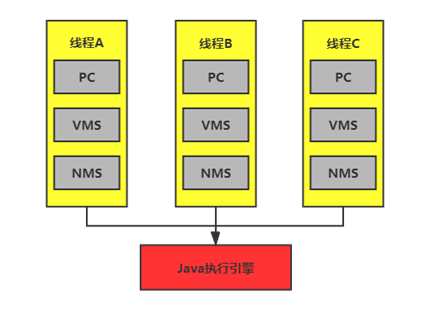

### 2.4.2、PC寄存器为什么被设定为线程私有的？

我们都知道所谓的多线程在一个特定的时间段内只会执行其中某一个线程的方法，CPU会不停地做任务切换，这样必然导致经常中断或恢复，如何保证分毫无差呢？**为了能够准确地记录各个线程正在执行的当前字节码指令地址，最好的办法自然是为每一个线程都分配一个PC寄存器**，这样一来各个线程之间便可以进行独立计算，从而不会出现相互干扰的情况。


# 3、虚拟机栈

## 3.1、概述

有不少Java开发人员一提到Java内存结构，就会非常粗粒度地将JVM中的内存区理解为仅有Java堆(heap)和Java栈(stack)？

**Java虚拟机栈是什么？**

- Java虚拟机栈（Java Virtual Machine Stack），早期也叫Java栈。每个线程在创建时都会创建一个虚拟机栈，其内部保存一个个的栈帧（Stack Frame），对应着一次次的Java方法调用。
- 是线程私有的

**生命周期：**

生命周期和线程一致。

**特点：**

栈是一种快速有效的分配存储方式，**访问速度仅次于程序计数器**。

### 3.1.1、如何理解栈管运行，堆管存储？

> 面试题：
>
> - 堆和栈的区别、谁的性能更高（艾绒软件）
> - 为什么要把堆和栈区分出来呢？栈中不是也可以存储数据吗？  (阿里)
>
> 解答思路：
>
> - 角度一：GC;OOM
> - 角度二：栈、堆执行效率
> - 角度三：内存大小；数据结构
> - 角度四：栈管运行；堆管存储。

**作用**

主管Java程序的运行，它保存方法的局部变量(8种基本数据类型、对象的引用地址)、部分结果，并参与方法的调用和返回。

- 局部变量 vs 成员变量(或属性)
- 基本数据变量  vs 引用类型变量（类、数组、接口）

即：栈解决程序的运行问题，即程序如何执行，或者说如何处理数据。堆解决的是数据存储的问题，即数据怎么放、放在哪儿。

### 3.1.2、栈存在GC吗?

不存在GC ; 存在OOM

### 3.1.3、可能抛出的异常？

> 面试题：
>
> - 什么情况下会发生栈内存溢出（360）
> - 栈存在内存溢出吗 (京东)
>
> 解答思路：
>
> - 局部数组过大。当函数内部的数组过大时，有可能导致堆栈溢出。
> - 递归调用层次太多。递归函数在运行时会执行压栈操作，当压栈次数太多时，也会导致堆栈溢出。

Java 虚拟机规范允许**Java栈的大小是动态的或者是固定不变的**。

- 如果采用固定大小的Java虚拟机栈，那每一个线程的Java虚拟机栈容量可以在线程创建的时候独立选定。如果线程请求分配的栈容量超过Java虚拟机栈允许的最大容量，Java虚拟机将会抛出一个 **StackOverflowError** 异常。
- 如果Java虚拟机栈可以动态扩展，并且在尝试扩展的时候无法申请到足够的内存，或者在创建新的线程时没有足够的内存去创建对应的虚拟机栈，那Java虚拟机将会抛出—个 OutOfMemoryError 异常。

### 3.1.4、如何设置栈内存大小？

> 面试题：Java中，栈的大小通过什么参数来设置？

**-Xss size (即：-XX:ThreadStackSize)**

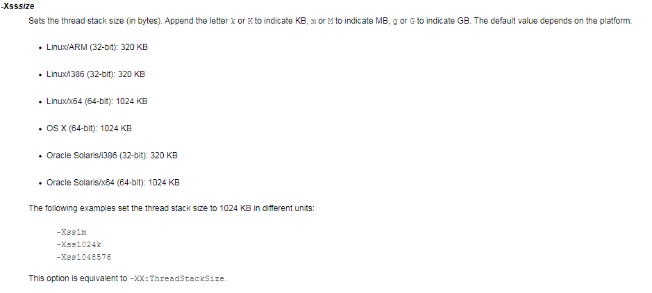

- 一般默认为512k-1024k，取决于操作系统。
- 栈的大小直接决定了函数调用的最大可达深度。
- 设置的栈空间值过大，会导致系统可以用于创建线程的数量减少。一般一个进程中通常有3000-5000个线程。

**默认值**

> [[实践总结] idea如何配置JVM启动参数(IntelliJ IDEA 2021.2.2)](https://blog.csdn.net/weixin_37646636/article/details/120530053)

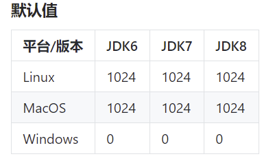

- jdk5.0之前，默认栈大小：256k
- jdk5.0之后，默认栈大小：1024k （linux\mac\windows)

## 3.2、栈的单位：栈帧（Stack Frame）

> 面试题：
>
> - 栈是如何运行的（OPPO）
>
> - VM有哪些组成，堆，栈各放了什么东西。（新浪）
> - 怎么理解栈、堆？堆中存什么？栈中存什么？  (阿里)

每个线程都有自己的栈，栈中的数据都是以**栈帧（Stack Frame）**的格式存在。

### 3.2.1、方法和栈帧的关系？

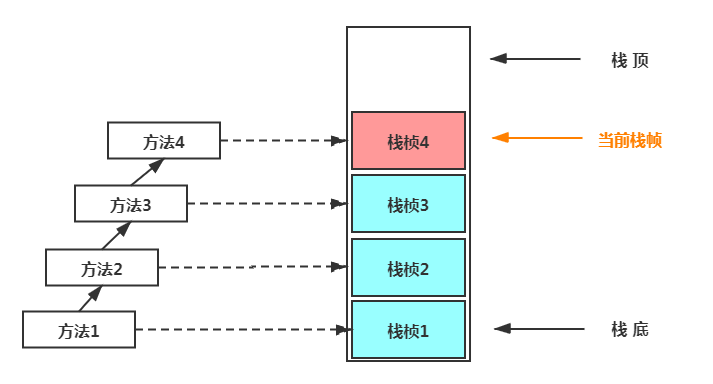

- 在这个线程上正在执行的每个方法都各自对应一个栈帧（Stack Frame）。

- 栈帧是一个内存区块，是一个数据集，维系着方法执行过程中的各种数据信息。

  

在一条活动线程中，一个时间点上，只会有一个活动的栈帧。即只有当前正在执行的方法的栈帧（栈顶栈帧）是有效的，这个栈帧被称为**当前栈帧（Current Frame）**，与当前栈帧相对应的方法就是**当前方法（Current Method）**，定义这个方法的类就是**当前类（Current Class）**。

如果在该方法中调用了其他方法，对应的新的栈帧会被创建出来，放在栈的顶端，成为新的当前帧。

**执行引擎运行的所有字节码指令只针对当前栈帧进行操作。**

### 3.2.2、栈的FILO原理?

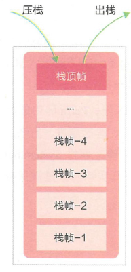

JVM直接对Java栈的操作只有两个：

- 每个方法执行，伴随着进栈(入栈、压栈)
- 执行结束后的出栈工作
- **遵循“先进后出”/“后进先出”原则**

**不同线程中所包含的栈帧是不允许存在相互引用**的，即不可能在一个栈帧之中引用另外一个线程的栈帧。

如果当前方法调用了其他方法，方法返回之际，当前栈帧会传回此方法的执行结果给前一个栈帧，接着，虚拟机会丢弃当前栈帧，使得前一个栈帧重新成为当前栈帧。

Java方法有两种返回函数的方式，**一种是正常的函数返回，使用return指令；另外一种是抛出异常。不管使用哪种方式，都会导致栈帧被弹出。**

## 3.3、栈桢内部结构

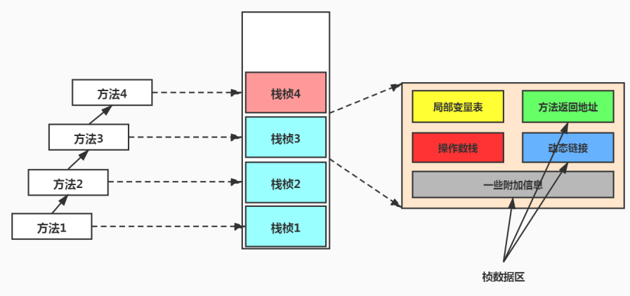

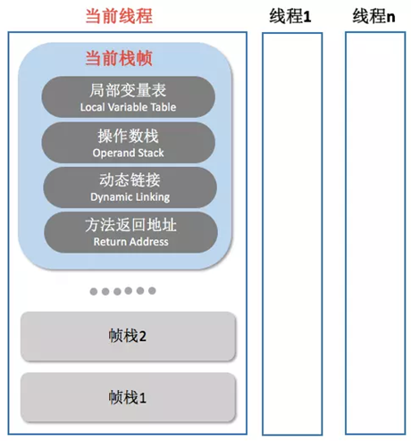

每个栈帧中存储着：

- 局部变量表（Local Variables）
- 操作数栈（Operand Stack）（或表达式栈）
- 动态链接(Dynamic Linking) （或指向运行时常量池的方法引用）
- 方法返回地址（Return Address）（或方法正常退出或者异常退出的定义）
- 一些附加信息

### 3.3.1、局部变量表（local variables)

- 局部变量表也被称之为局部变量数组或本地变量表
- **定义为一个数字数组，主要用于存储方法参数和定义在方法体内的局部变量**，这些数据类型包括各类基本数据类型(8种)、对象引用（reference），以及returnAddress类型。
- **局部变量表所需的容量大小是在编译期确定下来的**，并保存在方法的Code属性的**maximum local variables**数据项中。在方法运行期间是不会改变局部变量表的大小的。
- **方法嵌套调用的次数由栈的大小决定。**一般来说，栈越大，**方法嵌套调用次数越多**。对一个函数而言，它的参数和局部变量越多，使得局部变量表膨胀，它的栈帧就越大，以满足方法调用所需传递的信息增大的需求。进而函数调用就会占用更多的栈空间，导致其嵌套调用次数就会减少。
- **局部变量表中的变量只在当前方法调用中有效。**在方法执行时，虚拟机通过使用局部变量表完成参数值到参数变量列表的传递过程。**当方法调用结束后，随着方法栈帧的销毁，局部变量表也会随之销毁。**


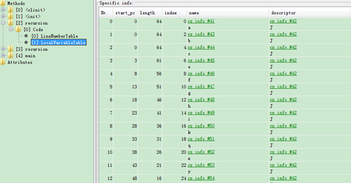

可以看到，在Class文件的局部变量表中，显示了每个局部变量的作用域范围、所在槽位的索引(index列)、变量名(name列)和数据类型(J表示long型)。

#### 3.3.1.1、存在线程安全问题吗？

由于局部变量表是建立在线程的栈上，是线程的私有数据，**因此不存在数据线程安全问题**。

#### 3.3.1.2、关于Slot的理解

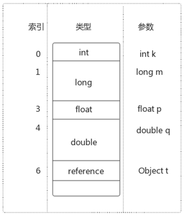

- 参数值的存放总是在局部变量数组的index为0开始，到数组长度-1的索引结束。
- 局部变量表，**最基本的存储单元是Slot（变量槽）**。
- 在局部变量表里，**32位以内的类型只占用一个slot（包括returnAddress类型），64位的类型（long和double)占用两个slot。**
  - byte 、short 、char 在存储前被转换为int，boolean 也被转换为int，0 表示false ，非0 表示true。
  - long 和double 则占据两个Slot。
- JVM会为局部变量表中的每一个Slot都分配一个访问索引，通过这个索引即可成功访问到局部变量表中指定的局部变量值。
- 当一个实例方法被调用的时候，它的方法参数和方法体内部定义的局部变量将会**按照顺序被复制**到局部变量表中的每一个Slot上
- **如果需要访问局部变量表中一个64bit的局部变量值时，只需要使用前一个索引即可。**(比如：访问long或double类型变量）
- 如果当前帧是由构造方法或者实例方法创建的，那么**该对象引用this将会存放在index为0的slot处**，其余的参数按照参数表顺序继续排列。

#### 3.3.1.3、Slot的重复利用举例？

**栈帧中的局部变量表中的槽位是可以重用的**，如果一个局部变量过了其作用域，那么在其作用域之后申明的新的局部变量就很有可能会复用过期局部变量的槽位，从而**达到节省资源的目的**。

```java
public void test4() {
    int a = 0;
    {
        int b = 0;
        b = a + 1;
    }
    //变量c的位置:复用了变量b的slot
    int c = a + 1;
}
```

局部变量表如下：

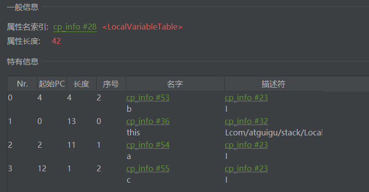

#### 3.3.1.4、静态变量与局部变量的对比

- 参数表分配完毕之后，再根据方法体内定义的变量的顺序和作用域分配。

- 我们知道类变量表有两次初始化的机会，第一次是在“**准备阶段**”，执行系统初始化，对类变量设置零值，另一次则是在“**初始化**”阶段，赋予程序员在代码中定义的初始值。

- 和类变量初始化不同的是，局部变量表不存在系统初始化的过程，这意味着一旦定义了局部变量则必须人为的初始化，否则无法使用。

  ```java
  public void test() {
      int i;
      System.out.println(i);
  }
  ```

  这样的代码是错误的，没有赋值不能够使用。

#### 3.3.1.5、与GC Roots的关系

**局部变量表中的变量也是重要的垃圾回收根节点，只要被局部变量表中直接或间接引用的对象都不会被回收。**


### 3.3.2、操作数栈（Operand Stack）

#### 3.3.2.1、概念

- 我们说Java虚拟机的**解释引擎是基于栈的执行引擎**，其中的栈指的就是操作数栈。
- 每一个独立的栈帧中除了包含局部变量表以外，还包含一个**后进先出**（Last-In-First-Out）的操作数栈，也可以称之为**表达式栈（Expression Stack）**。
- 操作数栈就是JVM执行引擎的一个工作区，当一个方法刚开始执行的时候，一个新的栈帧也会随之被创建出来，**这个方法的操作数栈是空的**。
- 每一个操作数栈都会拥有一个明确的栈深度用于存储数值，**其所需的最大深度在编译期就定义好了**，保存在方法的Code属性中，为**max_stack**的值。
- 栈中的任何一个元素都可以是任意的Java数据类型。
  - 32bit的类型占用一个栈单位深度
  - 64bit的类型占用两个栈单位深度
- **操作数栈，在方法执行过程中，根据字节码指令，并非采用访问索引的方式来进行数据访问的**，而是只能通过标准的入栈（push）和出栈（pop）操作，往栈中写入数据或提取数据来完成一次数据访问。
  - 某些字节码指令将值压入操作数栈，其余的字节码指令将操作数取出栈。使用它们后再把结果压入栈。比如：执行复制、交换、求和等操作
- **如果被调用的方法带有返回值的话，其返回值将会被压入当前栈帧的操作数栈中**，并更新PC寄存器中下一条需要执行的字节码指令。

**代码举例**：

```java
public void testAddOperation() {
    byte i = 15;
    int j = 8;
    int k = i + j;
}
```

字节码指令信息:

```bash
public void testAddOperation();
     Code:
     0: bipush        15
     2: istore_1
     3: bipush        8
     5: istore_2
     6: iload_1
     7: iload_2
     8: iadd
     9: istore_3
     10: return
```

- 操作数栈，**主要用于保存计算过程的中间结果**，同时作为计算过程中变量临时的存储空间。
- 操作数栈中元素的数据类型必须与字节码指令的序列严格匹配，这由编译器在编译器期间进行验证，同时在类加载过程中的类检验阶段的数据流分析阶段要再次验证。

#### 3.3.2.2、代码演示

```java
public void testAddOperation(){
    byte i = 15;
    int j = 8;
    int k = i + j;
}
```

 字节码分析：

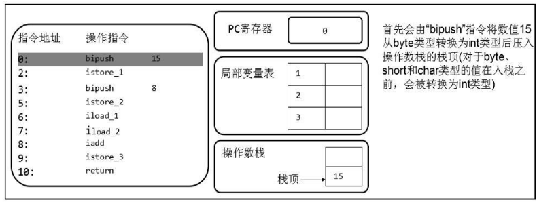

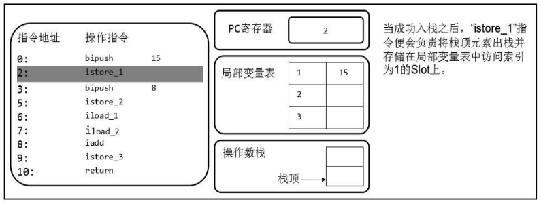

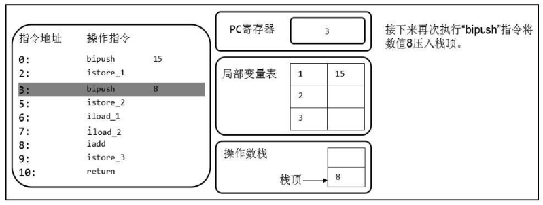

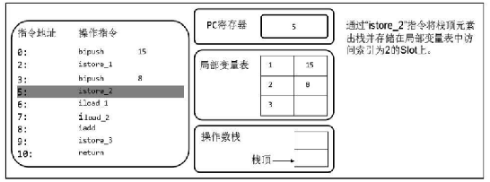

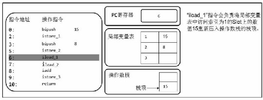

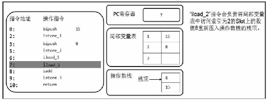

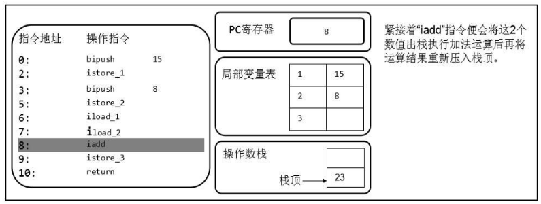

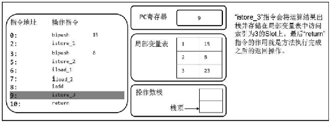

#### 3.3.2.3、何为栈顶缓存技术？

前面提过，基于栈式架构的虚拟机所使用的零地址指令更加紧凑，但完成一项操作的时候必然需要使用更多的入栈和出栈指令，这同时也就意味着将需要更多的指令分派（instruction dispatch）次数和内存读/写次数。

由于操作数是存储在内存中的，因此频繁地执行内存读/写操作必然会影响执行速度。为了解决这个问题，HotSpot JVM的设计者们提出了栈顶缓存（ToS，Top-of-Stack Cashing）技术，**将栈顶元素全部缓存在物理CPU的寄存器中**，以此降低对内存的读/写次数，提升执行引擎的执行效率。

### 3.3.3、动态链接

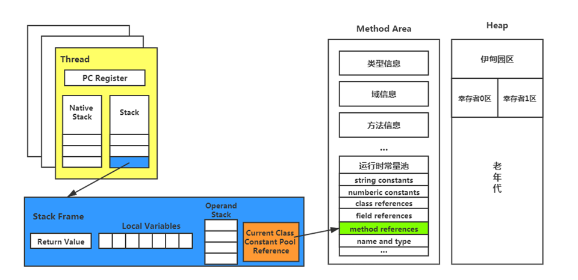

**动态链接（或指向运行时常量池的方法引用）**：

- 每一个栈帧内部都包含一个指向**运行时常量池**中**该栈帧所属方法的引用**。包含这个引用的目的就是为了支持当前方法的代码能够实现**动态链接（Dynamic Linking）**。比如：invokedynamic指令。
- 在Java源文件被编译到字节码文件中时，所有的变量和方法引用都作为符号引用（Symbolic Reference）保存在class文件的常量池里。比如：描述一个方法调用了另外的其他方法时，就是通过常量池中指向方法的符号引用来表示的，**那么动态链接的作用就是为了将这些符号引用转换为调用方法的直接引用**。

**举例**：

```java
public void testGetSum(){
    int i = getSum();
    int j = 10;
}
```

#### 3.3.3.1、为什么需要常量池呢？

常量池的作用，就是为了提供一些符号和常量，便于指令的识别。

#### 3.3.3.2、方法的调用

在JVM中，将符号引用转换为调用方法的直接引用与方法的绑定机制相关。

- **静态链接**

  当一个字节码文件被装载进JVM内部时，如果被调用的**目标方法在编译期可知**，且运行期保持不变时。这种情况下将调用方法的符号引用转换为直接引用的过程称之为静态链接。

- **动态链接**
  如果**被调用的方法在编译期无法被确定下来**，也就是说，只能够在程序运行期将调用方法的符号引用转换为直接引用，由于这种引用转换过程具备动态性，因此也就被称之为动态链接。

  对应的方法的绑定机制为：早期绑定（Early Binding）和晚期绑定（Late Binding）。**绑定是一个字段、方法或者类在符号引用被替换为直接引用的过程，这仅仅发生一次。**

- **早期绑定**
  早期绑定就是指被调用的**目标方法如果在编译期可知，且运行期保持不变时**，即可将这个方法与所属的类型进行绑定，这样一来，由于明确了被调用的目标方法究竟是哪一个，因此也就可以使用静态链接的方式将符号引用转换为直接引用。

- **晚期绑定**

  如果**被调用的方法在编译期无法被确定下来，只能够在程序运行期根据实际的类型绑定相关的方法**，这种绑定方式也就被称之为晚期绑定。


**虚方法与非虚方法**

随着高级语言的横空出世，类似于Java一样的基于面向对象的编程语言如今越来越多，尽管这类编程语言在语法风格上存在一定的差别，但是它们彼此之间始终保持着一个共性，那就是都支持封装、继承和多态等面向对象特性，既然**这一类的编程语言具备多态特性，那么自然也就具备早期绑定和晚期绑定两种绑定方式**。

Java中任何一个普通的方法其实都具备虚函数的特征，它们相当于C++语言中的虚函数（C++中则需要使用关键字virtual来显式定义）。如果在Java程序中不希望某个方法拥有虚函数的特征时，则可以使用关键字**final**来标记这个方法。

非虚方法：

- 如果方法在编译期就确定了具体的调用版本，这个版本在运行时是不可变的。这样的方法称为非虚方法。
- 静态方法、私有方法、final方法、实例构造器、父类方法都是非虚方法。
- 其他方法称为虚方法。

子类对象的多态性的使用前提：① 类的继承关系 ② 方法的重写 

在类加载的解析阶段就可以进行解析，如下是非虚方法举例：

```java
class Father {
    public static void print(String str) {
        System.out.println("father " + str);
    }
    private void show(String str) {
        System.out.println("father " + str);
    }
}
class Son extends Father {
}
public class VirtualMethodTest {
    public static void main(String[] args) {
        Son.print("coder");
        //Father fa = new Father();
        //fa.show("atguigu.com");
    }
}
```

虚拟机中提供了以下几条方法调用指令：

- 普通调用指令：
      1. **invokestatic：调用静态方法，解析阶段确定唯一方法版本**
      2. **invokespecial：调用\<init>方法、私有及父类方法，解析阶段确定唯一方法版本**
      3. invokevirtual：调用所有虚方法
      4. invokeinterface：调用接口方法

- 动态调用指令：
  5. invokedynamic：动态解析出需要调用的方法，然后执行


前四条指令固化在虚拟机内部，方法的调用执行不可人为干预，而invokedynamic指令则支持由用户确定方法版本。其中**invokestatic指令和invokespecial指令调用的方法称为非虚方法，其余的（final修饰的除外）称为虚方法**。


关于invokedynamic指令:

- JVM字节码指令集一直比较稳定，一直到Java7中才增加了一个invokedynamic指令，这是**Java为了实现『动态类型语言』支持而做的一种改进**。
- 但是在Java7中并没有提供直接生成invokedynamic指令的方法，需要借助ASM这种底层字节码工具来产生invokedynamic指令。直到Java8的Lambda表达式的出现，invokedynamic指令的生成，在Java**中才有了直接的生成方式**。
- Java7中增加的动态语言类型支持的本质是对Java虚拟机规范的修改，而不是对Java语言规则的修改，这一块相对来讲比较复杂，增加了虚拟机中的方法调用，最直接的受益者就是运行在Java平台的动态语言的编译器。


动态类型语言和静态类型语言:

动态类型语言和静态类型语言两者的区别就在于对类型的检查是在编译期还是在运行期，满足前者就是静态类型语言，反之是动态类型语言。

说的再直白一点就是，**静态类型语言是判断变量自身的类型信息；动态类型语言是判断变量值的类型信息，变量没有类型信息，变量值才有类型信息**，这是动态语言的一个重要特征。

```bash
Java: String info = “atguigu”; //info = atguigu;
JS：var name = “shkstart”; var name = 10;
Python: info = 130.5;
```


```java
/**
 * 关于invokedynamic指令
 * @author shkstart
 * @create 2020 下午 12:11
 */
interface Func {
    public boolean func(String str);
}
public class Lambda {
    public void lambda(Func func) {
        return;
    }

    public static void main(String[] args) {
        Lambda lambda = new Lambda();
        Func func = s -> {
            return true;
        };
        lambda.lambda(func);

        lambda.lambda(s -> {
            return true;
        });
    }
}
```


**方法重写的本质**

> IllegalAccessError介绍：
> 程序试图访问或修改一个属性或调用一个方法，这个属性或方法，你没有权限访问。一般的，这个会引起编译器异常。这个错误如果发生在运行时，就说明一个类发生了不兼容的改变。

- 找到操作数栈顶的第一个元素所执行的对象的实际类型，记作 C。
- 如果在过程结束；如果不通类型 C 中找到与常量中的描述符合简单名称都相符的方法，则进行访问权限校验，如果通过则返回这个方法的直接引用，查找过，则返回 java.lang.IllegalAccessError 异常。
- 否则，按照继承关系从下往上依次对 C 的各个父类进行第 2 步的搜索和验证过程。
- 如果始终没有找到合适的方法，则抛出 java.lang.AbstractMethodError异常。


**虚方法表**

- 在面向对象的编程中，会很频繁的使用到动态分派，如果在每次动态分派的过程中都要重新在类的方法元数据中搜索合适的目标的话就可能影响到执行效率。因此，**为了提高性能**，JVM采用在类的方法区建立一个**虚方法表（virtual method table）(非虚方法不会出现在表中)来实现。使用索引表来代替查找**。

- 每个类中都有一个虚方法表，表中存放着各个方法的实际入口。

- 那么虚方法表什么时候被创建？

  虚方法表会在类加载的链接阶段被创建并开始初始化，类的变量初始值准备完成之后，JVM会把该类的方法表也初始化完毕。

**举例1：**

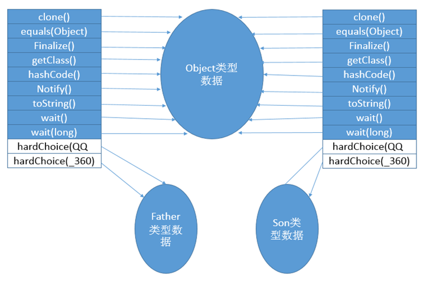

**举例2：**

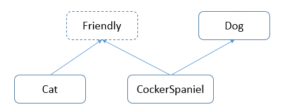

Dog虚方法表:

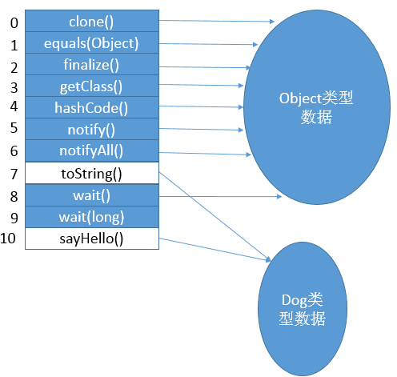

CockerSpaniel虚方法表:


Cat虚方法表:

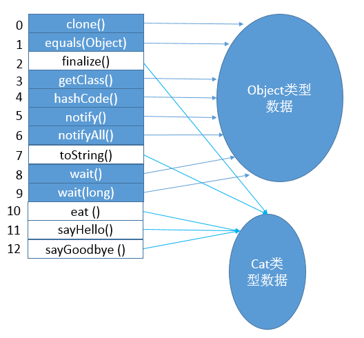

### 3.3.4、方法返回地址

- 存放调用该方法的pc寄存器的值。
- 一个方法的结束，有两种方式：
  - 正常执行完成
  - 出现未处理的异常，非正常退出
- 无论通过哪种方式退出，在方法退出后都返回到该方法被调用的位置。方法正常退出时，**调用者的pc计数器的值作为返回地址，即调用该方法的指令的下一条指令的地址**。而通过异常退出的，返回地址是要通过异常表来确定，栈帧中一般不会保存这部分信息。


当一个方法开始执行后，只有两种方式可以退出这个方法：

1、执行引擎遇到任意一个方法返回的字节码指令（return），会有返回值传递给上层的方法调用者，**简称正常完成出口**；

- 一个方法在正常调用完成之后究竟需要使用哪一个返回指令还需要根据方法返回值的实际数据类型而定。
- 在字节码指令中，返回指令包含ireturn（当返回值是boolean、byte、char、short和int类型时使用）、lreturn、freturn、dreturn以及areturn，另外还有一个return指令供声明为void的方法、实例初始化方法、类和接口的初始化方法使用。

2、在方法执行的过程中遇到了异常（Exception），并且这个异常没有在方法内进行处理，也就是只要在本方法的异常表中没有搜索到匹配的异常处理器，就会导致方法退出。简称**异常完成出口**。

方法执行过程中抛出异常时的异常处理，存储在一个异常处理表，方便在发生异常的时候找到处理异常的代码。

```bash
Exception table:
from to   target  type
4    16   19      any
19   21   19      any
```

本质上，方法的退出就是当前栈帧出栈的过程。此时，需要恢复上层方法的局部变量表、操作数栈、将返回值压入调用者栈帧的操作数栈、设置PC寄存器值等，让调用者方法继续执行下去。

**正常完成出口和异常完成出口的区别在于：通过异常完成出口退出的不会给他的上层调用者产生任何的返回值。**

### 3.3.5、一些附加信息

栈帧中还允许携带与Java虚拟机实现相关的一些附加信息。例如，对程序调试提供支持的信息。

## 3.4、问题小结与拓展

### 问题一：栈溢出的情况?

栈溢出:StackOverflowError;
举个简单的例子:在main方法中调用main方法,就会不断压栈执行,直到栈溢出;
栈的大小可以是固定大小的,也可以是动态变化（动态扩展）的。
如果是固定的,可以通过-Xss设置栈的大小;
如果是动态变化的,当栈大小到达了整个内存空间不足了,就是抛出OutOfMemory异常(java.lang.OutOfMemoryError)

### 问题二：调整栈大小,就能保证不出现溢出吗?

不能。因为调整栈大小,只会减少出现溢出的可能,栈大小不是可以无限扩大的,所以不能保证不出现溢出

### 问题三：分配的栈内存越大越好吗?

不是,因为增加栈大小，会造成每个线程的栈都变的很大,使得一定的栈空间下,能创建的线程数量会变小

### 问题四：垃圾回收是否会涉及到虚拟机栈?

不会;垃圾回收只会涉及到方法区和堆中,方法区和堆也会存在溢出的可能;
程序计数器,只记录运行下一行的地址,不存在溢出和垃圾回收;
虚拟机栈和本地方法栈,都是只涉及压栈和出栈,可能存在栈溢出,不存在垃圾回收。

### 问题五：方法中定义的局部变量是否线程安全?

具体问题具体分析,见分析代码:

```java
/**方法中定义的局部变量是否线程安全?   具体问题具体分析
 * @author shkstart
 * @create 15:53
 */
public class LocalVariableThreadSafe {
    //s1的声明方式是线程安全的,因为线程私有，在线程内创建的s1 ，不会被其它线程调用
    public static void method1() {
        //StringBuilder:线程不安全
        StringBuilder s1 = new StringBuilder();
        s1.append("a");
        s1.append("b");
        //...
    }

    //stringBuilder的操作过程：是线程不安全的，
    // 因为stringBuilder是外面传进来的，有可能被多个线程调用
    public static void method2(StringBuilder stringBuilder) {
        stringBuilder.append("a");
        stringBuilder.append("b");
        //...
    }

    //stringBuilder的操作：是线程不安全的；因为返回了一个stringBuilder，
    // stringBuilder有可能被其他线程共享
    public static StringBuilder method3() {
        StringBuilder stringBuilder = new StringBuilder();
        stringBuilder.append("a");
        stringBuilder.append("b");
        return stringBuilder;
    }

    //stringBuilder的操作：是线程安全的；因为返回了一个stringBuilder.toString()相当于new了一个String，
    // 所以stringBuilder没有被其他线程共享的可能
    public static String method4() {
        StringBuilder stringBuilder = new StringBuilder();
        stringBuilder.append("a");
        stringBuilder.append("b");
        return stringBuilder.toString();

        /**
         * 结论：如果局部变量在内部产生并在内部消亡的，那就是线程安全的
         */
    }
}
```


# 4、本地方法接口与本地方法栈

## 4.1、什么是本地方法?

>  "A native method is a Java method whose implementation is provided by non-java code."

简单地讲，**一个Native Method就是一个Java调用非Java代码的接口**。一个Native Method是这样一个Java方法：该方法的实现由非Java语言实现，比如C。这个特征并非Java所特有，很多其它的编程语言都有这一机制，比如在C++中，你可以用extern "C"告知C++编译器去调用一个C的函数。

在定义一个native method时，并不提供实现体（有些像定义一个Java interface），因为其实现体是由非java语言在外面实现的。

本地接口的作用是融合不同的编程语言为Java所用，它的初衷是融合 C/C++程序。

**举例1：**

```java
public class IHaveNatives{
      public native void methodNative1( int x ) ;
      public native static long methodNative2() ;
      private native synchronized float methodNative3( Object o ) ;
      native void methodNative4( int[] ary ) throws Exception ;
} 
```

**举例2：**

```java
System.currentTimeMillis()
```

**举例3：**

Thread类的start()内部。

**标识符native可以与所有其它的java标识符连用，但是abstract除外。**

## 4.2、为什么要使用Native Method？

Java使用起来非常方便，然而有些层次的任务用Java实现起来不容易，或者我们对程序的效率很在意时，问题就来了。

**与Java环境外交互**：

**有时Java应用需要与Java外面的环境交互，这是本地方法存在的主要原因。**你可以想想Java需要与一些底层系统，如操作系统或某些硬件交换信息时的情况。本地方法正是这样一种交流机制：它为我们提供了一个非常简洁的接口，而且我们无需去了解Java应用之外的繁琐的细节。

**与操作系统交互**：
JVM支持着Java语言本身和运行时库，它是Java程序赖以生存的平台，它由一个解释器（解释字节码）和一些连接到本地代码的库组成。然而不管怎样，它毕竟不是一个完整的系统，它经常依赖于一些底层系统的支持。这些底层系统常常是强大的操作系统。通过使用本地方法，我们得以用Java实现了jre的与底层系统的交互，甚至JVM的一些部分就是用C写的。还有，如果我们要使用一些Java语言本身没有提供封装的操作系统的特性时，我们也需要使用本地方法。

**Sun's Java**
Sun的解释器是用C实现的，这使得它能像一些普通的C一样与外部交互。jre大部分是用Java实现的，它也通过一些本地方法与外界交互。例如：类java.lang.Thread 的 setPriority()方法是用Java实现的，但是它实现调用的是该类里的本地方法setPriority0()。这个本地方法是用C实现的，并被植入JVM内部，在Windows 95的平台上，这个本地方法最终将调用Win32 SetPriority() API。这是一个本地方法的具体实现由JVM直接提供，更多的情况是本地方法由外部的动态链接库（external dynamic link library）提供，然后被JVM调用。

## 4.3、本地方法现状?

**目前该方法使用的越来越少了，除非是与硬件有关的应用**，比如通过Java程序驱动打印机或者Java系统管理生产设备，在企业级应用中已经比较少见。因为现在的异构领域间的通信很发达，比如可以使用Socket通信，也可以使用Web Service等等，不多做介绍。

## 4.4、本地方法栈

- **Java虚拟机栈用于管理Java方法的调用，而本地方法栈用于管理本地方法的调用。**

- 本地方法栈，也是线程私有的。

- 允许被实现成固定或者是可动态扩展的内存大小。（在内存溢出方面是相同的）

  - 如果线程请求分配的栈容量超过本地方法栈允许的最大容量，Java虚拟机将会抛出一个 StackOverflowError 异常。
  - 如果本地方法栈可以动态扩展，并且在尝试扩展的时候无法申请到足够的内存，或者在创建新的线程时没有足够的内存去创建对应的本地方法栈，那么Java虚拟机将会抛出一个 OutOfMemoryError 异常。

- 本地方法是使用C语言实现的。

- 它的具体做法是Native Method Stack中登记native方法，在Execution Engine 执行时加载本地方法库。

  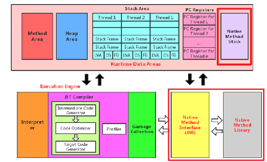

- **当某个线程调用一个本地方法时，它就进入了一个全新的并且不再受虚拟机限制的世界。它和虚拟机拥有同样的权限**。

  - 本地方法可以通过本地方法接口来访问虚拟机内部的运行时数据区。
  - 它甚至可以直接使用本地处理器中的寄存器
  - 直接从本地内存的堆中分配任意数量的内存。

- **并不是所有的JVM都支持本地方法。因为Java虚拟机规范并没有明确要求本地方法栈的使用语言、具体实现方式、数据结构等**。如果JVM产品不打算支持native方法，也可以无需实现本地方法栈。

# 5、堆

## 5.1、核心概述

- 一个JVM实例只存在一个堆内存，堆也是Java内存管理的核心区域。
- Java 堆区在JVM启动的时候即被创建，其空间大小也就确定了。是JVM管理的最大一块内存空间。
- 堆内存的大小是可以调节的。
- 《Java虚拟机规范》规定，堆可以处于**物理上不连续**的内存空间中，但在**逻辑上**它应该被视为**连续的**。
- 堆，是GC ( Garbage Collection，垃圾收集器）执行垃圾回收的重点区域。
- 在方法结束后，堆中的对象不会马上被移除，仅仅在垃圾收集的时候才会被移除。

### 5.1.1、对象都分配在堆上？

- 《Java虚拟机规范》中对Java堆的描述是：所有的对象实例以及数组都应当在运行时分配在堆上。（The heap is the run-time data area from which memory for all class instances and arrays is allocated ) 数组和对象可能永远不会存储在栈上，因为栈帧中保存引用，这个引用指向对象或者数组在堆中的位置。

- 说的是：“几乎”所有的对象实例都在这里分配内存。——从实际使用角度看的。

- 举例：

  ```java
  public class SimpleHeap {
      private int id;
  
      public SimpleHeap(int id) {
          this.id = id;
      }
  
      public void show() {
          System.out.println("My ID is " + id);
      }
  
      public static void main(String[] args) {
          SimpleHeap sl = new SimpleHeap(1);
          SimpleHeap s2 = new SimpleHeap(2);
      }
  }
  ```

  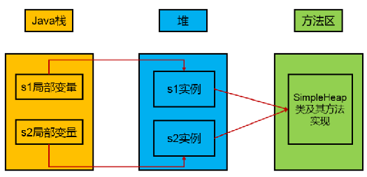

### 5.2.2、所有的线程都共享堆？

所有的线程共享Java堆，在这里还可以划分线程私有的缓冲区（Thread Local Allocation Buffer, TLAB)。

## 5.2、堆的内部结构

> 面试题：
> JVM内存为什么要分成新生代，老年代，持久代。新生代中为什么要分为Eden和Survivor（字节跳动）
> 堆里面的分区：Eden，survival （from+ to），老年代，各自的特点。（京东-物流）
> 堆的结构？为什么两个survivor区？  (蚂蚁金服)
> JVM的内存结构，Eden和Survivor比例。  (京东)

现代垃圾收集器大部分都基于分代收集理论设计，堆空间细分为：

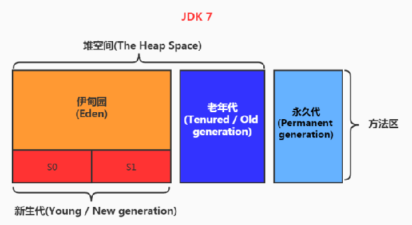

Java 7及之前堆内存逻辑上分为三部分：新生区+养老区+**永久区**

- Young Generation Space   新生区      Young/New
  - 又被划分为Eden区和Survivor区
- Tenure generation space  养老区      Old/Tenure
- Permanent Space          永久区      Perm

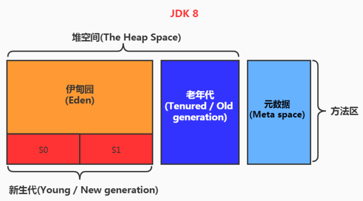

Java 8及之后堆内存逻辑上分为三部分：新生区+养老区+**元空间**

- Young Generation Space    新生区      Young/New
  - 又被划分为Eden区和Survivor区
- Tenure generation space   养老区      Old/Tenure
- Meta Space                元空间      Meta

**约定：**
新生区<=>新生代<=>年轻代  

养老区<=>老年区<=>老年代  

永久区<=>永久代

**年轻代与老年代：**

- 存储在JVM中的Java对象可以被划分为两类：
  - 一类是生命周期较短的瞬时对象，这类对象的创建和消亡都非常迅速
  - 另外一类对象的生命周期却非常长，在某些极端的情况下还能够与JVM的生命周期保持一致。

- Java堆区进一步细分的话，可以划分为年轻代（YoungGen）和老年代（OldGen）

- 其中年轻代又可以划分为Eden空间、Survivor0空间和Survivor1空间（有时也叫做from区、to区）。

  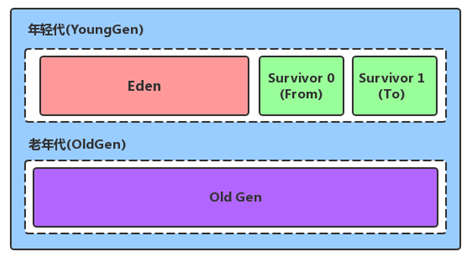

- **几乎所有**的Java对象都是在Eden区被new出来的。

- 绝大部分的Java对象的销毁都在新生代进行了。

  - IBM 公司的专门研究表明，新生代中 80% 的对象都是“朝生夕死”的。


## 5.3、如何设置堆内存大小？

> 面试题
>
> - 堆大小通过什么参数设置？  (阿里)
> - 初始堆大小和最大堆大小一样，问这样有什么好处？（亚信）
> - JVM中最大堆大小有没有限制？ (阿里)

- Java堆区用于存储Java对象实例，那么堆的大小在JVM启动时就已经设定好了，大家可以通过选项”-Xmx”和”-Xms”来进行设置。
  - “-Xms”用于表示堆区的起始内存，等价于-XX:InitialHeapSize
  - “-Xmx”则用于表示堆区的最大内存，等价于-XX:MaxHeapSize
- 一旦堆区中的内存大小超过“-Xmx”所指定的最大内存时，将会抛出OutOfMemoryError:heap异常。
- 通常会将 -Xms 和 -Xmx两个参数配置相同的值，其**目的是为了能够在java垃圾回收机制清理完堆区后不需要重新分隔计算堆区的大小，从而提高性能**。
- heap默认最大值计算方式：如果物理内存少于192M,那么heap最大值为物理内存的一半。如果物理内存大于等于1G，**那么heap的最大值为物理内存的1/4**。
- heap默认最小值计算方式：最少不得少于8M，如果物理内存大于等于1G，那么**默认值为物理内存的1/64**，即1024/64=16M。最小堆内存在jvm启动的时候就会被初始化。

> 关于堆空间的大小，从官网取下来说明：
> On Oracle Solaris 7 and Oracle Solaris 8 SPARC platforms, the upper limit for this value is approximately 4,000 MB minus overhead amounts. On Oracle Solaris 2.6 and x86 platforms, the upper limit is approximately 2,000 MB minus overhead amounts. On Linux platforms, the upper limit is approximately 2,000 MB minus overhead amounts.

另：对于32位虚拟机，如果物理内存等于4G，那么堆内存可以达到1G。对于64位虚拟机，如果物理内存为128G，那么heap最多可以达到32G。

### 5.3.1、如何设置新生代与老年代比例？

下面这参数开发中一般不会调：

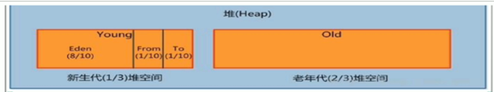

- 配置新生代与老年代在堆结构的占比。
  - 默认-XX:NewRatio=2，表示新生代占1，老年代占2，新生代占整个堆的1/3
  
    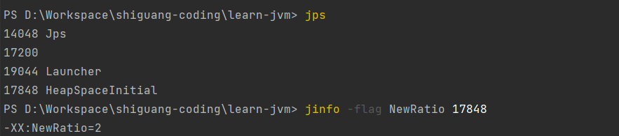
  
  - 可以修改-XX:NewRatio=4，表示新生代占1，老年代占4，新生代占整个堆的1/5
  
- 可以使用选项”**-Xmn**”设置新生代最大内存大小
  - 这个参数一般使用默认值就可以了。

### 5.3.2、如何设置Eden、幸存者区比例？

- 在HotSpot中，Eden空间和另外两个Survivor空间缺省所占的比例是8:1:1

- 当然开发人员可以通过选项“-XX:SurvivorRatio”调整这个空间比例。比如-XX:SurvivorRatio=8

  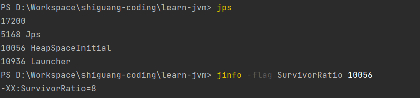

### 5.3.3、OOM举例

```java

/**
 * 测试OOM
 *
 * -Xms600m -Xmx600m
 * @author shkstart  shkstart@126.com
 * @create 2020  21:12
 */
public class OOMTest {
    public static void main(String[] args) {
        ArrayList<Picture> list = new ArrayList<Picture>();
        while(true){
            try {
                Thread.sleep(10);
            } catch (InterruptedException e) {
                e.printStackTrace();
            }
            list.add(new Picture(new Random().nextInt(1024 * 1024)));
        }
    }
}

class Picture{
    private byte[] pixels;

    public Picture(int length) {
        this.pixels = new byte[length];
    }
}
```

**IDEA配置：**

鼠标右键 -> More Run/Debug -> Modify Run Configuration...


也可以通过 Run -> Edit Configurations... 进行设置，选择当前正在运行的JAVA程序


添加VM配置

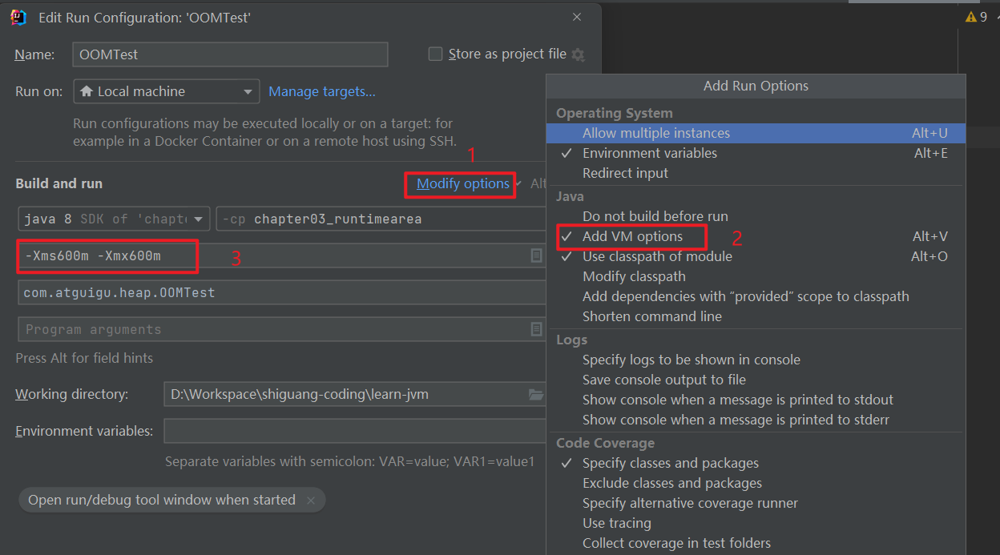


**VisualVM插件安装:**

Tools -> Plugins

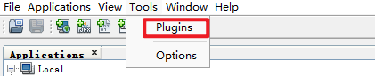

Available Plugine 找到 Visual Gc -> Install，按照后重启即可

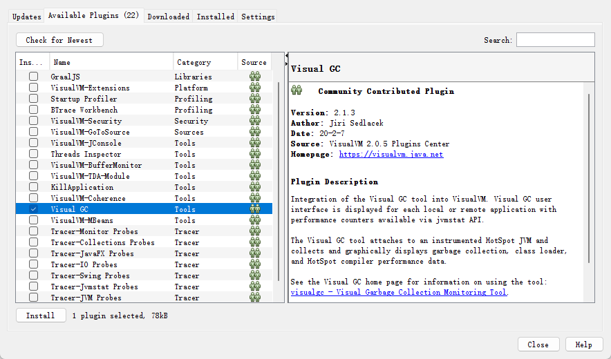

运行JAVA程序，监控内存状态

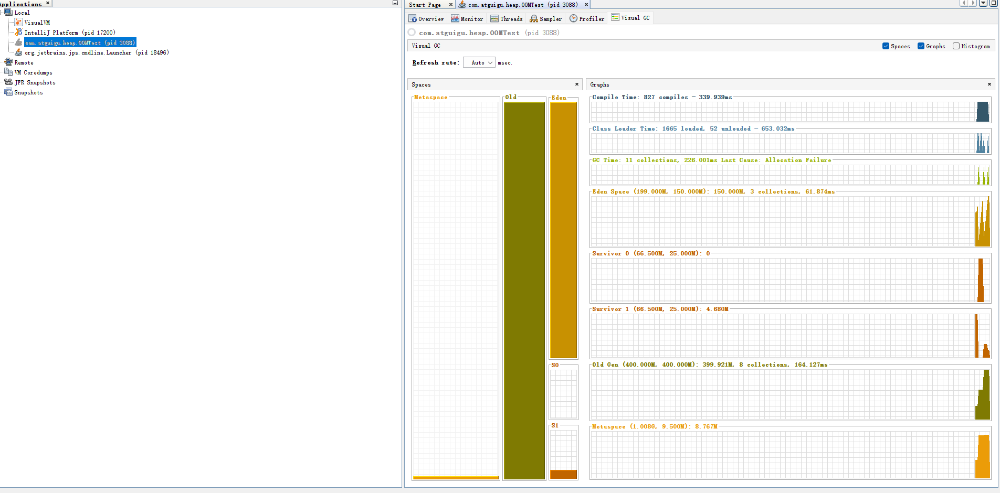

可以看到，Eden区和Survivor的比例不是默认的8：1：1，而是6：1：1，可通过添加`-XX:SurvivorRatio=8`参数进行调整。

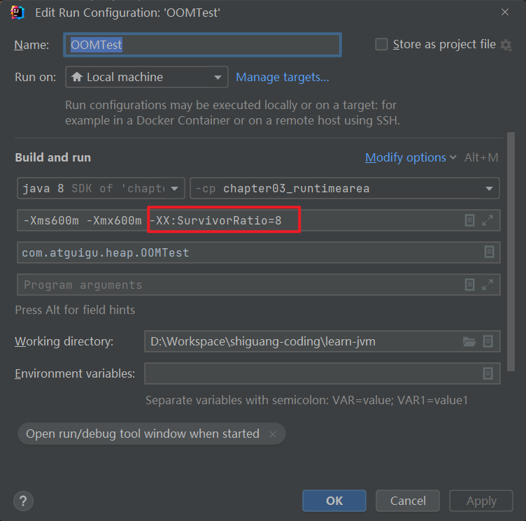

调整后如下：

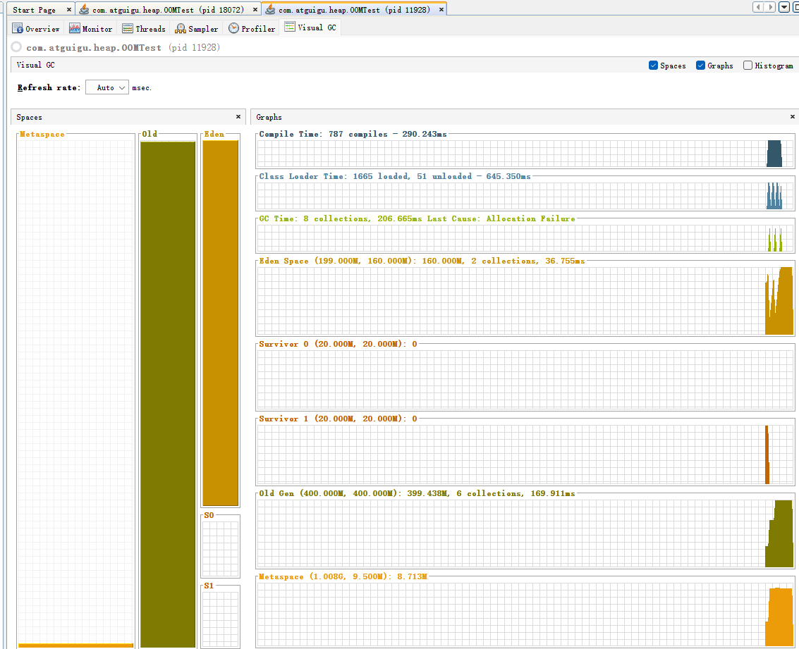


报错如下：
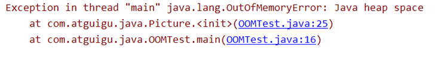

### 5.3.4、参数设置小结

> 面试题：什么是空间分配担保策略？

#### **-Xms -Xmx**

堆空间大小的设置： 
-Xms:初始内存 （默认为物理内存的1/64）；
-Xmx:最大内存（默认为物理内存的1/4）；

**举例：**

```java
/**
 * -Xms10m -Xmx10m
 *
 * @author shkstart
 * @create 2020 上午 10:48
 */
public class HeapSpaceTest {
    public static void main(String[] args) {
        String str = "atguigu";
        List<String> list = new ArrayList<>();
        try {
            while(true){

                str +=  UUID.randomUUID().toString();
                list.add(str);
            }
        } catch (Throwable e) {
            e.printStackTrace();
            System.out.println(list.size());
        }
    }
}
```

报错如下：
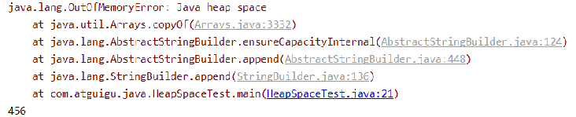


#### -Xmn

设置新生代的大小。(初始值及最大值)
通常默认即可。

#### -XX:NewRatio

配置新生代与老年代在堆结构的占比。赋的值即为老年代的占比，剩下的1给新生代
默认-XX:NewRatio=2，表示新生代占1，老年代占2，新生代占整个堆的1/3
-XX:NewRatio=4，表示新生代占1，老年代占4，新生代占整个堆的1/5

#### -XX:SurvivorRatio

- 在HotSpot中，Eden空间和另外两个Survivor空间缺省所占的比例是8：1
- 开发人员可以通过选项“-XX:SurvivorRatio”调整这个空间比例。比如-XX:SurvivorRatio=8

#### -XX:MaxTenuringThreshold

- 设置新生代垃圾的最大年龄。超过此值，仍未被回收的话，则进入老年代。
- 默认值为15
- -XX:MaxTenuringThreshold=0：表示年轻代对象不经过Survivor区，直接进入老年代。对于老年代比较多的应用，可以提高效率。
- 如果将此值设置为一个较大值，则年轻代对象会在Survivor区进行多次复制，这样可以增加对象在年轻代的存活时间，增加在年轻代即被回收的概率。

#### -XX:+PrintGCDetails

输出详细的GC处理日志


显示如下：

```bash
Heap
 PSYoungGen      total 9728K, used 2497K [0x00000000fd580000, 0x00000000fe000000, 0x0000000100000000)
  eden space 8704K, 28% used [0x00000000fd580000,0x00000000fd7f06e8,0x00000000fde00000)
  from space 1024K, 0% used [0x00000000fdf00000,0x00000000fdf00000,0x00000000fe000000)
  to   space 1024K, 0% used [0x00000000fde00000,0x00000000fde00000,0x00000000fdf00000)
 ParOldGen       total 22016K, used 0K [0x00000000f8000000, 0x00000000f9580000, 0x00000000fd580000)
  object space 22016K, 0% used [0x00000000f8000000,0x00000000f8000000,0x00000000f9580000)
 Metaspace       used 3511K, capacity 4498K, committed 4864K, reserved 1056768K
  class space    used 388K, capacity 390K, committed 512K, reserved 1048576K
```

#### -XX:HandlePromotionFailure

在发生Minor GC之前，虚拟机会检查老年代最大可用的连续空间是否大于新生代所有对象的总空间，

- 如果大于，则此次Minor GC是安全的
-  如果小于，则虚拟机会查看-XX:HandlePromotionFailure设置值是否允许担保失败。
- 如果HandlePromotionFailure =true，那么会继续检查老年代最大可用连续空间是否大于历次晋升到老年代的对象的平均大小，如果大于，则尝试进行一次Minor GC，但这次Minor GC依然是有风险的；如果小于或者HandlePromotionFailure=false，则改为进行一次Full GC。

在JDK 6 Update 24之后，HandlePromotionFailure参数不会再影响到虚拟机的空间分配担保策略，观察OpenJDK中的源码变化，虽然源码中还定义了HandlePromotionFailure参数，但是在代码中已经不会再使用它。JDK 6 Update 24之后的规则变为只要老年代的连续空间大于新生代对象总大小或者历次晋升的平均大小就会进行Minor GC，否则将进行Full GC。

#### -XX:+PrintFlagsFinal

查看所有的参数的最终值（可能会存在修改，不再是初始值）

具体查看某个参数的指令： jps：查看当前运行中的进程
                      jinfo -flag SurvivorRatio 进程id

## 5.4、对象分配金句

> 面试题：
>
> - 什么时候对象会进入老年代？（渣打银行）
> - JVM的伊甸园区，from区，to区的比例是否可调？（花旗银行）
> - JVM中一次完整的GC流程是怎样的，对象如何晋升到老年代（字节跳动）
> - 对象在堆内存创建的生命周期  (蚂蚁金服)
> - 重点讲讲对象如何晋升到老年代，几种主要的JVM参数  (蚂蚁金服)
> - 新生代和老年代的内存回收策略 (蚂蚁金服)
> - 什么时候对象可以被收回？ (蚂蚁金服)

为新对象分配内存是一件非常严谨和复杂的任务，JVM的设计者们不仅需要考虑内存如何分配、在哪里分配等问题，并且由于内存分配算法与内存回收算法密切相关，所以还需要考虑GC执行完内存回收后是否会在内存空间中产生内存碎片。

**金句：**

- <font color = "red">针对幸存者s0,s1区的总结：复制之后有交换，谁空谁是to.</font>
- <font color = "red">关于垃圾回收：</font>
  - <font color = "red">频繁在新生区收集</font>
  - <font color = "red">很少在养老区收集</font>
  - <font color = "red">几乎不在永久区/元空间收集</font>

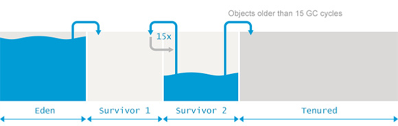

### 5.4.1、过程剖析

1. new的对象先放伊甸园区。此区有大小限制。
2. 当伊甸园的空间填满时，程序又需要创建对象，JVM的垃圾回收器将对伊甸园区进行垃圾回收(Minor GC/YGC)，将伊甸园区中的不再被其他对象所引用的对象进行销毁。再加载新的对象放到伊甸园区
3. 然后将伊甸园中的剩余对象移动到幸存者0区。
4. 如果再次触发垃圾回收，此时上次幸存下来的放到幸存者0区的，如果没有回收，就会放到幸存者1区。
5. 如果再次经历垃圾回收，此时会重新放回幸存者0区，接着再去幸存者1区。
6. 啥时候能去养老区呢？可以设置次数。默认是15次。
   - **可以设置参数：-XX:MaxTenuringThreshold=\<N> 设置对象晋升老年代的年龄阈值。**
7. 在养老区，相对悠闲。当养老区内存不足时，再次触发GC：Major GC，进行养老区的内存清理。
8. 若养老区执行了Major GC之后发现依然无法进行对象的保存，就会产生OOM异常
   - **java.lang.OutOfMemoryError: Java heap space**

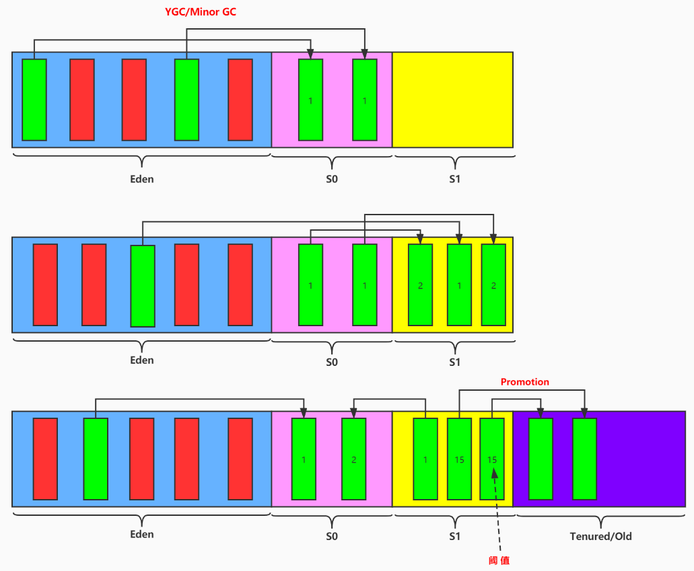


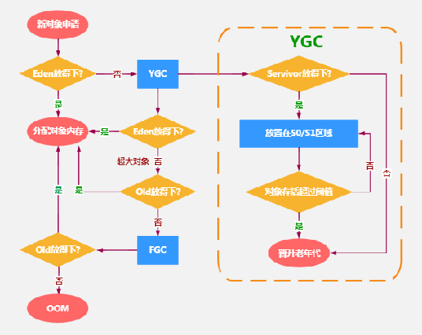


**内存分配策略（或对象提升(promotion)规则):**

如果对象在Eden 出生并经过第一次MinorGC 后仍然存活，并且能被Survivor 容纳的话，将被移动到Survivor 空间中，并将对象年龄设为1 。对象在Survivor 区中每熬过一次MinorGC ， 年龄就增加1岁，当它的年龄增加到一定程度（默认为15 岁，其实每个JVM、每个GC都有所不同）时，就会被晋升到老年代中。

### 5.4.2、内存分配原则

针对不同年龄段的对象分配原则如下所示：

- 优先分配到Eden
- 大对象直接分配到老年代 
  - 尽量避免程序中出现过多的大对象
- 长期存活的对象分配到老年代
- 动态对象年龄判断
  - 如果Survivor 区中相同年龄的所有对象大小的总和大于Survivor空间的一半，年龄大于或等于该年龄的对象可以直接进入老年代，无须等到 MaxTenuringThreshold 中要求的年龄。
- 空间分配担保
  - -XX:HandlePromotionFailure

### 5.4.3、代码举例

```java
/**
 * -Xms600m -Xmx600m -XX:SurvivorRatio=8 -XX:+PrintGCDetails
 * @author shkstart  shkstart@126.com
 * @create 2021  17:51
 */
public class HeapInstanceTest {
    byte[] buffer = new byte[new Random().nextInt(1024 * 200)];

    public static void main(String[] args) {
        ArrayList<HeapInstanceTest> list = new ArrayList<HeapInstanceTest>();
        while (true) {
            list.add(new HeapInstanceTest());
            try {
                Thread.sleep(10);
            } catch (InterruptedException e) {
                e.printStackTrace();
            }
        }
    }
}
```

## 5.5、解释MinorGC、MajorGC、FullGC

> 面试题：
>
> - Minor GC 与 Full GC 分别在什么时候发生？（腾讯）
> - 老年代的垃圾回收机制什么时候触发，自动触发的阈值是多少（蚂蚁金服）
> - 简述 Java 内存分配与回收策略以及 Minor GC 和Major GC（国美）
> - JVM的一次完整的GC流程（从ygc到fgc)是怎样的(蚂蚁金服)

JVM在进行GC时，并非每次都对上面三个内存(新生代、老年代；方法区)区域一起回收的，大部分时候回收的都是指新生代。

针对HotSpot VM的实现，它里面的GC按照回收区域又分为两大种类型：

- 一种是部分收集（Partial GC）
- 一种是整堆收集（Full GC）
- 部分收集：不是完整收集整个Java堆的垃圾收集。其中又分为：
  - 新生代收集（Minor GC / Young GC）：只是新生代（Eden\S0,S1）的垃圾收集
  - 老年代收集（Major GC / Old GC）：只是老年代的垃圾收集。
    - 目前，只有CMS GC会有单独收集老年代的行为。
    - **注意，很多时候Major GC会和Full GC混淆使用，需要具体分辨是老年代回收还是整堆回收。**
  - 混合收集（Mixed GC)：收集整个新生代以及部分老年代的垃圾收集。
    - 目前，只有G1 GC会有这种行为
- 整堆收集（Full GC)：收集整个java堆和方法区的垃圾收集。

### 5.5.1、MinorGC触发机制

**年轻代GC(Minor GC)触发机制**：

- 当年轻代空间不足时，就会触发Minor GC。这里的**年轻代满指的是Eden区满**，Survivor满不会引发GC。（每次 Minor GC 会清理年轻代的内存。)
- 因为 Java 对象大多都具备朝生夕灭的特性，所以 Minor GC 非常频繁，一般回收速度也比较快。这一定义既清晰又易于理解。
- Minor GC会引发STW，暂停其它用户的线程，等垃圾回收结束，用户线程才恢复运行。

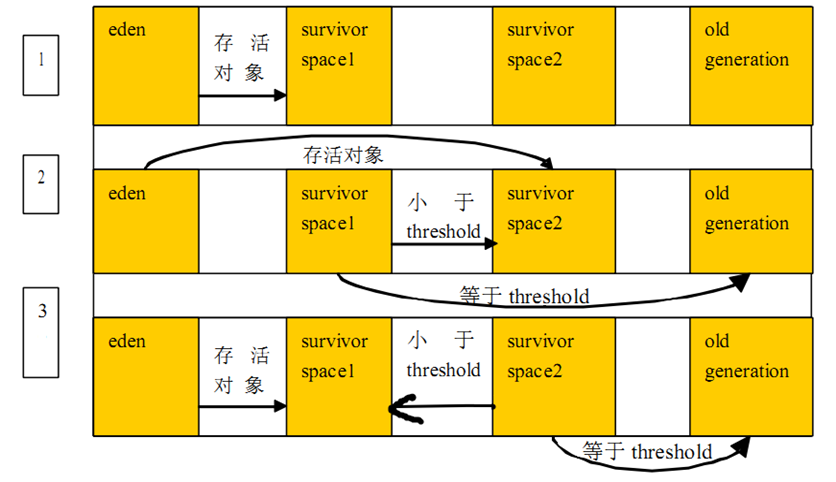

### 5.5.2、MajorGC触发机制

**老年代GC（Major GC/Full GC）触发机制：**

- 指发生在老年代的GC，对象从老年代消失时，我们说“Major GC”或“Full GC”发生了。
  - 出现了Major GC，经常会伴随至少一次的Minor GC（但非绝对的，在Parallel Scavenge收集器的收集策略里就有直接进行Major GC的策略选择过程）。
  - 也就是在老年代空间不足时，会先尝试触发Minor GC。如果之后空间还不足，则触发Major GC
    Major GC的速度一般会比Minor GC慢10倍以上，STW（Stop-The-World）的时间更长,STW（Stop-The-World）是指 JVM 在执行某些特定操作时，暂停所有应用线程的现象。STW 期间，应用程序的所有线程都会停止执行，直到 JVM 完成相关操作。STW 通常发生在垃圾回收（GC）过程中，但也可能在其他情况下出现。
- 如果Major GC 后，内存还不足，就报OOM了。

### 5.5.3、FullGC触发机制

**Full GC触发机制：**

触发Full GC 执行的情况有如下五种：
（1）调用`System.gc()`时，系统建议执行Full GC，但是不必然执行
（2）老年代空间不足
（3）方法区空间不足
（4）通过Minor GC后进入老年代的平均大小大于老年代的可用内存
（5）由Eden区、survivor space0（From Space）区向survivor space1（To Space）区复制时，对象大小大于To Space可用内存，则把该对象转存到老年代，且老年代的可用内存小于该对象大小
**说明：full gc是开发或调优中尽量要避免的。这样暂时时间会短一些。**

### 5.5.4、代码举例

**代码举例1：**

```java
public class OOMTest {
    public static void main(String[] args) {
        String str = "www.atguigu.com";
        //将参数调整的小一些，这样问题会出现的比较早。
        // -Xms8m -Xmx8m -XX:+PrintGCDetails
        while(true){
            str += str + new Random().nextInt(88888888) +
                    new Random().nextInt(999999999);
        }
    }
}
```

**代码举例2:**

```java
/**
 * 测试MinorGC 、 MajorGC、FullGC
 * -Xms10m -Xmx10m -XX:+PrintGCDetails
 * @author shkstart
 * @create 17:33
 */
public class GCTest {
    public static void main(String[] args) {
        int i = 0;
        try {
            List<String> list = new ArrayList<>();
            String a = "atguigu.com";
            while (true) {
                list.add(a);
                a = a + a;
                i++;
            }
        } catch (Throwable t) {
            t.printStackTrace();
            System.out.println("遍历次数为：" + i);
        }
    }
}
```

## 5.6、OOM如何解决

1、要解决OOM异常或heap space的异常，一般的手段是首先通过内存映像分析工具（如Eclipse Memory Analyzer）对dump 出来的堆转储快照进行分析，重点是确认内存中的对象是否是必要的，也就是要先分清楚到底是出现了内存泄漏（Memory Leak）还是内存溢出（Memory Overflow）。

2、如果是**内存泄漏**，可进一步通过工具查看泄漏对象到GC Roots 的引用链。于是就能找到泄漏对象是通过怎样的路径与GC Roots 相关联并导致垃圾收集器无法自动回收它们的。掌握了泄漏对象的类型信息，以及GC Roots 引用链的信息，就可以比较准确地**定位出泄漏代码的位置**。

3、如果不存在内存泄漏，换句话说就是内存中的对象确实都还必须存活着，那就应当检查虚拟机的堆参数（-Xmx 与-Xms），与机器物理内存对比看是否还可以调大，从代码上检查**是否存在某些对象生命周期过长、持有状态时间过长的情况，尝试减少程序运行期的内存消耗**。

## 5.7、堆空间分代思想

> **为什么需要把Java堆分代？不分代就不能正常工作了吗？**
>
> 其实不分代完全可以，分代的唯一理由就是**优化GC性能**。如果没有分代，那所有的对象都在一块，就如同把一个学校的人都关在一个教室。GC的时候要找到哪些对象没用，这样就会对堆的所有区域进行扫描。而很多对象都是朝生夕死的，如果分代的话，把新创建的对象放到某一地方，当GC 的时候先把这块存储“朝生夕死”对象的区域进行回收，这样就会腾出很大的空间出来。

经研究，不同对象的生命周期不同。70%-99%的对象是临时对象。

- 新生代：有Eden、两块大小相同的Survivor(又称为from/to，s0/s1)构成，to总为空。
- 老年代：存放新生代中经历多次GC仍然存活的对象。

JDK7:

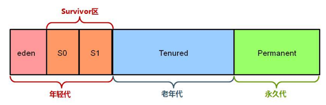

JDK8：

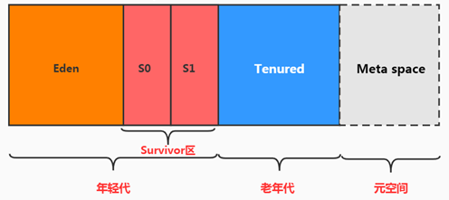


### 5.5.5、快速分配策略：TLAB

**为什么有TLAB（Thread Local Allocation Buffer）？**

- 堆区是线程共享区域，任何线程都可以访问到堆区中的共享数据
- 由于对象实例的创建在JVM中非常频繁，因此在并发环境下从堆区中划分内存空间是线程不安全的
- 为避免多个线程操作同一地址，需要使用加锁等机制，进而影响分配速度。

所以，多线程同时分配内存时，使用TLAB可以避免一系列的非线程安全问题，同时还能够提升内存分配的吞吐量，因此我们可以将这种内存分配方式称之为**快速分配策略**。

**什么是TLAB？**

- 从内存模型而不是垃圾收集的角度，对Eden区域继续进行划分，JVM**为每个线程分配了一个私有缓存区域**，它包含在Eden空间内。
- 据我所知所有OpenJDK衍生出来的JVM都提供了TLAB的设计。


**TLAB的再说明：**

- 尽管不是所有的对象实例都能够在TLAB中成功分配内存，但JVM确实是将TLAB作为内存分配的首选。
- 在程序中，开发人员可以通过选项“**-XX:+/-UseTLAB**”设置是否开启TLAB空间。
- 默认情况下，TLAB空间的内存非常小，**仅占有整个Eden空间的1%**，当然我们可以通过选项“**-XX:TLABWasteTargetPercent**”设置TLAB空间所占用Eden空间的百分比大小。
- 一旦对象在TLAB空间分配内存失败时，JVM就会尝试着通过**使用加锁机制**确保数据操作的原子性，从而直接在Eden空间中分配内存。

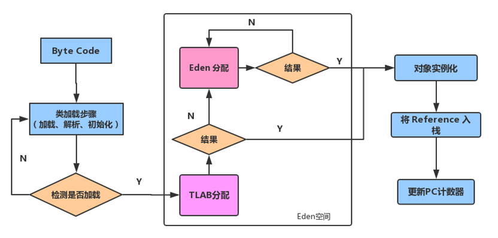

# 6、方法区

## 6.1、栈、堆、方法区的关系	

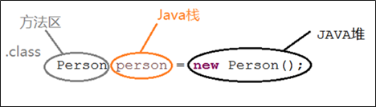

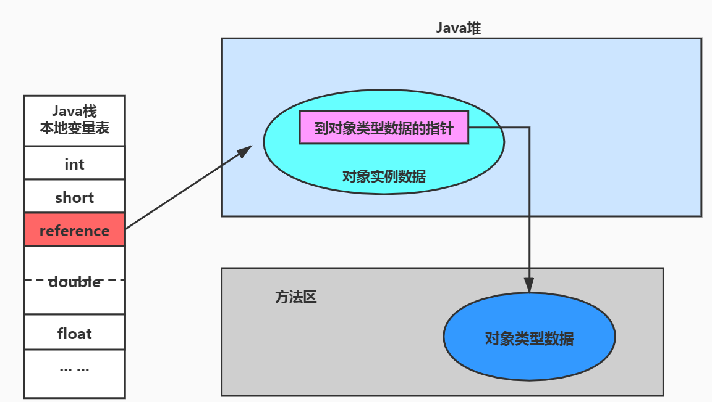

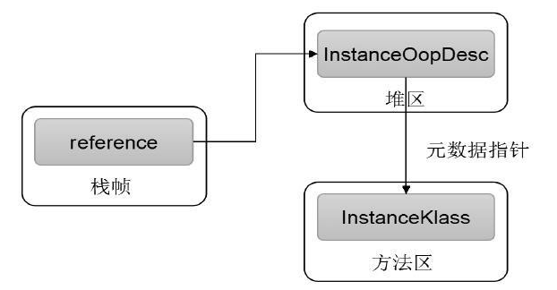

## 6.2、方法区在哪里？

> https://docs.oracle.com/javase/specs/jvms/se8/html/jvms-2.html#jvms-2.5.4
> 
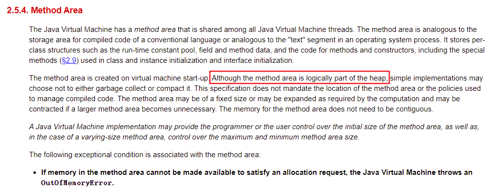

《Java虚拟机规范》中明确说明: “尽管所有的方法区在逻辑上是属于堆的一部分，但一些简单的实现可能不会选择去进行垃圾收集或者进行压缩。” 但对于HotSpotJVM而言，方法区还有一个别名叫做Non-Heap(非堆)，目的就是要和堆分开。

所以，方法区看作是一块独立于Java 堆的内存空间。

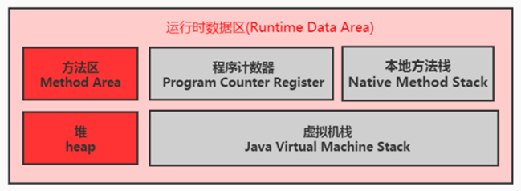

## 6.3、方法区的理解

从线程共享与否的角度来看

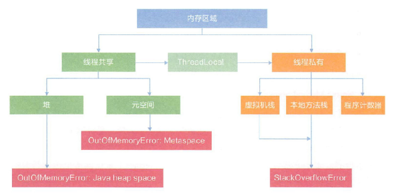

- 方法区（Method Area）与Java堆一样，是各个线程共享的内存区域。
- 方法区在JVM启动的时候被创建，并且它的实际的物理内存空间中和Java堆区一样都可以是不连续的。
- 方法区的大小，跟堆空间一样，可以选择固定大小或者可扩展。
- 方法区的大小决定了系统可以保存多少个类，如果系统定义了太多的类，导致方法区溢出，虚拟机同样会抛出内存溢出错误：java.lang.OutOfMemoryError: **PermGen space** 或者 java.lang.OutOfMemoryError: **Metaspace**
  - **加载大量的第三方的jar包；Tomcat部署的工程过多（30-50个）；大量动态的生成反射类**
- 关闭JVM就会释放这个区域的内存。

## 6.4、HotSpot中方法区的演进

- 在jdk7及以前，习惯上把方法区，称为永久代。jdk8开始，使用元空间取代了永久代。

  

- 本质上，方法区和永久代并不等价。仅是对hotspot而言的。《Java虚拟机规范》对如何实现方法区，不做统一要求。例如：BEA JRockit/ IBM J9中不存在永久代的概念。

  - 现在来看，当年使用永久代，不是好的idea。导致Java程序更容易OOM（超过-XX:MaxPermSize上限）

    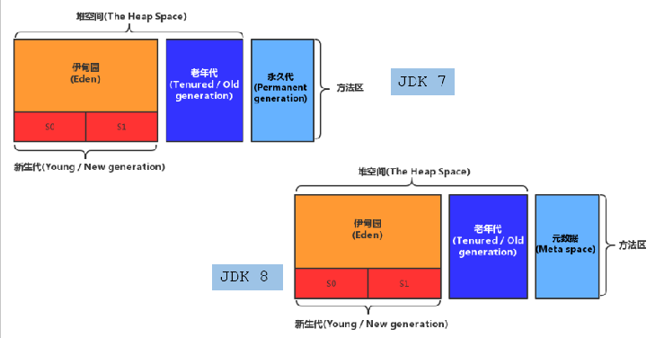

- 而到了JDK 8，终于完全废弃了永久代的概念，改用与JRockit、J9一样在本地内存中实现的元空间（Metaspace）来代替

  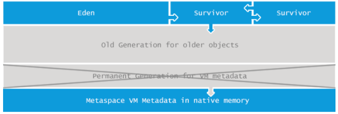

- 元空间的本质和永久代类似，都是对JVM规范中方法区的实现。不过元空间与永久代最大的区别在于：**元空间不在虚拟机设置的内存中，而是使用本地内存**。

- 永久代、元空间二者并不只是名字变了，内部结构也调整了。

- 根据《Java虚拟机规范》的规定，如果方法区无法满足新的内存分配需求时，将抛出OOM异常。

## 6.5、方法区常用参数有哪些？

**设置方法区内存的大小**

- 方法区的大小不必是固定的，jvm可以根据应用的需要动态调整。

- jdk7及以前：

  - **通过-XX:PermSize来设置永久代初始分配空间。默认值是20.75M**

  - **-XX:MaxPermSize来设定永久代最大可分配空间。32位机器默认是64M，64位机器模式是82M**

  - 当JVM加载的类信息容量超过了这个值，会报异常OutOfMemoryError:PermGen space 。

    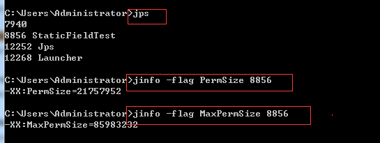

- jdk8及以后：

  - 元数据区大小可以使用参数-XX:MetaspaceSize和-XX:MaxMetaspaceSize指定,替代上述原有的两个参数。
  - 默认值依赖于平台。**windows下，-XX:MetaspaceSize是21M，-XX:MaxMetaspaceSize 的值是-1，即没有限制。**
  - 与永久代不同，**如果不指定大小，默认情况下，虚拟机会耗尽所有的可用系统内存。如果元数据区发生溢出，虚拟机一样会抛出异常OutOfMemoryError: Metaspace**
  - -XX:MetaspaceSize：设置初始的元空间大小。对于一个64位的服务器端JVM来说，其默认的-XX:MetaspaceSize值为21MB。这就是初始的高水位线，一旦触及这个水位线，Full GC将会被触发并卸载没用的类（即这些类对应的类加载器不再存活），然后这个高水位线将会重置。新的高水位线的值取决于GC后释放了多少元空间。如果释放的空间不足，那么在不超过MaxMetaspaceSize时，适当提高该值。如果释放空间过多，则适当降低该值。
  - 如果初始化的高水位线设置过低，上述高水位线调整情况会发生很多次。通过垃圾回收器的日志可以观察到Full GC多次调用。为了避免频繁地GC ，建议将-XX:MetaspaceSize设置为一个相对较高的值。

在JDK8 及以上版本中，设定MaxPermSize 参数， JVM在启动时并不会报错，但是会提示：

```bash
Java HotSpot 64Bit Server VM warning:
ignoring option MaxPermSize=2560m; support was removed in 8.0 。
```

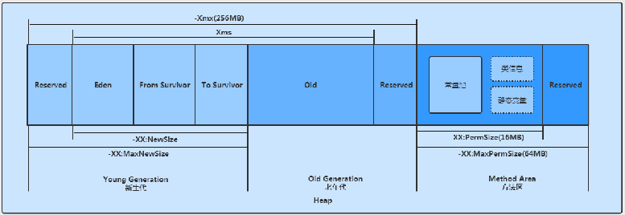


**代码举例**：

```java
/**
 * jdk8中：
 * -XX:MetaspaceSize=10m -XX:MaxMetaspaceSize=10m
 * jdk6中：
 * -XX:PermSize=10m -XX:MaxPermSize=10m
 * @author shkstart  shkstart@126.com
 * @create 2021  22:24
 */
 
public class OOMTest extends ClassLoader {
    public static void main(String[] args) {
        int j = 0;
        try {
            OOMTest test = new OOMTest();
            for (int i = 0; i < 10000; i++) {
                //创建ClassWriter对象，用于生成类的二进制字节码
                ClassWriter classWriter = new ClassWriter(0);
                //指明版本号，public,类名，包名，父类，接口
                classWriter.visit(Opcodes.V1_6, Opcodes.ACC_PUBLIC, "Class" + i, null, "java/lang/Object", null);
                //返回byte[]
                byte[] code = classWriter.toByteArray();
                //类的加载
                test.defineClass("Class" + i, code, 0, code.length);//CLass对象
                j++;
            }
        } finally {
            System.out.println(j);
        }
    }
}
```

## 6.6、方法区都存什么？

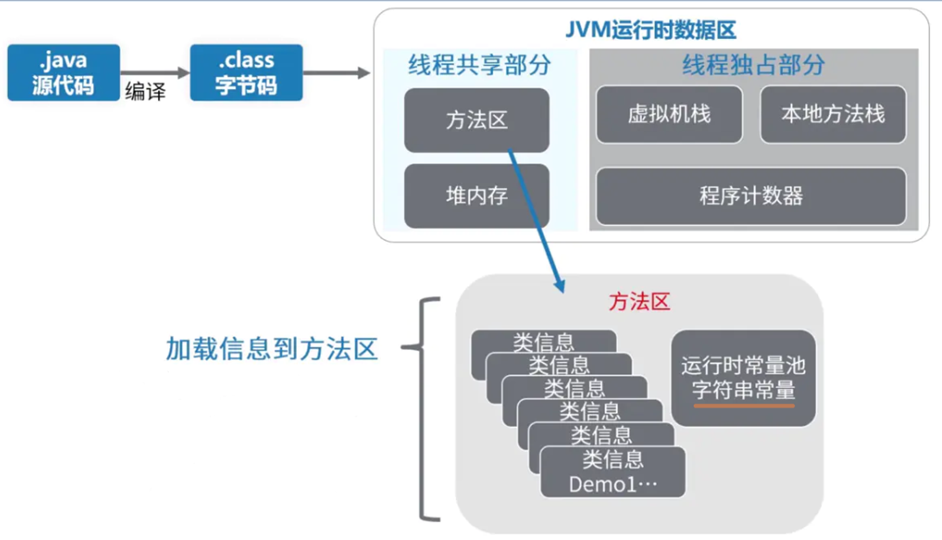

《深入理解Java 虚拟机》书中对方法区（Method Area）存储内容描述如下：
它用于存储已被虚拟机加载的类型信息、常量、静态变量、即时编译器编译后的代码缓存等。


### 6.6.1、类型信息

对每个加载的类型（类class、接口interface、枚举enum、注解annotation），JVM必须在方法区中存储以下类型信息： 
① 这个类型的完整有效名称（全名=包名.类名）
② 这个类型直接父类的完整有效名(对于interface或是java.lang.Object，都没有父类) 
③ 这个类型的修饰符(public,abstract, final的某个子集) 
④ 这个类型直接接口的一个有序列表 

### 6.6.2、域(Field)信息

- JVM必须在方法区中保存类型的所有域的相关信息以及域的声明顺序。
- 域的相关信息包括： 域名称、域类型、域修饰符(public, private, protected, static, final, volatile, transient的某个子集)

### 6.6.3、方法(Method)信息

JVM必须保存所有方法的以下信息，同域信息一样包括声明顺序 ：

- 方法名称 
- 方法的返回类型(或 void)
- 方法参数的数量和类型(按顺序)
- 方法的修饰符(public, private, protected, static, final, synchronized, native, abstract的一个子集)
- 方法的字节码(bytecodes)、操作数栈、局部变量表及大小 （abstract和native方法除外）
- 异常表（abstract和native方法除外）
  - 每个异常处理的开始位置、结束位置、代码处理在程序计数器中的偏移地址、被捕获的异常类的常量池索引

**代码举例一：**

```java
public void catchOne() {
    try {
        tryIt();
    } catch (MyExc e) {
        handleExc(e);
    }
}
```

编译后，如下：

```bash
public void catchOne();
    descriptor: ()V
    flags: ACC_PUBLIC
    Code:
      stack=2, locals=2, args_size=1
         0: aload_0
         1: invokevirtual #2                  // Method tryIt:()V
         4: goto          13
         7: astore_1
         8: aload_0
         9: aload_1
        10: invokevirtual #4                  // Method handleExc:(Ljava/lang/Exception;)V
        13: return
```


```bash
  Exception table:
         from    to  target type
             0     4     7   Class com/atguigu/java/MethodInnerTest$MyExc
```

代码举例二：

```java
public class MethodInnerStrucTest extends Object implements Serializable {
    //属性
    public int num = 10;
    private static String str = "测试方法的内部结构";

    //方法
    public void test1(){
        int count = 20;
        System.out.println("count = " + count);
    }
    public static int test2(int cal){
        int result = 0;
        try {
            int value = 30;
            result = value / cal;
        } catch (Exception e) {
            e.printStackTrace();
        }
        return result;
    }
}
```

### 6.6.4、non-final的类变量

- 静态变量和类关联在一起，随着类的加载而加载,它们成为类数据在逻辑上的一部分。
- 类变量被类的所有实例共享，即使没有类实例时你也可以访问它。

```java
public class MethodAreaTest {
    public static void main(String[] args) {
        Order order = null;
        order.hello();
        System.out.println(order.count);
    }
}

class Order{
    public static int count = 1;
    public static void hello(){
        System.out.println("hello!");
    }
}
```

**补充说明：全局常量：static final**

被声明为final的类变量的处理方法则不同，每个全局常量在编译的时候就会被分配了。

### 6.6.5、运行时常量池

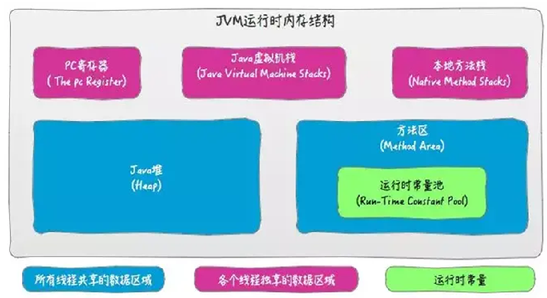

- 运行时常量池（Runtime Constant Pool）是方法区的一部分。

- 常量池表（Constant Pool Table）是Class文件的一部分，**用于存放编译期生成的各种字面量与符号引用**，**这部分内容将在类加载后存放到方法区的运行时常量池中**。

- 运行时常量池，在加载类和接口到虚拟机后，就会创建对应的运行时常量池。

- JVM为每个已加载的类型（类或接口）都维护一个常量池。池中的数据项像数组项一样，是通过**索引访问**的。

- 运行时常量池中包含多种不同的常量，包括编译期就已经明确的数值字面量，也包括到运行期解析后才能够获得的方法或者字段引用。此时不再是常量池中的符号地址了，这里换为真实地址。

  - 运行时常量池，相对于Class文件常量池的另一重要特征是：**具备动态性**。

    String.intern()

- 运行时常量池类似于传统编程语言中的符号表（symbol table），但是它所包含的数据却比符号表要更加丰富一些。

- 当创建类或接口的运行时常量池时，如果构造运行时常量池所需的内存空间超过了方法区所能提供的最大值，则JVM会抛OutOfMemoryError异常。

#### 6.6.5.1、关联：常量池

- 方法区，内部包含了运行时常量池。
- 字节码文件，内部包含了常量池。
- 要弄清楚方法区，需要理解清楚ClassFile，因为加载类的信息都在方法区。
- 要弄清楚方法区的运行时常量池，需要理解清楚ClassFile中的常量池。

> https://docs.oracle.com/javase/specs/jvms/se8/html/jvms-4.html。如下：
>
> 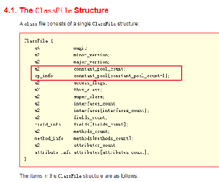

 一个有效的字节码文件中除了包含类的版本信息、字段、方法以及接口等描述信息外，还包含一项信息那就是常量池表（Constant Pool Table），包括各种字面量和对类型、域和方法的符号引用。

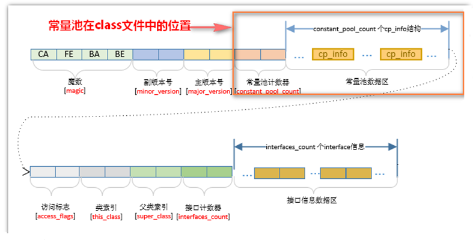

**小结：**
常量池，可以看做是一张表，虚拟机指令根据这张常量表找到要执行的类名、方法名、参数类型、字面量等类型。

#### 6.6.5.2、为什么需要常量池？

一个java源文件中的类、接口，编译后产生一个字节码文件。而Java中的字节码需要数据支持，通常这种数据会很大以至于不能直接存到字节码里，换另一种方式，可以存到常量池，这个字节码包含了指向常量池的引用。在动态链接的时候会用到运行时常量池，之前有介绍。

比如：如下的代码：

```java
public class SimpleClass {
    public void sayHello() {
        System.out.println("hello");
    }
}
```

虽然只有194字节，但是里面却使用了String、System、PrintStream及Object等结构。这里代码量其实已经很小了。如果代码多，引用到的结构会更多！这里就需要常量池了！

#### 6.6.5.3、常量池都有什么？

几种在常量池内存储的数据类型包括：

- 数量值
- 字符串值
- 类引用
- 字段引用
- 方法引用

例如下面这段代码：

```java
public class MethodAreaTest2 {
    public static void main(String[] args) {
        Object obj = new Object();
    }
}
```

其中代码：Object foo = new Object();将会被编译成如下字节码：

```bash
0:      new #2               // Class java/lang/Object
1:      dup
2:      invokespecial #3    // Method java/ lang/Object “<init>”( ) V
```

## 6.7、方法区使用举例

```java
/**
 * @author shkstart  shkstart@126.com
 * @create 2020  14:28
 */
public class MethodAreaDemo {
    public static void main(String[] args) {
        int x = 500;
        int y = 100;
        int a = x / y;
        int b = 50;
        System.out.println(a + b);
    }
}
```

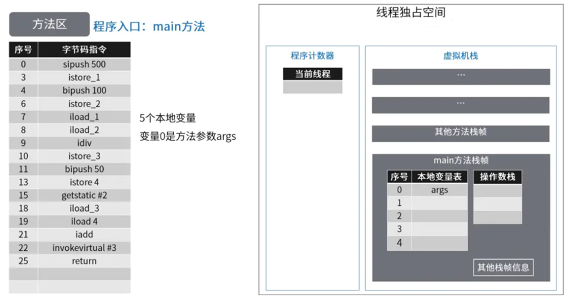

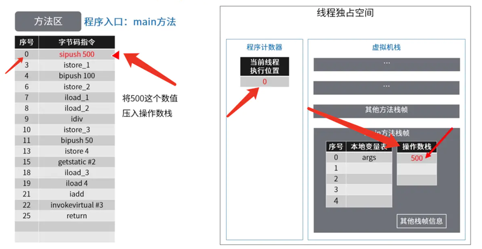

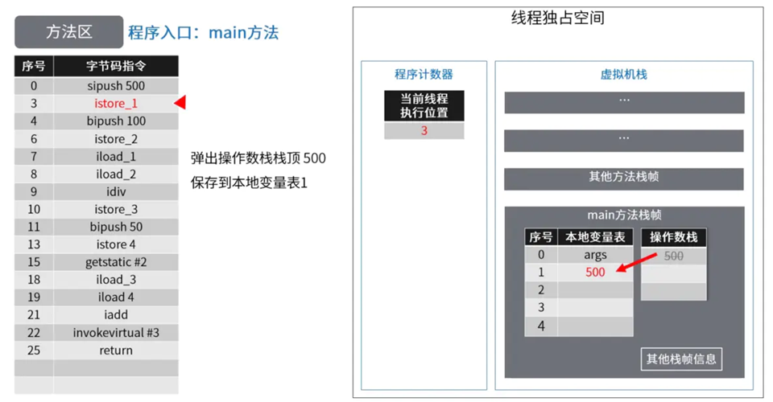

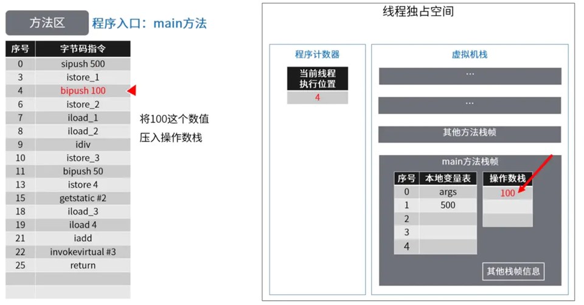

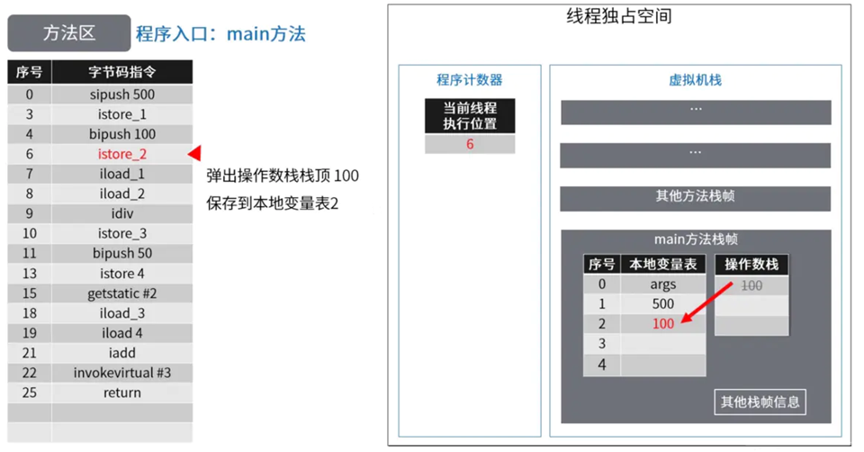


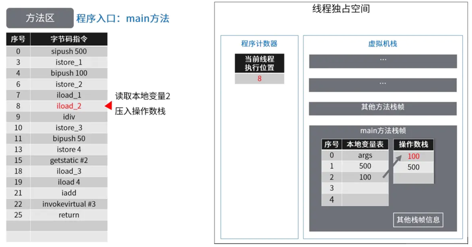

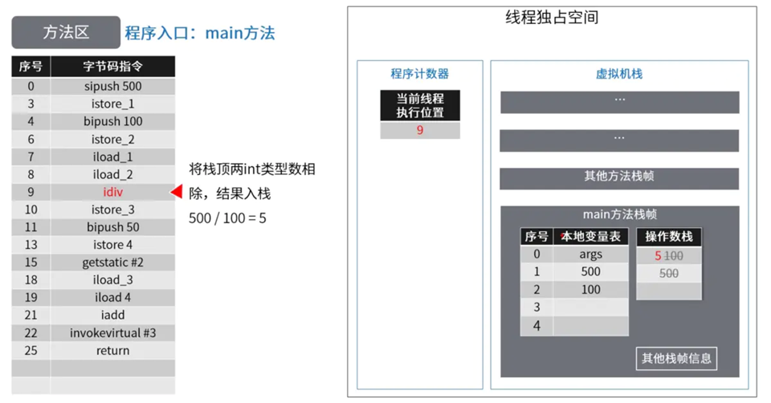

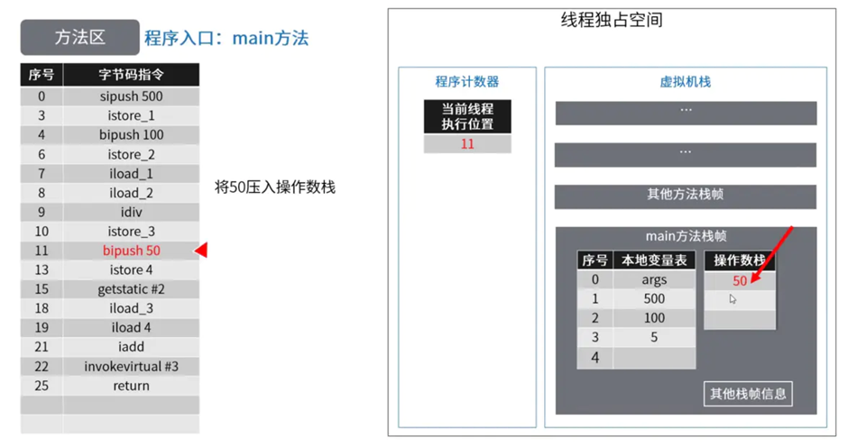

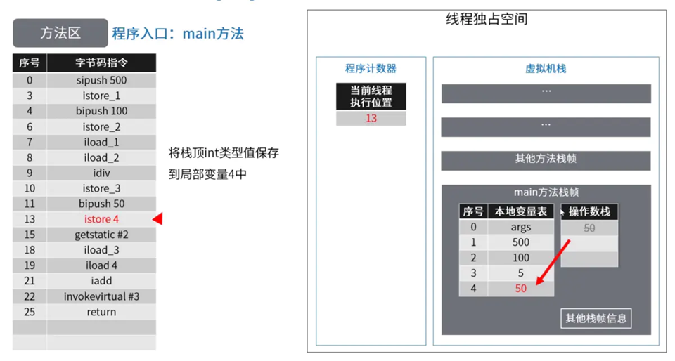

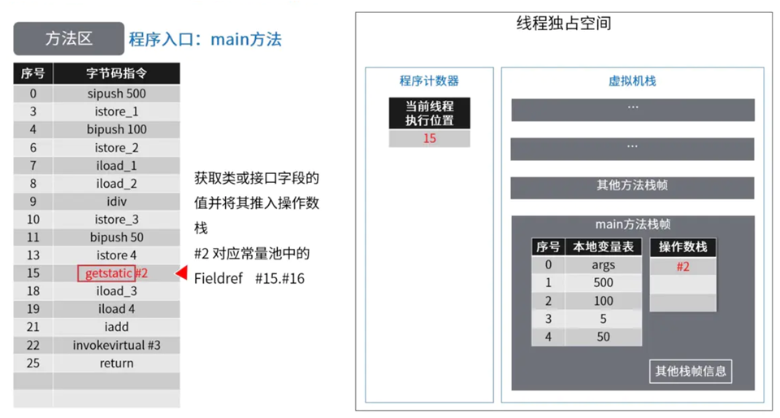

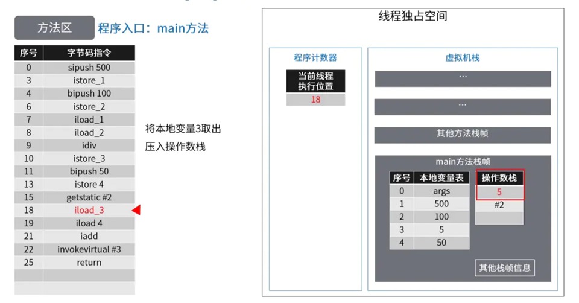

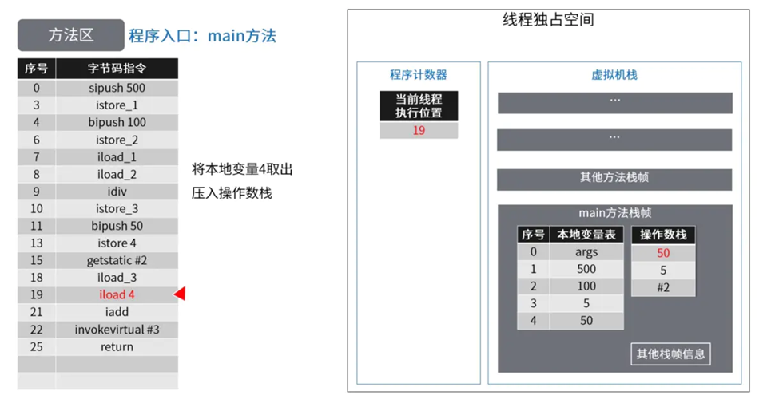

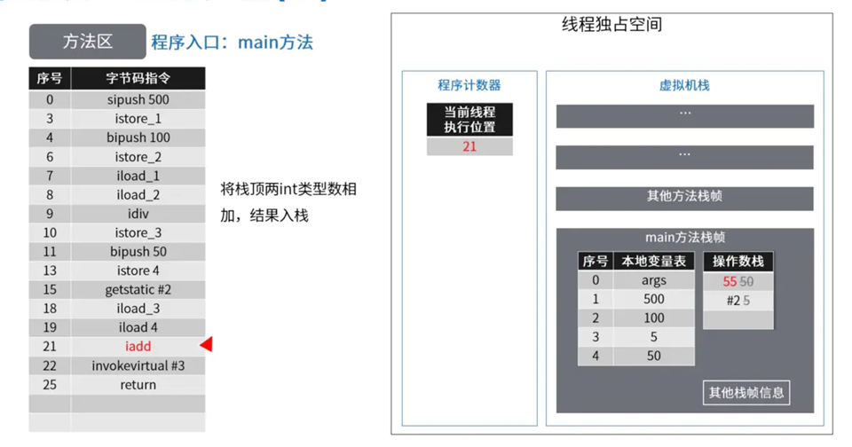

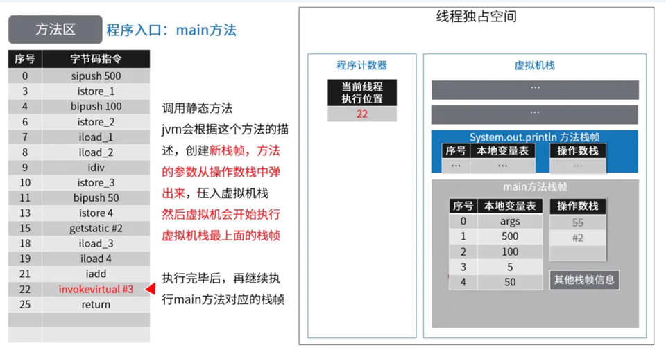

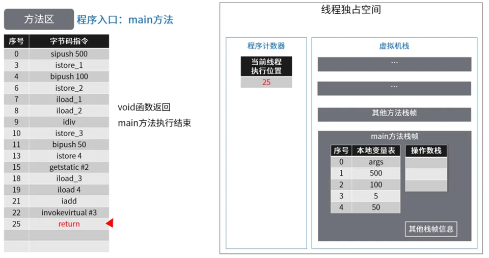

## 6.8、永久代与元空间

> http://openjdk.java.net/jeps/122

1、首先明确：只有HotSpot才有永久代。
BEA JRockit、IBM J9等来说，是不存在永久代的概念的。原则上如何实现方法区属于虚拟机实现细节，不受《Java虚拟机规范》管束，并不要求统一。

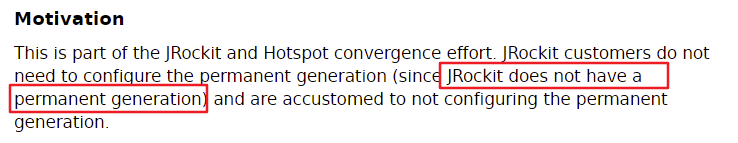

2、HotSpot中永久代的变化
**jdk1.6及之前**：有永久代(permanent generation)
**jdk1.7**：有永久代，但已经逐步“去永久代”，字符串常量池、静态变量移除，保存在堆中
**jdk1.8及之后**： 无永久代，类型信息、字段、方法、常量保存在本地内存的元空间，但字符串常量池仍在堆

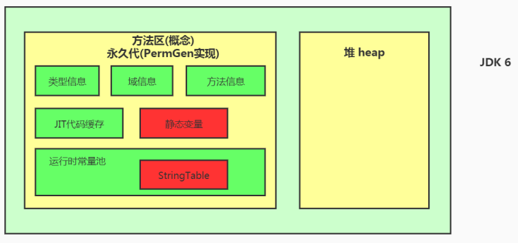

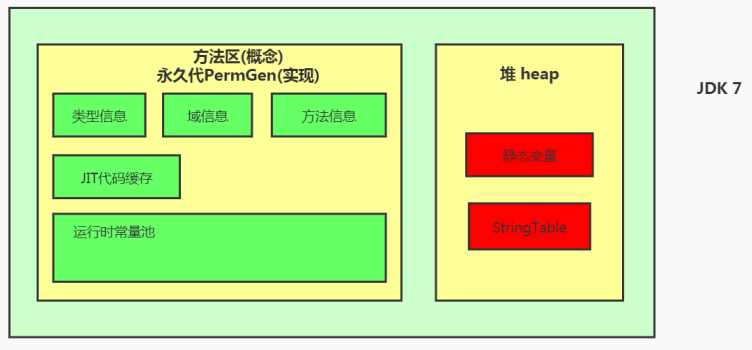

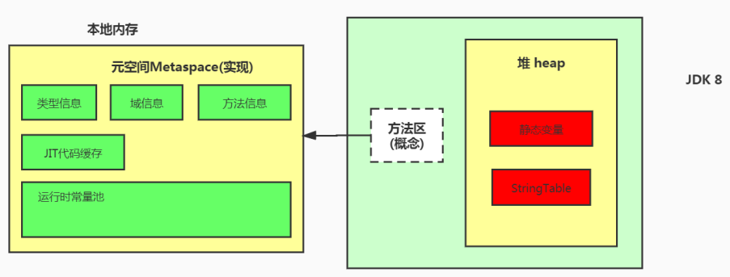

## 6.9、方法区是否存在GC？回收什么？

> 面试题：JVM的永久代中会发生垃圾回收么?（腾讯）

有些人认为方法区（如HotSpot虚拟机中的元空间或者永久代）是没有垃圾收集行为的，其实不然。《Java虚拟机规范》对方法区的约束是非常宽松的，提到过可以不要求虚拟机在方法区中实现垃圾收集。事实上也确实有未实现或未能完整实现方法区类型卸载的收集器存在（如JDK 11时期的ZGC收集器就不支持类卸载）。

一般来说**这个区域的回收效果比较难令人满意，尤其是类型的卸载，条件相当苛刻**。但是这部分区域的回收**有时又确实是必要的**。以前Sun公司的Bug列表中，曾出现过的若干个严重的Bug就是由于低版本的HotSpot虚拟机对此区域未完全回收而导致内存泄漏。

**方法区的垃圾收集主要回收两部分内容：常量池中废弃的常量和不再使用的类型。**

- 先来说说方法区内常量池之中主要存放的两大类常量：字面量和符号引用。字面量比较接近Java语言层次的常量概念，如文本字符串、被声明为final的常量值等。而符号引用则属于编译原理方面的概念，包括下面三类常量：
  - 1、类和接口的全限定名
  - 2、字段的名称和描述符
  - 3、方法的名称和描述符 
- HotSpot虚拟机对常量池的回收策略是很明确的，只要常量池中的常量没有被任何地方引用，就可以被回收。
- 回收废弃常量与回收Java堆中的对象非常类似。
- 判定一个常量是否“废弃”还是相对简单，而要判定一个类型是否属于“不再被使用的类”的条件就比较苛刻了。需要同时满足下面三个条件： 
  - 该类所有的实例都已经被回收，也就是Java堆中不存在该类及其任何派生子类的实例。 
  - 加载该类的类加载器已经被回收，这个条件除非是经过精心设计的可替换类加载器的场景，如OSGi、JSP的重加载等，否则通常是很难达成的。 
  - 该类对应的java.lang.Class对象没有在任何地方被引用，无法在任何地方通过反射访问该类的方法。
- Java虚拟机被允许对满足上述三个条件的无用类进行回收，这里说的仅仅是“被允许”，而并不是和对象一样，没有引用了就必然会回收。关于是否要对类型进行回收，HotSpot虚拟机提供了-Xnoclassgc参数进行控制，还可以使用-verbose:class以及**-XX:+TraceClassLoading -XX:+TraceClassUnloading查看类加载和卸载信息**
- 在大量使用反射、动态代理、CGLib等字节码框架，动态生成JSP以及OSGi这类频繁自定义类加载器的场景中，**通常都需要Java虚拟机具备类型卸载的能力，以保证不会对方法区造成过大的内存压力**。

## 6.10、内存结构小结

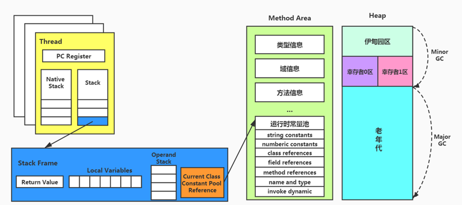

# 7、直接内存

## 7.1、概述

- 不是虚拟机运行时数据区的一部分，也不是《Java虚拟机规范》中定义的内存区域。
- 直接内存是在Java堆外的、直接向系统申请的内存区间。
- 来源于NIO，通过存在堆中的DirectByteBuffer操作Native内存
- 通常，访问直接内存的速度会优于Java堆。即读写性能高。
  - 因此出于性能考虑，读写频繁的场合可能会考虑使用直接内存。
  - **Java的NIO库允许Java程序使用直接内存，用于数据缓冲区**

## 7.2、非直接缓冲区vs直接缓冲区

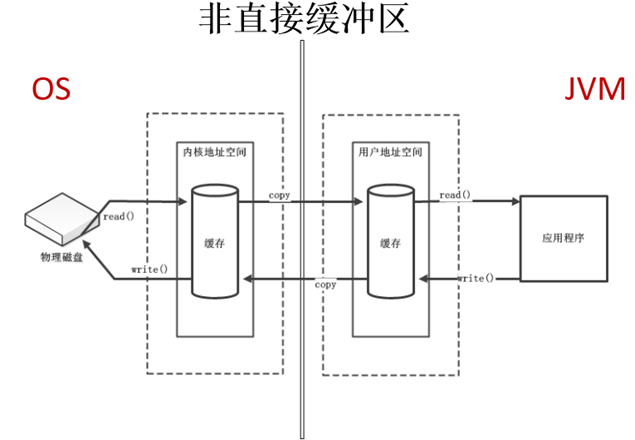

读写文件，需要与磁盘交互，需要由用户态切换到内核态。
使用IO,见上图。这里需要两份内存存储重复数据，效率低。

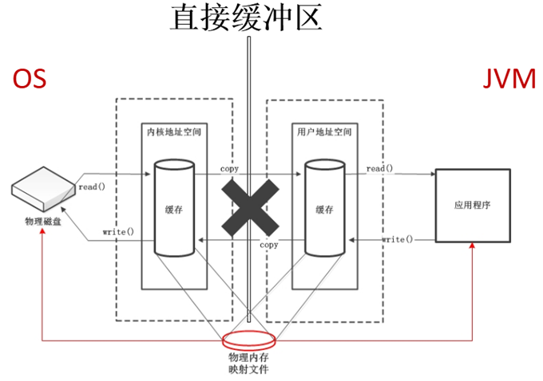

使用NIO时，如上图。操作系统划出的直接缓存区可以被java代码直接访问，只有一份。NIO适合对大文件的读写操作。

## 7.3、大小设置方式

- 也可能导致OutOfMemoryError异常
- 由于直接内存在Java堆外，因此它的大小不会直接受限于-Xmx指定的最大堆大小，但是系统内存是有限的，Java堆和直接内存的总和依然受限于操作系统能给出的最大内存。
- 缺点
  - 分配回收成本较高
  - 不受JVM内存回收管理
- 直接内存大小可以通过MaxDirectMemorySize设置
- 如果不指定，默认与堆的最大值-Xmx参数值一致

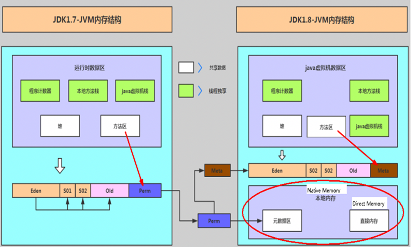

简单理解：
**java process memory = java heap + native memory**

## 7.4、代码举例

如果不指定MaxDirectMemorySize，则默认与java堆最大值（-Xmx指定）一致。

```java
/**
 * -Xmx20m -XX:MaxDirectMemorySize=10m
 * @author shkstart
 * @create 2020 上午 12:44
 */
public class DirectMemTest {
    private static final long _1MB = 1024 * 1024;

    public static void main(String[] args) throws IllegalAccessException {
        Field unsafeField = Unsafe.class.getDeclaredFields()[0];
        unsafeField.setAccessible(true);
        Unsafe unsafe = (Unsafe)unsafeField.get(null);
        while(true){
            unsafe.allocateMemory(_1MB);
        }
        
    }
}
```


# 8、StringTable

> 面试题：new string()是放在哪里，还放在哪里？（搜狐、万达集团）

## 8.1、String的不可变性

1. 通过字面量的方式（区别于new）给一个字符串赋值，此时的字符串值声明在字符串常量池中。
2. 字符串常量池中是不会存储相同内容的字符串的。

```java
@Test
public void test1() {
    String s1 = "abc";//字面量的定义方式
       String s2 = "abc";
    s1 = "hello";

    System.out.println(s1 == s2);//比较s1和s2的地址值

    System.out.println(s1);//hello
    System.out.println(s2);//abc

    System.out.println("*****************");

    String s3 = "abc";
    s3 += "def";
    System.out.println(s3);//abcdef
    System.out.println(s2);

    System.out.println("*****************");

    String s4 = "abc";
    String s5 = s4.replace('a', 'm');
    System.out.println(s4);//abc
    System.out.println(s5);//mbc

}


@Test
public void test2(){
    StringTest1 ex = new StringTest1();
    ex.change(ex.str, ex.ch);
    System.out.print(ex.str + " and ");//
    System.out.println(ex.ch);
}
String str = new String("good");
char[] ch = { 't', 'e', 's', 't' };

public void change(String str, char ch[]) {
    str = "test ok";
    ch[0] = 'b';
}
```

## 8.2、String的内存分配

整体来说：

- Java 6及以前，字符串常量池存放在永久代。
- Java 7 中 Oracle 的工程师对字符串池的逻辑做了很大的改变，**即将字符串常量池的位置调整到Java堆内**。
- Java 8 中，字符串常量仍然在堆。

**StringTable为什么要调整？**

> https://www.oracle.com/technetwork/java/javase/jdk7-relnotes-418459.html#jdk7changes
>
> 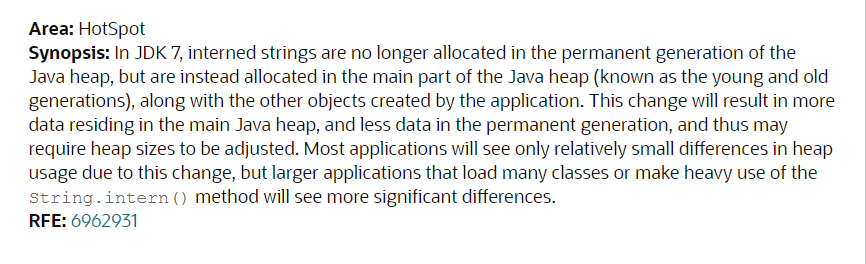

**举例：**

jdk6:

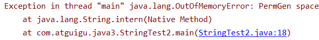

jdk8:

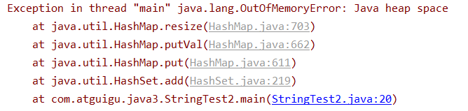

**具体细节：数组+链表**
String的String Pool是一个固定大小的Hashtable，默认值大小长度是1009，如果放进String Pool的String非常多，就会造成Hash冲突严重，从而导致链表会很长，而链表长了后直接会造成的影响就是当调用String.intern时性能会大幅下降（因为要一个一个找）。

在 jdk6中StringTable是固定的，就是1009的长度，所以如果常量池中的字符串过多就会导致效率下降很快。在jdk7中，StringTable的长度可以通过一个参数指定：

- -XX:StringTableSize=99991

## 8.3、String的基本操作

```java
public class StringTest3 {
    @Test
    public void test1(){
        System.out.println();//2320
        System.out.println();//2321
        System.out.println();//2321
        System.out.println("1");//2321
        System.out.println("2");
        System.out.println("3");
        System.out.println("4");
        System.out.println("5");
        System.out.println("6");
        System.out.println("7");
        System.out.println("8");
        System.out.println("9");
        System.out.println("10");//2330

        System.out.println("1");//2331
        System.out.println("2");//2331
        System.out.println("3");
        System.out.println("4");
        System.out.println("5");
        System.out.println("6");
        System.out.println("7");
        System.out.println("8");
        System.out.println("9");
        System.out.println("10");//2331
    }
    @Test
    public void test2(){
        String s1 = "a" + "b" + "c";//常量优化机制,编译的时候就已经是abc
        String s2 = "abc";
        /*
         * 最终.java编译成.class,再执行.class
         * String s1 = "abc";
         * String s2 = "abc"
         */
        System.out.println(s1 == s2); //true
        System.out.println(s1.equals(s2)); //true
    }
 
}
```

## 8.4、字符串拼接操作

```java
@Test
public void test3(){
    String s1 = "a";
    String s2 = "b";
    String s3 = "ab";
    String s4 = s1 + s2;//new StringBuilder().append("a").append("b").toString() --> new String("ab")
    System.out.println(s3 == s4);
}
 
@Test
public void test4(){
    final String s1 = "a";
    final String s2 = "b";
    String s3 = "ab";
    String s4 = s1 + s2;
    System.out.println(s3 == s4);
}
 
//体会执行效率：
public void method1(){
    String src = "";
    for(int i = 0;i < 10;i++){
        src = src + "a";//每次循环都会创建一个StringBuilder
    }
    System.out.println(src);
    
}

public void method2(){
    StringBuilder src = new StringBuilder();
    for (int i = 0; i < 10; i++) {
        src.append("a");
        
    }
    System.out.println(src);
}
```

## 8.5、new String()问题

String的实例化方式： 

- 方式一：通过字面量定义的方式

- 方式二：通过new + 构造器的方式

- 面试题：String s = new String("abc");方式创建对象，在内存中创建了几个对象？

  两个:一个是堆空间中new结构，另一个是char[]对应的常量池中的数据："abc"

## 8.6、intern()方法

```java
public class StringTest4 {
    public static void main(String[] args) {
        String s = new String("1");
        s.intern();
        String s2 = "1";
        System.out.println(s == s2);//

        String s3 = new String("1") + new String("1");
        s3.intern();
        String s4 = "11";
        System.out.println(s3 == s4);//
    }
}
```

jdk6中的解释：

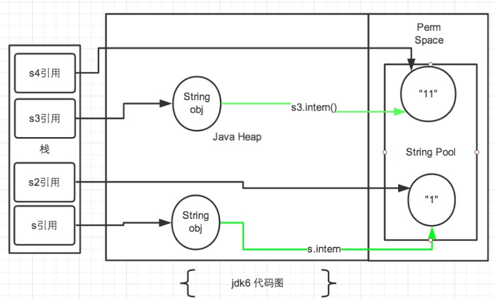

jdk7中的解释：

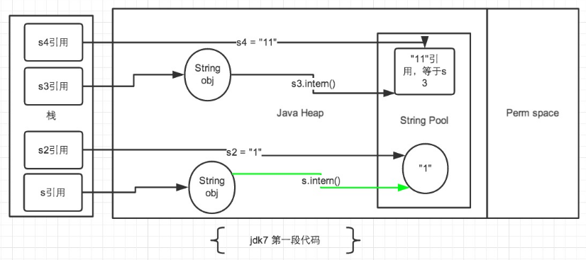

题目变形：

```java
@Test
public void test1(){
    String s = new String("1");
    String s2 = "1";
    s.intern();
    System.out.println(s == s2);//

    String s3 = new String("1") + new String("1");
    String s4 = "11";
    s3.intern();
    System.out.println(s3 == s4);//
    
}
```

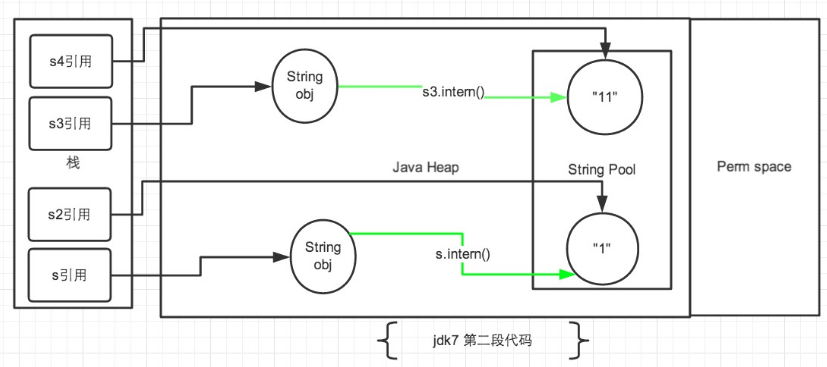

## 8.7、G1的String去重操作

**问题：String底层是什么结构？**

新的需求：

许多大规模的java应用的瓶颈在于内存，测试表明，在这些类型的应用里面，java堆中存活的数据集合差不多25%是String对象。更进一步，这里面差不多一半String对象是重复的，重复的意思是说：string1.equals(string2)为true。堆上存在重复的String对象必然是一种内存的浪费。这个项目将在G1垃圾收集器中实现自动持续对重复的String对象进行去重，这样就能避免浪费内存。

**说明：**
**String去重不需要对jdk的类库和已经存在的java代码做任何的改动。**